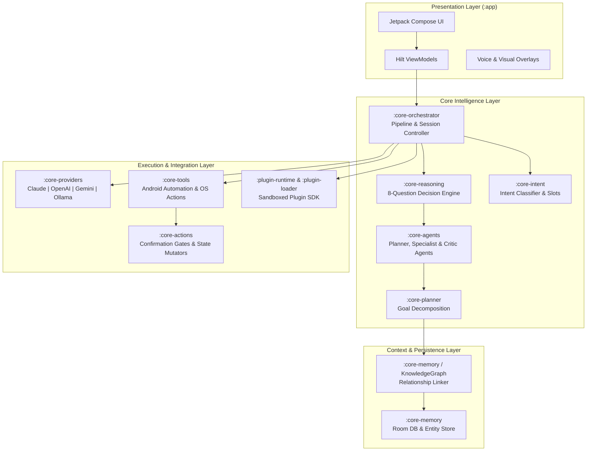

# AURA AI

An autonomous, multi-agent on-device AI assistant and extensible execution engine for Android.

[](https://github.com/daanialmirza5/AuraAI/actions/workflows/ci.yml)
[](https://kotlinlang.org/)
[](https://developer.android.com/)
[](https://developer.android.com/jetpack/compose)
[](docs/ARCHITECTURE.md)
[](LICENSE)

---

## Overview

**AURA AI** is an extensible, on-device autonomous assistant platform for Android built with Clean Architecture across **18 modular Gradle subprojects**. Rather than relying on simple linear prompt chains, AURA operates an on-device decision engine that decomposes user intents, validates safety and privacy constraints, queries a persistent knowledge graph, selects specialized agents, and safely executes native Android tools and third-party plugins.

### Core Highlights
- **18-Module Clean Architecture**: Strict unidirectional dependencies separating UI (`app`), orchestration (`core-orchestrator`), decision logic (`core-reasoning`), memory (`core-memory`), tools (`core-tools`), and plugin infrastructure (`plugin-*`).
- **Deterministic 8-Question Decision Engine**: Evaluates ambiguities, side effects, required confirmation gates, and capabilities before executing actions.
- **Swappable LLM Providers**: Unified streaming and non-streaming interface supporting Anthropic Claude, OpenAI, Google Gemini, and local Ollama instances.
- **On-Device Memory & Knowledge Graph**: Room-backed persistent storage auto-linking entities, relationships, conversation context, and user preferences.
- **Native Android Automation**: Scoped accessibility interactions, system settings toggles, clipboard/share utilities, media controls, and background `WorkManager` workflows.
- **Multimodal Runtimes**: Low-latency streaming speech-to-text / text-to-speech voice pipeline and vision tools (OCR, barcode scanning, receipt parsing).

---

## Architecture



---

## Module Breakdown

| Subproject | Responsibility |
|---|---|
| `:app` | Jetpack Compose UI shell, Navigation, Hilt DI roots, App Settings, and Permission Handlers |
| `:core-orchestrator` | Coordinates the conversation loop, streaming token lifecycle, and agent handoffs |
| `:core-agents` | Specialized agent implementations (Research, Task Execution, Planning, Evaluation) |
| `:core-reasoning` | 8-question constraint checker, safety evaluator, and ambiguity resolver |
| `:core-intent` | Intent classification, entity slot extraction, and conversation context framing |
| `:core-planner` | Multi-step goal decomposition, dependency resolution, and rollback handling |
| `:core-memory` | SQLite/Room entity persistence, semantic relationship linker, and session history |
| `:core-providers` | HTTP/SSE client adapters for Claude, OpenAI, Gemini, and Ollama |
| `:core-tools` | System actions: Settings toggles, Clipboard, Share, File Search, WorkManager triggers |
| `:core-actions` | User confirmation gates, sensitive action barriers, and execution results |
| `:core-capabilities`| Runtime capability discovery, device hardware inspection, and feature toggling |
| `:core-events` | Reactive Kotlin Coroutine Flow event bus for decoupled inter-module messaging |
| `:core-ai` | Shared LLM message representations, streaming protocols, and token utilities |
| `:core-plugin` | Manifest parsing, permission models, and plugin life-cycle state machines |
| `:plugin-api` | Stable public developer SDK for building third-party AURA extensions |
| `:plugin-runtime` | Sandboxed execution runtime enforcing memory limits and capability boundaries |
| `:plugin-loader` | Dynamic DEX / APK package loading and cryptographic signature validation |
| `:plugin-marketplace`| Local catalog indexing and metadata resolution for community plugins |

---

## Tech Stack

- **Language & Runtime**: Kotlin 2.0+, Java 17 toolchain
- **UI Framework**: Jetpack Compose, Material 3, Compose Navigation
- **Architecture**: Clean Architecture, Unidirectional Data Flow (MVI/MVVM), Kotlin Coroutines & Flow
- **Dependency Injection**: Google Hilt / Dagger
- **Local Persistence**: Android Jetpack Room, SQLite, EncryptedSharedPreferences (AndroidX Security)
- **Background Tasks**: Android Jetpack WorkManager
- **Networking**: Ktor / OkHttp with SSE (Server-Sent Events) streaming support
- **AI Integrations**: Anthropic Claude API, OpenAI ChatCompletions, Google Gemini REST API, Ollama Local API
- **Testing & Quality**: JUnit 5, MockK, Turbine (Flow testing), KtLint, Detekt

---

## Project Structure

```text
AuraAI/
├── app/                      # Main Android application & Compose UI
├── core-actions/             # Sensitive action confirmation & safety gates
├── core-agents/              # Agent implementations (Planner, Critic, Specialist)
├── core-ai/                  # Shared AI abstractions, streaming protocol
├── core-capabilities/        # Hardware and OS capability registry
├── core-events/              # Event bus and reactive streams
├── core-intent/              # Intent classification and slot parsing
├── core-memory/              # Room database, Knowledge Graph, entity linking
├── core-orchestrator/        # Pipeline orchestration and multi-agent coordination
├── core-planner/             # Goal decomposition and execution graph
├── core-plugin/              # Plugin core domain and policies
├── core-providers/           # LLM provider network adapters (Claude, OpenAI, Gemini, Ollama)
├── core-reasoning/           # 8-question decision and constraint engine
├── core-tools/               # Android OS tools (Settings, Clipboard, Accessibility)
├── docs/                     # Detailed architecture, milestone, and module specs
├── gradle/                   # Gradle wrapper and build configuration
├── plugin-api/               # Third-party developer Plugin SDK
├── plugin-loader/            # Dynamic DEX plugin loader
├── plugin-marketplace/       # Plugin catalog and repository interface
├── plugin-runtime/           # Sandboxed plugin execution environment
├── build.gradle.kts          # Root build configuration
├── settings.gradle.kts       # 18-module composite Gradle settings
└── README.md
```

---

## Getting Started

### Prerequisites
- **Android Studio**: Ladybug / Koala or newer
- **JDK**: Java Development Kit 17 (managed via Foojay toolchain plugin)
- **Android SDK**: Min SDK 26 (Android 8.0), Target SDK 34 (Android 14)

### Building the Project

```bash
# Clone the repository
git clone https://github.com/daanialmirza5/AuraAI.git
cd AuraAI

# Check code style with ktlint & detekt
./gradlew detekt ktlintCheck

# Run unit and pipeline test suites
./gradlew testDebugUnitTest

# Assemble debug APK
./gradlew assembleDebug
```

### Configuring AI Providers
1. Launch the app on an Android device or emulator.
2. Navigate to **Settings > AI Providers**.
3. Enter your API key for Claude, OpenAI, or Gemini, or specify the local IP endpoint for an Ollama server (e.g. `http://10.0.2.2:11434` for emulator).
4. Keys are stored locally using Android Jetpack `EncryptedSharedPreferences`.

---

## Verification & Testing

The repository includes modular unit and integration tests across the multi-agent pipeline:

```bash
# Run tests across core decision modules
./gradlew :core-reasoning:test
./gradlew :core-orchestrator:test
./gradlew :core-agents:test
./gradlew :core-memory:test
```

Continuous integration is automated via GitHub Actions in [`.github/workflows/ci.yml`](.github/workflows/ci.yml).

---

## Documentation

For deep technical specifications, refer to the [`docs/`](docs) directory:
- [AI Provider Integration](docs/AI_PROVIDER_INTEGRATION.md)
- [Android Automation & Accessibility](docs/ANDROID_AUTOMATION.md)
- [Voice Streaming Runtime](docs/VOICE_RUNTIME.md)
- [Vision Runtime](docs/VISION_RUNTIME.md)
- [Knowledge Graph Engine](docs/KNOWLEDGE_GRAPH.md)
- [Plugin SDK & Security](docs/PLUGIN_SDK.md)

---

## License

This project is licensed under the [MIT License](LICENSE).
