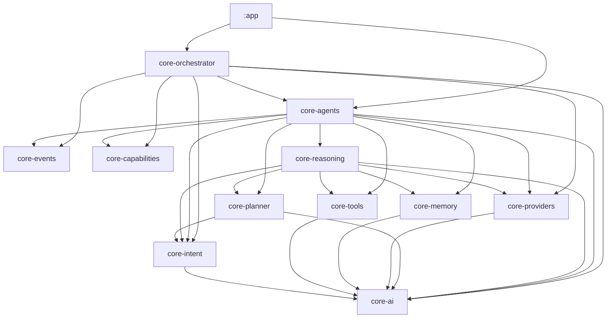
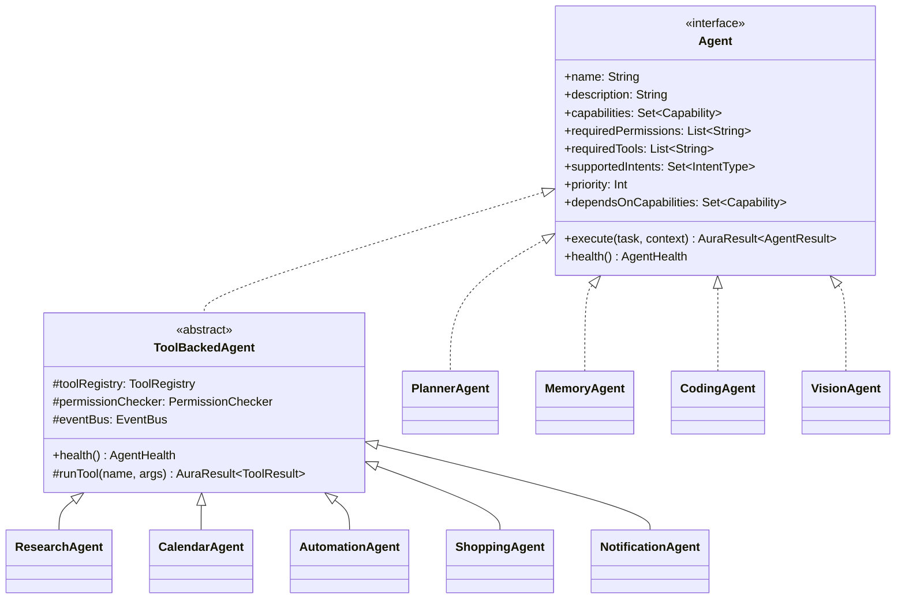
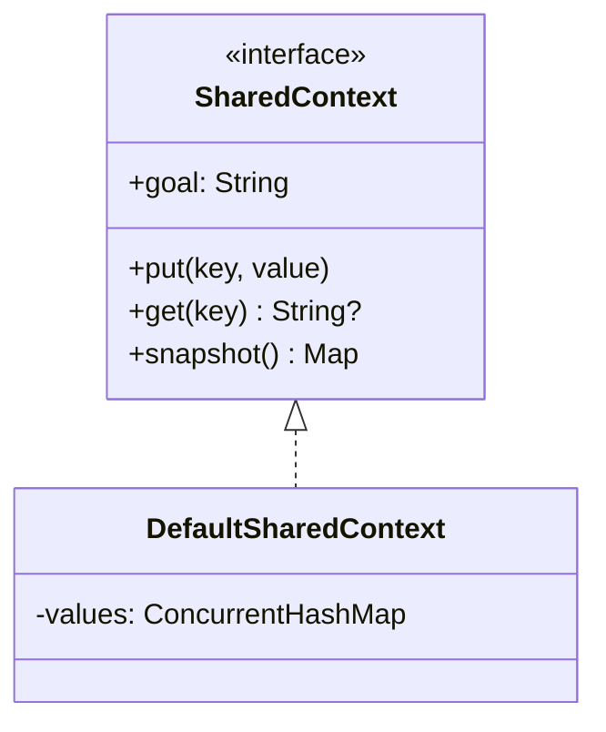

# AURA AI — Phase 6: Multi-Agent System

**What this phase is:** a production-grade multi-agent framework — 4 new modules
(`core-events`, `core-capabilities`, `core-agents`, `core-orchestrator`), 9 real agents wrapping
Phase 3–5's existing machinery, and an orchestrator that selects, coordinates, retries, and
aggregates them. **What this phase is not:** a connection to any cloud AI provider. Every agent
that genuinely needs one (`CodingAgent`, `VisionAgent`) says so honestly and fails the same
`AuraError.ProviderNotConnected`/`RequiresProvider` way every scaffolded seam in this codebase
always has.

Companion documents: **[ORCHESTRATOR.md](ORCHESTRATOR.md)** (selection, dispatch, coordination,
aggregation in detail), **[EVENT_BUS.md](EVENT_BUS.md)** (the pub/sub layer agents communicate
through), **[CAPABILITY_REGISTRY.md](CAPABILITY_REGISTRY.md)** (how capability-based dependency
resolution works), **[EXECUTION_PIPELINE.md](EXECUTION_PIPELINE.md)** (a full worked example,
traced end to end).

---

## 1. Module map

`core-events` and `core-capabilities` are genuinely dependency-free — not even `core-ai` — by
design: every other module can depend on them with zero risk of a cycle, which is exactly what a
shared event vocabulary and a shared capability vocabulary need to be safe to use everywhere.
`core-orchestrator` never imports a type from `core-tools`, `core-memory`, `core-planner`, or
`core-reasoning` directly — it only ever sees those concerns through the `Agent` abstraction,
which is the point of the whole layer.

| Module | Kotlin/JVM or Android? | Depends on |
|---|---|---|
| `core-events` | Kotlin/JVM | — |
| `core-capabilities` | Kotlin/JVM | — |
| `core-agents` | Kotlin/JVM | core-ai, core-intent, core-tools, core-memory, core-providers, core-planner, core-reasoning, core-events, core-capabilities |
| `core-orchestrator` | Kotlin/JVM | core-ai, core-intent, core-providers, core-events, core-capabilities, core-agents |

All four are pure Kotlin/JVM, unit-testable without Android — `core-actions` remains the only
Android-aware core module, unchanged this phase.

---

## 2. The `Agent` contract

Every field the brief asks for is on `Agent` directly: `name`, `description`, `capabilities`,
`requiredPermissions`, `requiredTools`, `supportedIntents`, `execute()`, `health()`. Two more exist
with safe defaults, so no agent is forced to think about them unless it matters:

- **`priority`** (default 100) — lower runs first when more than one agent is selected.
- **`dependsOnCapabilities`** (default empty) — what this agent needs *already available* before
  it should run. This is the real data `ExecutionCoordinator` topologically sorts on — see
  [ORCHESTRATOR.md §3](ORCHESTRATOR.md#3-execution-coordinator--dependency-ordering).

`ToolBackedAgent` is shared implementation, not part of the brief's contract — 5 of the 9 agents
do their real work by invoking exactly one registered `core-tools.Tool`, so `health()` (check the
tool is registered, check required permissions via `core-reasoning`'s real, Android-backed
`PermissionChecker`) and `runTool()` (invoke + publish `ToolExecutedEvent`) are written once
instead of five times.

---

## 3. The 9 agents

| Agent | Capabilities | Required tools | Required permissions | Supported intents | Reachable via |
|---|---|---|---|---|---|
| `PlannerAgent` | GoalPlanning | — | — | *every* `IntentType` | Intent match (universal fallback) |
| `MemoryAgent` | MemoryRecall, MemoryStorage | — | — | *(none)* | Capability dependency of `PlannerAgent` |
| `ResearchAgent` | WebSearch | `web_search` | — | Research | Intent match |
| `CodingAgent` | CodeGeneration, CodeReview | — | — | Coding | Intent match |
| `CalendarAgent` | CalendarManagement | `create_calendar_event` | — | Calendar | Intent match |
| `AutomationAgent` | DeviceAutomation | `app_automation` | — | Automation | Intent match |
| `ShoppingAgent` | ShoppingSearch | `shopping_search` | — | Shopping | Intent match |
| `VisionAgent` | VisionAnalysis | — | — | *(none)* | Explicit inclusion only |
| `NotificationAgent` | Notification | `notify` | `POST_NOTIFICATIONS` | *(none)* | Explicit inclusion only |

Three agents are honestly unreachable through ordinary intent-based selection
(`MemoryAgent` — pulled in as a capability dependency instead; `VisionAgent`/`NotificationAgent` —
neither has a matching `IntentType` and nothing yet declares a capability dependency on them).
`AgentOrchestrator.orchestrate` accepts `additionalAgentNames` specifically so a caller can
force-include them (e.g. running `NotificationAgent` as the last step of a larger flow) — see
[ORCHESTRATOR.md](ORCHESTRATOR.md).

Only one tool across all 9 agents needs a runtime permission (`notify` needs
`POST_NOTIFICATIONS`) — the same accurate, hand-verified map Phase 5's `CapabilityResolver`
established, reused rather than reinvented (see
[CAPABILITY_REGISTRY.md](CAPABILITY_REGISTRY.md)).

### What's genuinely scaffolded

`CodingAgent` and `VisionAgent` are the only two agents that cannot succeed today, and for two
different, both-honest reasons:

- `CodingAgent` constructs a real, valid `GenerationRequest` and actually calls
  `AIProviderManager.generate` — the request shape exists, the call is real, it fails only because
  every `AIProvider` this codebase ships is still `ScaffoldAIProvider`-based.
- `VisionAgent` fails *before* attempting a call — `GenerationRequest` has no image/attachment
  field at all (Phase 3 never built multimodal input), so there's no request to even construct.
  This is a two-layer gap, and `VisionAgent`'s `execute()` says so rather than pretending to try.

---

## 4. Agent Memory Access

`MemoryAgent` is the one agent that talks to `core-memory`'s `MemoryRetriever`/`MemoryExtractor`/
`LongTermMemoryStore` directly. Every other agent gets memory *through*
[SharedContext](#5-context-sharing) — by declaring `dependsOnCapabilities =
setOf(Capability.MemoryRecall)` (as `PlannerAgent` does) rather than each independently taking a
`core-memory` dependency for the same purpose. This is a deliberate choice: it means exactly one
place in `core-agents` needs to change if `core-memory`'s retrieval API ever changes shape.

## 5. Context Sharing

One `SharedContext` instance is created per `AgentOrchestrator.orchestrate` call and passed to
every agent that runs in it — a thread-safe blackboard (`ConcurrentHashMap`-backed, safe for
agents running in parallel within the same wave) that lets one agent's output be visible to
another without either knowing the other exists. `MemoryAgent` writes `relatedMemorySummary`;
`ResearchAgent` writes `researchSummary`; `PlannerAgent` writes `planId`. Deliberately
`String -> String`, the same shape as `core-tools.ToolResult.data` and
`core-planner.PlanStep.parameters` — every other cross-module handoff in this codebase already
uses plain string maps for exactly this kind of boundary.

## 6. No agent depends on another agent

Every constructor dependency any of the 9 agents takes is on a *lower* module —
`core-tools.ToolRegistry`, `core-memory`'s retrieval/extraction/storage interfaces,
`core-planner.Planner`, `core-providers.AIProviderManager`, `core-reasoning`'s `PermissionChecker`.
None of the 9 agent classes imports another agent class. The only two channels between them are
the ones the brief names: the `core-events.EventBus` (fire-and-forget, no response expected) and
`SharedContext` (read/write, scoped to one orchestration pass). This is enforced by construction,
not by convention — there is no import path from one `impl/*Agent.kt` file to another.
