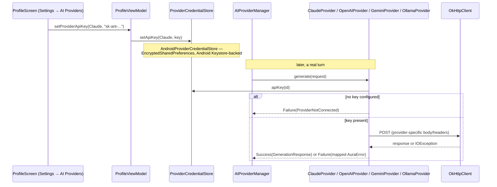

# AURA AI — AI Provider Integration

Version 1.0 Critical item 2.1 ([TODO_V1.md §2.1](TODO_V1.md#21-ai-provider-integration)): replacing
`ScaffoldAIProvider`'s honest `AuraError.ProviderNotConnected` with real network calls for four of
the five providers `AIProviderManager` already knew about. Nothing above `core-providers` changed —
`AIProvider`, `AIProviderManager`, `GenerationRequest`/`GenerationResponse`, and every caller in
core-planner/core-agents/the runtime pipeline are exactly as Phase 3–8 left them. This phase's own
code is entirely inside `core-providers` (the HTTP transport) and `:app` (credentials, DI, Settings
UI) — the seam every earlier phase's docs said this would be.

---

## 1. What's real now, and what's still scaffolded

| Provider | Transport | Auth | Status |
|---|---|---|---|
| `ClaudeProvider` | Anthropic Messages API, SSE streaming | `x-api-key` header | **Real** |
| `OpenAIProvider` | Chat Completions API, SSE streaming | `Authorization: Bearer` header | **Real** |
| `GeminiProvider` | `generateContent` / `streamGenerateContent` (`alt=sse`) | `key` query parameter | **Real** |
| `OllamaProvider` | Self-hosted `/api/chat`, newline-delimited JSON streaming | none — local server | **Real** |
| `LocalModelProvider` | — | — | Still `ScaffoldAIProvider` — see [TODO_V1.md §3](TODO_V1.md#3-high--expected-soon-after-10-not-blocking-it) item 2.11. On-device inference (MediaPipe/ONNX bundling a model file) is a different kind of work than an HTTP client and was deliberately not folded into this estimate. |

Every real provider still returns `AuraError.ProviderNotConnected` — honestly — when no API key is
configured. The scaffold's core promise ("never fake a result") didn't change; only the condition
under which a real call is *attempted* did.

---

## 2. Request flow

---

## 3. `ProviderCredentialStore` — the seam that keeps core-providers pure Kotlin/JVM

`core-providers` cannot read Android's encrypted storage directly (it's a `kotlin.jvm` module, not
`android.library` — deliberately, since nothing else about it needs Android). The same
interface-plus-honest-default-plus-real-app-impl pattern every other phase in this codebase has used
(`PermissionChecker`, `NetworkStatusProvider`, `BatteryStatusProvider` in core-reasoning) applies
here too:

- **`ProviderCredentialStore`** (core-providers) — `apiKey`/`setApiKey`/`baseUrlOverride`/
  `setBaseUrlOverride`, all suspend. `NoOpProviderCredentialStore` is the honest default (every key
  always absent) for any future pure-JVM test or tool that constructs a provider without the app's
  DI graph.
- **`AndroidProviderCredentialStore`** (`:app`) — the real implementation, backed by Jetpack
  Security's `EncryptedSharedPreferences` (AES256-GCM master key, AES256-SIV key encryption,
  AES256-GCM value encryption — the same defaults Google's own EncryptedSharedPreferences samples
  use). A **separate** preference file (`aura_provider_credentials`) from
  `PreferencesRepositoryImpl`'s plaintext `aura_user_preferences` — API keys never share a file with
  non-secret settings like theme or assistant voice.

Base URLs live in the same store as keys (`baseUrlOverride`/`setBaseUrlOverride`) since both answer
"how do I reach this provider" for the same five provider ids — introducing a second abstraction
just to separate "secret" from "not secret, but related" would be the kind of premature split this
codebase's own conventions argue against. In practice only Ollama's Settings row exposes a base-url
field (`ProfileScreen.kt`) — a cloud provider's endpoint isn't meant to be user-editable, so nothing
in the UI offers it, even though the store's API supports it generically.

---

## 4. Error mapping — one place, shared by all four providers

`ProviderHttpErrors` (`core-providers/ProviderHttpSupport.kt`) is the single function every HTTP-
backed provider calls to turn a transport-level failure into the closed `AuraError` set the rest of
the platform already knows how to handle (`ReasoningEngine`'s alternatives/recovery-plan machinery
from Phase 5, `ConversationPipeline`'s fallback-response building from Phase 8 — see
[EXECUTION_TRACE.md](EXECUTION_TRACE.md) — both already correctly handle `ProviderNotConnected`
without any change needed here):

| HTTP status | `AuraError` |
|---|---|
| 401, 403 | `Authentication` |
| 429 | `RateLimited` (with `retryAfterMillis` parsed from the `retry-after` header, when present) |
| other 4xx | `InvalidRequest` (first 300 chars of the response body included, for debugging) |
| 5xx | `ProviderUnavailable` |
| thrown `IOException` (timeout, DNS failure, connection refused) | `Network` |
| no API key configured | `ProviderNotConnected` (unchanged from the scaffold) |

`ProviderHttpErrors`, the shared lenient `Json` codec (`providerJson`), and the
`ToolDescriptor.toJsonSchemaParameters()`/`JsonObject.toStringArgumentMap()` helpers are the only
code shared across all four providers — everything else (message-role mapping, streaming event
shape, response parsing) is provider-specific because the four APIs' schemas genuinely don't agree
with each other beyond that.

---

## 5. Security

- **`INTERNET`** was missing from `AndroidManifest.xml` entirely before this phase (every previous
  phase correctly never needed it) — now declared.
- **`network_security_config.xml`** permits cleartext traffic to exactly `localhost`, `127.0.0.1`,
  and `10.0.2.2` (the emulator's alias for the host machine) — for `OllamaProvider` only, which is
  the one provider genuinely expected to run over plain HTTP. Every other domain still requires
  HTTPS, unchanged from the platform default. **Known limitation:** a user pointing Ollama at a real
  LAN address (e.g. `192.168.1.50`) via the Settings base-url override will hit Android's default
  cleartext block, since Android's `network-security-config` only matches exact domains, not IP
  ranges — documented here rather than silently broadened, since permitting cleartext to *any*
  address would defeat the point of scoping this at all.
- API keys are encrypted at rest (§3) but travel in-memory as plain `String`s while a request is in
  flight, same as any HTTP client — no different from how any other mobile app handles this.
- Base URLs are not treated as secret (they're not), only credentials are.

---

## 6. Testing

`core-providers/src/test` (new — the first test source set in the entire project; see
[TODO_V1.md §2.7](TODO_V1.md#27-testing)) covers all four providers against a real
`okhttp3.mockwebserver.MockWebServer`, not mocked HTTP internals — request shape (headers, auth
placement), success-path response parsing, and every row of the error-mapping table in §4, plus a
dedicated suite for the shared `ProviderHttpErrors`/JSON-schema/argument-map helpers in isolation.

The one testability seam added deliberately: each of `ClaudeProvider`/`OpenAIProvider`/
`GeminiProvider` exposes `internal var apiBaseUrl`, defaulted to the real endpoint. This is a
property, not a constructor parameter — Dagger's generated constructor call ignores Kotlin default
argument values entirely, so a constructor parameter with a default would force either an
unqualified (dangerously ambiguous) `String` binding into the Hilt graph or a dedicated qualifier
for a value nothing in production ever actually needs to inject. A settable `internal` property,
visible to `core-providers`' own test source set via the Kotlin Gradle plugin's automatic
main→test friend-path, avoids touching the DI graph at all. `OllamaProvider` needed no such seam —
its base URL was already a real, user-facing `ProviderCredentialStore` field.

The same default-value trap applied to `@IoDispatcher CoroutineDispatcher` (all four providers run
their network call via `withContext(ioDispatcher)`) — solved the conventional way instead, with a
proper qualifier annotation (`core-providers.IoDispatcher`) and a `@Provides` binding in `:app`'s
`CoroutineModule`, exactly like the existing `@ApplicationScope` qualifier for `CoroutineScope`.

---

## 7. Settings UI

`ProfileScreen.kt`, Settings sub-tab → "AI Providers" section: one card per provider
(`ProviderSettingsRow`), showing connection state (`AIProvider.isAvailable()`), an editable API-key
field for the three cloud providers, an editable base-URL field for Ollama only, and a way to select
the active provider (`AIProviderManager.selectProvider`). `LocalModelProvider`'s card intentionally
has no input at all — there is nothing to configure yet. Credential/base-url writes bump a
`refreshTick` counter (`ProfileViewModel`) to force the row list to re-derive, since
`ProviderCredentialStore` is a plain suspend get/set, not a reactive store — there is nothing else
that would tell the UI a provider's connection state may have just changed.

---

## 8. What this phase deliberately did not touch

- `LocalModelProvider` — remains scaffolded; see §1.
- `AIProviderManager`'s `selectProvider`/`activeProvider` logic — unchanged; still defaults to
  Gemini if bound, otherwise the first provider in the set.
- `ConversationPipeline`/`PlanExecutor` — Phase 8's provider-not-connected fallback handling already
  worked correctly against the scaffold and needed no change to keep working correctly against a
  real, live `ProviderNotConnected`/`Authentication`/`RateLimited` failure.
- No prompt engineering, system-prompt tuning, or model-selection UI beyond the hardcoded model name
  per provider (`claude-sonnet-5`, `gpt-4o-mini`, `gemini-2.0-flash`, `llama3.2`) — out of scope for
  "integrate the transport," tracked separately if it becomes its own item.
