# AURA AI — Android Automation

Version 1.0 Critical item 3 ([TODO_V1.md §2.3](TODO_V1.md#23-android-automation)): expanding the
existing `Tool`/`ActionEngine` system (unchanged in shape — see `docs/PLATFORM_REVIEW.md`) with
real OS-level capabilities, plus the one genuinely new piece of infrastructure this milestone
needed: a confirmation gate for tools too sensitive to run autonomously.

---

## 1. What's new

Eight new tools, all registered the same way every tool since Phase 3 has been — one `@Binds
@IntoSet` line in `AiToolsModule` — no change to `Tool`, `ToolRegistry`, `ActionEngine`'s shape,
`core-planner`, or anything upstream of `core-actions`/`:app`:

| Tool | What it does | Lives in | `requiresConfirmation` |
|---|---|---|---|
| `open_settings` | Opens a system Settings screen (Wi-Fi, Bluetooth, display, this app's own page, …) | core-actions | No — navigation only |
| `clipboard` | Reads or writes the system clipboard | core-actions | No |
| `share` | Opens the Android share sheet | core-actions | No — user still picks a target |
| `file_search` | Searches the `Downloads` collection by filename | core-actions | No — read-only |
| `media_control` | Play/pause/next/previous/stop via a synthetic media-button event | core-actions | No |
| `schedule_action` | Runs any other tool once, later, via WorkManager | core-actions | **Yes** |
| `read_screen` | Reads visible on-screen text via `AuraAccessibilityService` | `:app` | **Yes** |
| `device_navigate` | Presses back/home/recents via `AuraAccessibilityService` | `:app` | No |

`open_app`, `set_reminder`, `app_automation`, and the other seven tools from Phase 3 are
unchanged.

---

## 2. Confirmation gate

```mermaid
flowchart TD
    A["Tool.requiresConfirmation"] -->|false, the default| B["ActionEngine.execute()<br/>(reasoning/agent/plan pipeline)"]
    A -->|true| C{Which call site?}
    C -->|execute&#40;&#41;| D["Refused — AuraError.NotSupported,<br/>tool never runs"]
    C -->|executeConfirmed&#40;&#41;| E["Runs — reached only from<br/>a direct UI tap"]
```

`Tool.requiresConfirmation` (default `false`, so every tool written before this milestone keeps
its exact prior behavior) marks a tool too sensitive to run unattended.
`ActionEngine.execute()` — the one method `ConversationPipeline`/`PlanExecutor`/every agent has
ever called — now refuses those tools outright. `ActionEngine.executeConfirmed()` is new: it
bypasses the gate, and is called from exactly one place in this codebase —
`AutomateViewModel.runQuickAction`, itself reachable only from a direct button tap in the
Automate tab's "Quick Actions" row. The tap *is* the confirmation; there's no separate approval
dialog to build or maintain.

`schedule_action` is marked `requiresConfirmation = true` deliberately: running something later,
unattended, with no one watching, is a materially different risk than an immediate action the
user sees and can undo. Its own `DeferredActionWorker` still calls `ActionEngine.execute()` (not
`executeConfirmed`) when the scheduled time arrives — so scheduling a tool that itself requires
confirmation correctly still fails at execution time. Deferring cannot be used to route around the
gate.

---

## 3. WorkManager

The first WorkManager usage in this project. `DeferredActionTool` enqueues a `OneTimeWorkRequest`
carrying a tool name and its arguments (as two parallel string arrays — `Data` has no native map
type); `DeferredActionWorker` (`@HiltWorker`) reconstructs the call and runs it through
`ActionEngine.execute()` when WorkManager fires it. `AuraApplication` now implements
`Configuration.Provider`, supplying `HiltWorkerFactory` so a `@HiltWorker` class can receive
Dagger-provided dependencies (`ActionEngine`) — the manifest's default, zero-argument
`WorkManagerInitializer` is removed (`tools:node="remove"`) so this custom configuration is the
one that actually initializes WorkManager, not raced against.

Deliberately narrow scope: this is "run one tool once, later" — not a recurring, triggered,
conditional workflow. That's Milestone 4 ([TODO_V1.md §2.6](TODO_V1.md#26-workflow-engine)), a
distinct and larger subsystem that can build on this same WorkManager plumbing rather than
duplicating it.

---

## 4. Accessibility — what's real and what's deliberately not

`AuraAccessibilityService` is real but narrow: it reads the visible screen's text
(`onAccessibilityEvent` walking `rootInActiveWindow`) and can dispatch exactly three global system
actions (back/home/recents). It does **not** dispatch gestures or simulate taps/typing in other
apps' UI — the highest-risk, hardest-to-verify-safe capability an `AccessibilityService` can have,
and this environment has no physical device to verify it against. The same "implement what's
verifiable, document what isn't" judgment call as acoustic voice barge-in in
`docs/VOICE_RUNTIME.md` §3.

Disabled until the user explicitly enables it in system Accessibility settings — it cannot be
requested via the normal runtime-permission dialog. `ProfileScreen`'s Settings → Automation
section carries an explicit disclosure card (what the service does and doesn't do) before sending
the user to system settings, satisfying "require confirmation before a sensitive action" for the
one action in this milestone that's actually irreversible-ish (a system-level grant, not just an
in-app one) rather than building a bespoke in-app confirmation dialog for something the OS itself
already gates behind its own settings screen.

`read_screen` is `requiresConfirmation = true` (on-screen content can be anything the user is
currently looking at); `device_navigate` is not (plain navigation).

---

## 5. A build-stability issue found and fixed along the way

Adding WorkManager surfaced a real, if obscure, dependency-resolution problem: `androidx.work`
transitively requires a newer Room than this project's prior pin (2.6.1), silently resolving Room
up to 2.8.4 — and Room 2.8.4's schema-bundle (de)serialization uses kotlinx-serialization
internally, at a version that kept drifting between the `:app` debug and release `kspXxxKotlin`
tasks' processor classpaths. The symptom: `AbstractMethodError` deep inside
`androidx.room.migration.bundle.*$$serializer` reading a schema JSON file written by a
differently-resolved KSP run. Two real fixes, not workarounds:

1. Bumped the project's own `room` version pin to `2.8.4` — matching what was actually resolving,
   so the declared version is truthful.
2. Aligned `kotlinx-serialization-json` to `1.8.1` (Room 2.8.4's own requirement) instead of the
   `1.7.3` picked in `docs/AI_PROVIDER_INTEGRATION.md` — verified compatible with this project's
   pinned Kotlin 2.1.0 (`1.8.1`'s own `kotlin-stdlib` requirement is `2.1.20`, same metadata-format
   line).

Even after both fixes, one cross-variant flake persisted (debug-written schema, release-read
mismatch). Given this project has no Room migrations yet — one schema version, seeded fresh on
every install — `exportSchema` was set to `false` on `AuraDatabase`, removing the entire
schema-bundle read/write path rather than continuing to chase KSP-classpath version drift. Real
migrations, when they're actually needed, are the point to revisit this.

Also found: `assembleRelease` had never been run in this project before this milestone (every
prior phase and milestone verified `assembleDebug`). It failed on R8 minification — Google Tink
(behind `androidx.security.crypto`'s `EncryptedSharedPreferences`, from
`docs/AI_PROVIDER_INTEGRATION.md`) references `com.google.errorprone.annotations.*`, compile-time-only
annotations R8 doesn't need to keep. Fixed with the exact `-dontwarn` rules Android Gradle Plugin
itself generated into `missing_rules.txt` — a well-documented, standard fix for this specific
Tink/R8 interaction, not a suppressed real risk.

---

## 6. Testing

`core-actions/src/test` (new — this module's first test source set): 5 tests for
`DefaultActionEngine`'s confirmation gate — a tool that requires confirmation is refused by
`execute()` and never actually invoked, verified by asserting on a recording fake `Tool`, not just
the returned `AuraResult`; the same tool runs fine through `executeConfirmed()`; an unregistered
tool name fails honestly through either path.

The eight new tools themselves are almost entirely thin wrappers around Android framework APIs
(`PackageManager`, `ClipboardManager`, `MediaStore`, `AudioManager`, `WorkManager`,
`AccessibilityService`) with no meaningful behavior to verify without a real device or Robolectric
— deferred to Milestone 6 (Testing), same reasoning as `docs/VOICE_RUNTIME.md` §6.
