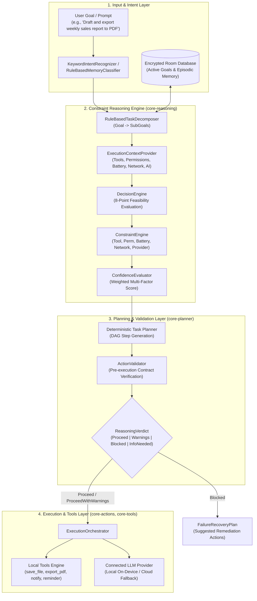

# AuraAI System Architecture

AuraAI is an autonomous, on-device AI agent for Android. It operates with local-first intent recognition, task decomposition, constraint evaluation, deterministic execution planning, and privacy-preserving memory storage.

---

## 1. High-Level Architectural Flow



---

## 2. Module Topology & Dependency Structure

AuraAI strictly enforces clean architecture with unidirectional dependency flow across pure Kotlin JVM core libraries and Android UI/platform modules:

```text
AuraAI/
├── app/                      # Android Application entry point & Jetpack Compose UI
├── core-orchestrator/        # End-to-end task execution pipeline coordinator
├── core-reasoning/           # Pure Kotlin JVM Constraint Reasoning Engine
├── core-planner/             # Pure Kotlin JVM DAG Execution Planner
├── core-intent/              # Intent classification and entity extraction
├── core-capabilities/        # System capability resolution & permission discovery
├── core-tools/               # Built-in local tool implementations (PDF, Files, Calendar)
├── core-memory/              # Room database & memory embedding repository
├── core-providers/           # AI provider contracts & multi-model adapters
├── core-ai/                  # Core Result types (AuraResult) & data models
└── plugin-runtime/           # Dynamic plugin loading & sandbox execution
```

---

## 3. Constraint Evaluation Taxonomy

Before any plan is executed, the `ConstraintEngine` evaluates 5 orthogonal constraint dimensions:

| Constraint Type | Check Source | Failure Handling | Verdict Impact |
| :--- | :--- | :--- | :--- |
| **Tool Availability** | `ExecutionContext.hasTool(name)` | Tool must be registered in the local runtime. | **Hard Blocker** (`ReasoningVerdict.Blocked`) |
| **Android Permissions** | `ExecutionContext.permissionState` | Required Android runtime permissions (e.g. `RECORD_AUDIO`, `CAMERA`). | **Hard Blocker** (`ReasoningVerdict.Blocked`) |
| **Network Connectivity** | `ExecutionContext.isOnline` | Evaluated only when sub-goals explicitly require internet access. | **Warning / Degraded** (`ProceedWithWarnings`) |
| **Battery Constraint** | `ExecutionContext.isBatteryConstrained` | Battery $\le 15\%$ and not actively charging triggers deferral of heavy tasks. | **Warning / Degraded** (`ProceedWithWarnings`) |
| **AI Provider** | `ExecutionContext.aiProviderAvailable` | Validates connected model backend when generation is required. | **Warning / Alternative Plan** |

---

## 4. Failure Recovery & Graceful Degradation

When constraints fail or goals are ambiguous, the engine never crashes or fails silently. It constructs an actionable `FailureRecoveryPlan` with `RecoveryAction` objects:

1. **Missing Permissions**: Generates actionable prompts directing the user to grant specific Android runtime permissions.
2. **Offline with AI Sub-Goals**: Emits an `AlternativePlan` that executes local steps (e.g., document parsing, file exporting) while inserting editable placeholders for AI-generated text.
3. **Vague Goals**: Categorizes 1-word inputs (`"help"`, `"fix"`) into `ReasoningVerdict.NeedsMoreInformation` to solicit clarification.

---

## 5. On-Device Performance Profile

Because the reasoning and planning layers (`core-reasoning`, `core-planner`) are built as pure, zero-reflection Kotlin JVM libraries, constraint evaluation overhead is negligible on mobile hardware:

* **Evaluation Latency**: $< 0.1\text{ ms}$ ($< 100\ \mu\text{s}$) average per goal evaluation.
* **Throughput**: $> 15,000\text{ evaluations/sec}$ on modern mobile chipsets.
* **Memory Footprint**: Transient object allocations bounded to immutable data classes, collected in Generation 0 garbage collection without UI frame drops.
