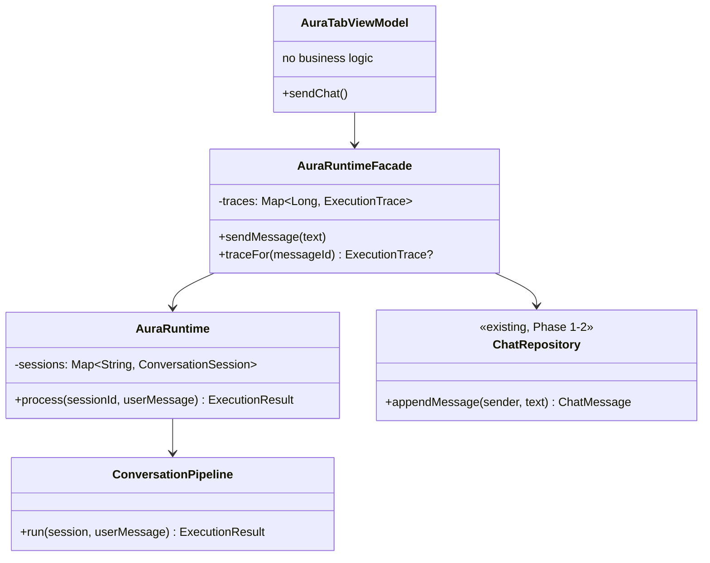

# AURA AI — Phase 8: The AURA Runtime

**What this phase is:** the wiring that makes the platform review's own top finding stop being
true — `AuraTabViewModel.sendChat()` no longer returns a canned string; it runs every real message
through the actual platform built across Phases 3–7. **What this phase is not:** new
capability. No new agent, tool, reasoning rule, or provider was written — every step of the flow
below calls something that already existed; this phase's own code is sequencing and response
formatting, nothing else.

Companion documents: **[RUNTIME_PIPELINE.md](RUNTIME_PIPELINE.md)** (the full 15-stage flow, and
why several of its stages are sub-steps of `ReasoningEngine` rather than separate calls),
**[CONVERSATION_PIPELINE.md](CONVERSATION_PIPELINE.md)** (the algorithm itself, traced through
both of the brief's worked examples against the real code), **[EXECUTION_TRACE.md](EXECUTION_TRACE.md)**
(everything developer mode can see).

---

## 1. Three layers, three responsibilities



Each layer answers one question, and only one:

| Layer | Answers | Depends on |
|---|---|---|
| `ConversationPipeline` | "What does the platform do with this message?" — stateless, the entire Phase 3–7 stack | 9 existing core interfaces, `PlanExecutor` |
| `AuraRuntime` | "Which conversation is this?" — session lifecycle | `ConversationPipeline` only |
| `AuraRuntimeFacade` | "How does this reach the app's existing chat history and developer-mode UI?" | `AuraRuntime`, `ChatRepository` |
| `AuraTabViewModel` | "What does the screen show right now?" — pure state shaping | `AuraRuntimeFacade`, `ChatRepository`, `MemoryRepository` |

None of the three new runtime types has an interface — each is a single concrete
`@Singleton class X @Inject constructor(...)`, the same shape `PlanExecutor` itself has always
had. No new Hilt module was needed; Dagger injects them exactly like it already injected
`PlanExecutor`.

---

## 2. What `AuraTabViewModel` no longer does

Before this phase:

```kotlin
fun sendChat() {
    ...
    viewModelScope.launch { chatRepository.appendMessage(MessageSender.User, text); isTyping.value = true }
    replyJob = viewModelScope.launch {
        delay(1500)
        chatRepository.appendMessage(MessageSender.Ai, CANNED_REPLY)
        isTyping.value = false
    }
}
```

After:

```kotlin
fun sendChat() {
    val text = chatInput.value.trim()
    if (text.isEmpty()) return
    savedStateHandle[KEY_CHAT_INPUT] = ""
    replyJob?.cancel()
    isTyping.value = true
    replyJob = viewModelScope.launch {
        auraRuntimeFacade.sendMessage(text)
        isTyping.value = false
    }
}
```

`sendMessage` does everything `sendChat()` used to do inline (append the user's message, produce
and append the reply) — the difference is *what* produces the reply. Every other `AuraTabViewModel`
method (`setSub`, `onOrbTap`, `forgetMemory`, the developer-mode toggle) was already, and remains,
pure state-shaping — relaying one user action to one repository call and letting `combine()`
project the result into `AuraTabUiState`. "No business logic" was already true of those; it's now
true of `sendChat()` too.

---

## 3. What changed in the existing app layer, and why

Two small, necessary changes to Phase 1–2 code, both additive to what already worked:

- **`ChatRepository.appendMessage` now returns the persisted `ChatMessage`** (previously `Unit`).
  Developer mode needs to associate a trace with the *exact* message it explains — the assistant
  message's real, database-assigned id — and there was no way to get that back before. Only three
  files referenced the old signature (the interface, its one implementation, and
  `AuraTabViewModel` itself, already being rewritten this phase), so this was a safe,
  fully-contained change.
- **`ChatMessageDao.insert` now returns the generated row id** (`Long`, via Room's standard
  auto-return-generated-id behavior) instead of `Unit` — the mechanism the above relies on.

Nothing about Room's schema, `ChatMessageEntity`, or any other repository changed.

---

## 4. What's still honestly not connected

This phase integrates the runtime; it does not connect a cloud provider. Every `AIProvider` this
codebase ships remains `ScaffoldAIProvider`-based, exactly as every phase since Phase 3 left it —
seen and handled correctly by the pipeline (see [RUNTIME_PIPELINE.md](RUNTIME_PIPELINE.md) §4 and
[CONVERSATION_PIPELINE.md](CONVERSATION_PIPELINE.md) §3 for exactly how "provider required, not
connected" becomes an honest, explained response instead of a silent failure or a fabricated one).

`plugin-marketplace`'s `install`/`checkForUpdates` remain unconnected for the same reason
(`docs/PLUGIN_SDK.md`). Persistence of `core-memory`'s stores and `core-plugin`'s storage/settings
remains in-memory-only (`docs/PLATFORM_REVIEW.md`, Finding 5) — this phase did not change that;
developer-mode traces are deliberately in-memory too, for the same "ephemeral debugging aid"
reasoning.
