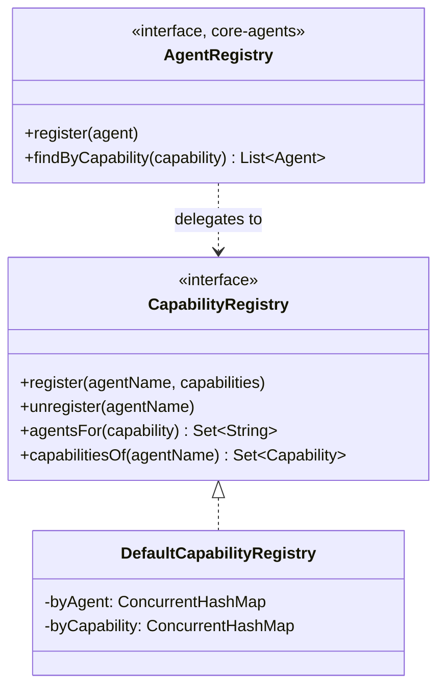
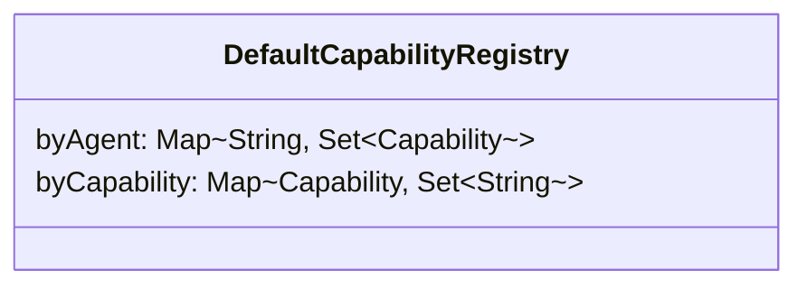
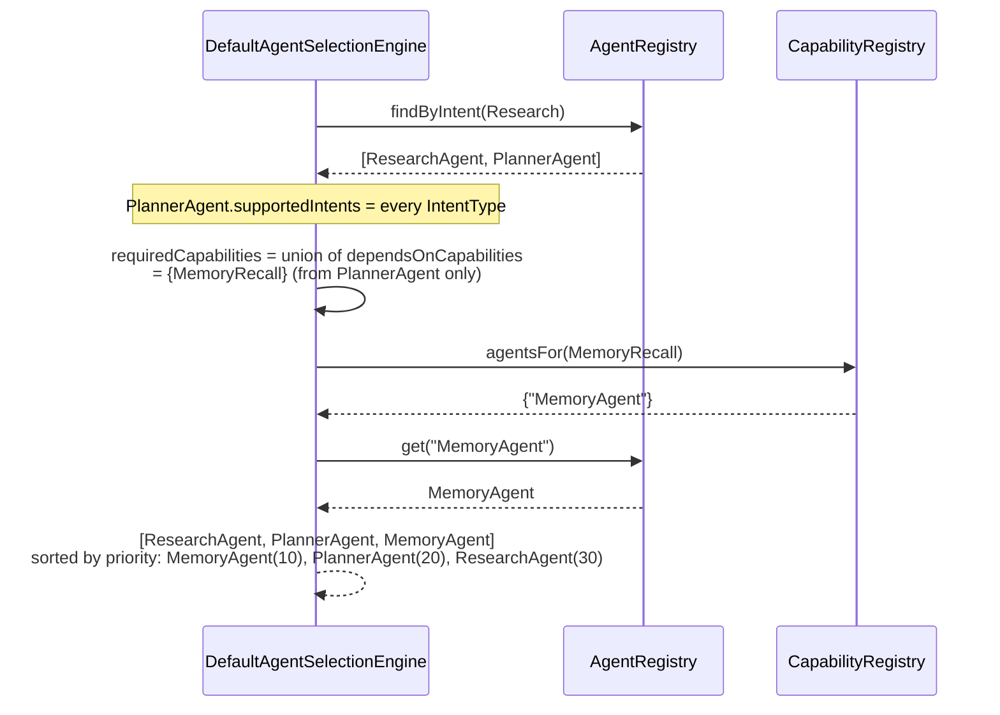

# AURA AI — Capability Registry

The bidirectional index between agents and what they can do, and the mechanism that lets
`AgentSelectionEngine` pull in agents an intent match alone would never reach. See
[AGENT_SYSTEM.md §3](AGENT_SYSTEM.md#3-the-9-agents) for which agents provide which capabilities
and [ORCHESTRATOR.md §1](ORCHESTRATOR.md#1-agentselectionengine--which-agents-are-needed) for how
selection consumes this registry.

---

## 1. `Capability`

```kotlin
enum class Capability {
    GoalPlanning, MemoryRecall, MemoryStorage, WebSearch, CodeGeneration, CodeReview,
    CalendarManagement, DeviceAutomation, ShoppingSearch, VisionAnalysis, Notification,
}
```

A fixed, closed vocabulary — every value here is one this phase's 9 agents genuinely provide or
depend on, nothing speculative. `core-capabilities` depends on nothing (not even `core-ai`),
matching `core-events`'s own reasoning: a shared vocabulary module has to sit below everything
that uses it.

---

## 2. `CapabilityRegistry` — distinct from `AgentRegistry` on purpose



`CapabilityRegistry` only ever deals in **names** (`String`) and `Capability` values — it has
never seen a full `Agent` object and never will. `AgentRegistry` (in `core-agents`) is the one
that knows about real `Agent` instances, their tools, their permissions; `DefaultAgentRegistry.register`
calls `capabilityRegistry.register(agent.name, agent.capabilities)` as its very next line, keeping
the two in sync in exactly one place.

This split matters for `core-orchestrator`: `AgentSelectionEngine` needs to resolve "which agent
names provide capability X" without needing the full weight of `core-agents`' `Agent` interface
for that specific question — it asks `CapabilityRegistry` first, and only calls
`AgentRegistry.get(name)` once it already knows which names it wants.



Two `ConcurrentHashMap`s, one the inverse of the other — `register` populates both, `unregister`
clears an agent out of both. `agentsFor`/`capabilitiesOf` are both O(1).

---

## 3. Worked example: how `MemoryAgent` gets selected

`MemoryAgent.supportedIntents` is honestly empty (see [AGENT_SYSTEM.md](AGENT_SYSTEM.md)) — no
`IntentType` maps to "recall memory" as a primary intent. Without capability-based resolution,
`MemoryAgent` could never run. Here's what actually happens for goal `"Research quantum
entanglement"` (`intent.type = Research`):



`ResearchAgent` matches `Research` directly. `PlannerAgent` matches *every* intent (it's the
universal fallback — see [AGENT_SYSTEM.md](AGENT_SYSTEM.md)) and declares
`dependsOnCapabilities = {MemoryRecall}`. That single declaration is what pulls `MemoryAgent` into
every orchestration pass, regardless of intent — not a special case for memory, just the general
capability-closure rule applied once.

---

## 4. Why this is a distinct module, not a package inside `core-agents`

Keeping `core-capabilities` fully independent of `core-agents` means the vocabulary of *what
AURA can do* is decoupled from the vocabulary of *which class does it*. `core-orchestrator`'s
`AgentSelectionEngine` reasons about capabilities before it ever needs to touch a concrete `Agent`
instance, and a future consumer that wants to ask "can AURA currently do X" (a settings screen
listing active capabilities, say) can depend on `core-capabilities` alone without pulling in the
entire agent framework.
