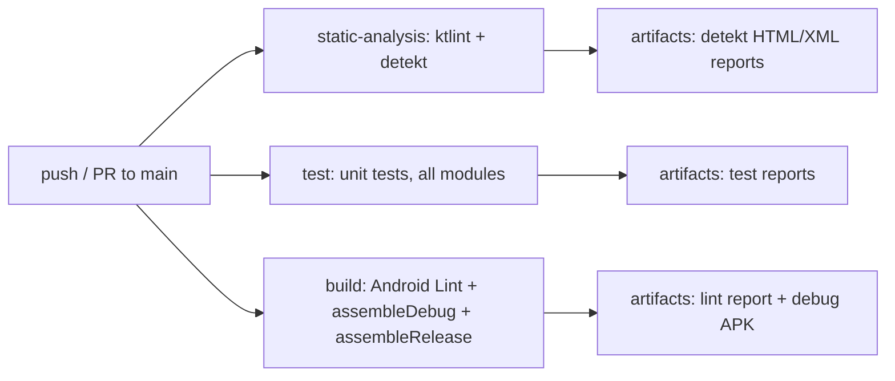

# AURA AI — CI/CD

Critical item 8/10 toward Version 1.0 ([TODO_V1.md §2.8](TODO_V1.md#28-cicd)): "GitHub Actions,
Build verification, Lint, Detekt, Ktlint, Test execution, Release pipeline."

---

## 1. What exists now

A ready-to-use GitHub Actions workflow, `.github/workflows/ci.yml`, with three jobs — static
analysis (ktlint + detekt), unit tests, and build (Android Lint + `assembleDebug` +
`assembleRelease`) — running in parallel on every push/PR to `main`, plus manual dispatch.

Two real static-analysis tools were added this milestone, not just referenced hypothetically:
`org.jlleitschuh.gradle.ktlint` and `io.gitlab.arturbosch.detekt`, applied to all 18 modules from
the root `build.gradle.kts`'s `subprojects {}` block — one place to configure, matching how the
version catalog itself is already structured.

---

## 2. Introducing ktlint/detekt to ~8 milestones of pre-existing code

Running a linter for the first time against a codebase this size doesn't start from zero — it
starts from however many violations eight milestones of code never had a chance to be checked
against. Two different strategies were used, matched to what each tool actually does:

- **ktlint is auto-fixing.** `./gradlew ktlintFormat` was run once, across every module, and fixed
  every formatting violation it could (trailing commas, multi-line constructor/lambda formatting,
  and so on) automatically. The two violations it *couldn't* auto-fix were both the same real
  pattern — `core-events.DefaultEventBus` and `core-plugin.DefaultPluginEventBus` each named their
  backing `MutableSharedFlow` field `_events`, but exposed it through a *function* `events()`
  (required by the `EventBus`/`PluginEventBus` interfaces), not a matching `val events` property —
  which is outside ktlint's `backing-property-naming` rule's pattern. Fixed by renaming the field
  to `mutableEvents` in both files; zero behavior change. `.editorconfig` (new, repo root) also
  configures two project-specific, defensible rule adjustments: `@Composable` functions are
  correctly exempted from lowercase-function-name checking (`ktlint_function_naming_ignore_when_annotated_with = Composable`
  — Compose's own naming convention, not a violation), and `max_line_length` is disabled rather
  than reflowing this codebase's already-established, prose-dense KDoc comment style across dozens
  of files for no functional benefit.
- **detekt is not auto-fixing** — most of what it finds (complexity, code smells, naming) needs a
  human judgment call, not a mechanical rewrite. Rather than either skipping detekt entirely or
  spending days retroactively fixing ~460 pre-existing findings across 18 modules that were never
  checked against it, detekt's own supported mechanism for exactly this situation was used: a
  per-module baseline (`config/detekt/baseline-<module>.xml`, generated once via
  `./gradlew detektBaseline`) grandfathers every finding that already existed, while `detekt` still
  fails on any **new** finding introduced from this point forward. This is the standard way
  detekt is meant to be adopted into an existing codebase — not a workaround.

`config/detekt/detekt.yml` makes three small, documented rule adjustments on top of detekt's
default ruleset (`buildUponDefaultConfig = true`): `MagicNumber` disabled (pervasive and harmless
in UI/design-system code — padding, sizes, alpha values), `LongParameterList`'s constructor
threshold raised to 8 (several `Agent`/`ViewModel` constructors legitimately take that many
Hilt-injected collaborators), and KDoc-coverage enforcement left off (this codebase documents the
*why*, not every public symbol, by deliberate convention).

---

## 3. The one genuine blocker: this repository has no remote

Git was only initialized locally, this session (`docs/TODO_V1.md` §0) — there is no GitHub (or
any) remote configured, confirmed via `git remote -v` returning nothing. A CI provider needs
somewhere to actually run: pushing this workflow file doesn't make it execute anywhere until the
repository is hosted somewhere Actions can attach to. That's the one piece of this item that's
genuinely the user's own decision, not an engineering gap — the brief itself names exactly this
class of thing as a reason to stop and flag rather than guess ("Play Store account configuration,"
by direct analogy): does this go to a public or private GitHub repository, under which account/
organization, and would the user like it pushed now or later.

Everything that doesn't depend on that decision is done: the workflow file is real, complete, and
was verified by running the equivalent command sequence locally
(`ktlintCheck detekt test lintDebug assembleDebug assembleRelease`, all in one pass) rather than
only trusting the YAML would work.

---

## 4. Verification

`./gradlew ktlintCheck detekt test lintDebug assembleDebug assembleRelease` — the same sequence of
checks `ci.yml`'s three jobs run — succeeds end-to-end in a single invocation: ktlint clean (0
violations across all 18 modules), detekt clean against its baselines (0 new findings), all tests
passing, Android Lint 0 errors (85 pre-existing warnings, unchanged from before this milestone),
and both `assembleDebug` and `assembleRelease` (R8 minification included) succeeding.
