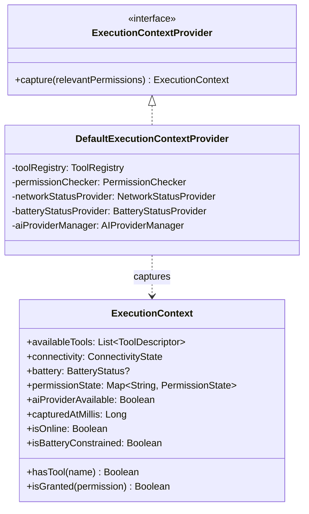
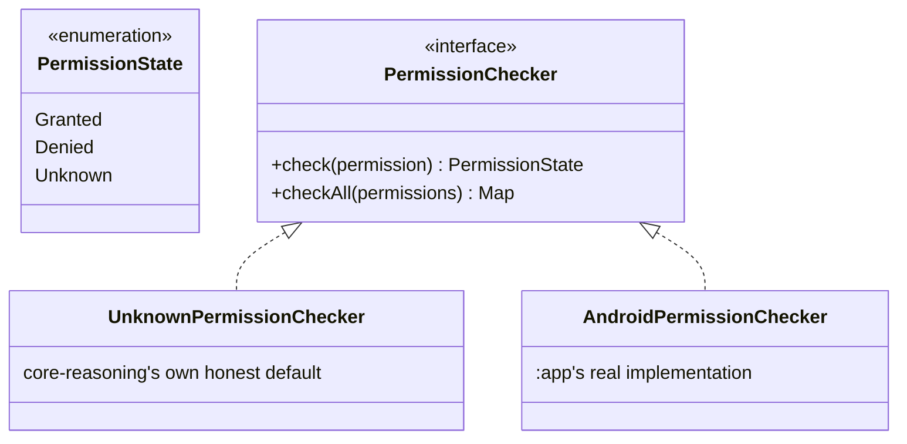
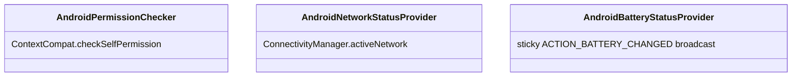
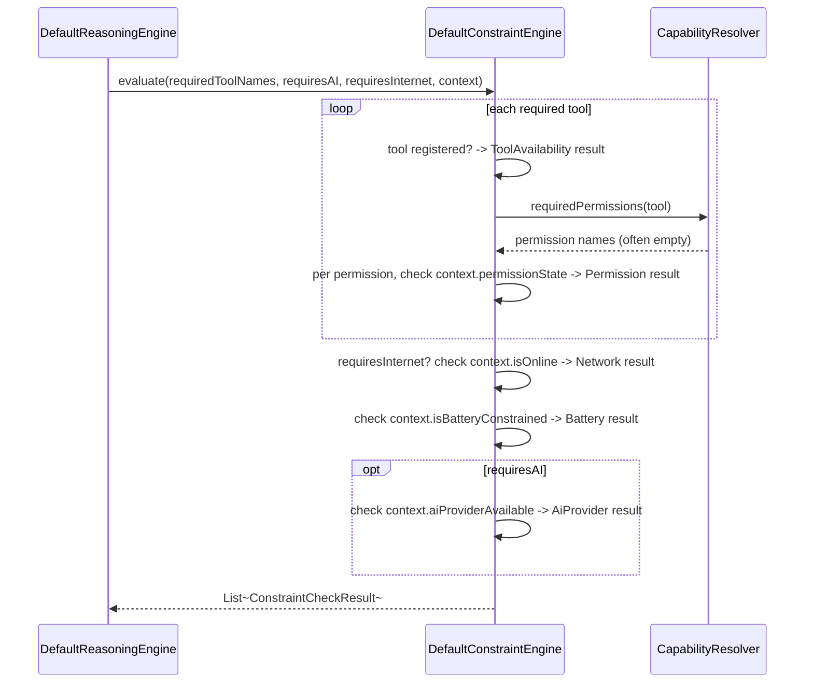
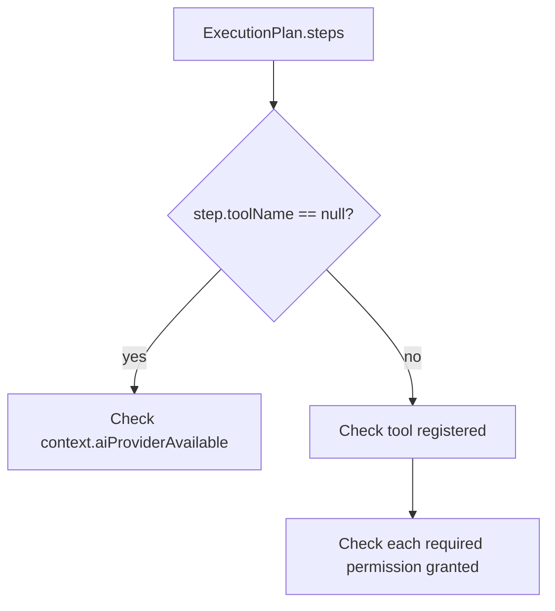

# AURA AI — Constraint Engine

Everything about checking reasoning's conclusions against reality: `ExecutionContext`, permission/
network/battery awareness, `CapabilityResolver`, `ConstraintEngine`, and `ActionValidator`. See
[REASONING_ENGINE.md](REASONING_ENGINE.md) for how this fits the full pass and
[DECISION_ENGINE.md](DECISION_ENGINE.md) for how `CapabilityResolver` feeds the 8 decisions.

---

## 1. `ExecutionContext` — one snapshot, read everywhere

Captured exactly once per `ReasoningEngine.reason` call, then threaded read-only through
`DecisionEngine`, `ConstraintEngine`, and `ActionValidator` — every decision in one reasoning pass
is judged against the same facts, even if the device's real state changes mid-call.
`relevantPermissions` is supplied by the caller (in practice, `CapabilityResolver`'s answer for
this specific goal's implied tools) rather than checked exhaustively — no reason to ask about
`READ_CONTACTS` for a goal that will never touch a contacts-reading tool.

---

## 2. The permission and network maps

`CapabilityResolver` is the one place that knows what each registered tool actually needs — a
hand-maintained mirror of what core-actions' `Tool` implementations do, verified against their
actual source, not guessed:

| Tool | Permission needed | Network needed | Why |
|---|---|---|---|
| `open_app` | None | No | Launches an installed app via `Intent` |
| `set_reminder` | None | No | Inexact `AlarmManager.set()` needs no special permission |
| `create_calendar_event` | None | No | `ACTION_INSERT` hands the write to the Calendar app itself |
| `navigate` | None | Yes | Opens a maps app via `geo:` URI; needs connectivity to actually route |
| `compose_email` | None | No | `ACTION_SENDTO` hands off to the mail app |
| `web_search` | None | Yes | Opens a browser search |
| `shopping_search` | None | Yes | Opens a browser search |
| `notify` | `POST_NOTIFICATIONS` | No | The one tool that posts directly rather than handing off |
| `export_pdf` | None | No | Writes to the app's own cache directory |
| `save_file` | None | No | Writes to the app's own internal storage |
| `app_automation` | None | No | Toggles an already-persisted app-owned device/automation |

Exactly **one** of AURA's 11 registered tools needs a runtime permission. This isn't an
approximation — every intent-handoff tool needs nothing because the *other* app performs the
actual write after the user reviews it there, and both storage tools write to the app's own
private, unrestricted storage. A future tool with a real requirement adds one line to
`DefaultCapabilityResolver`'s maps; nothing downstream changes, since every consumer reads through
the `CapabilityResolver` interface.

---

## 3. `PermissionState`, and why `Unknown` is not `Denied`

`core-reasoning` is pure Kotlin/JVM — it has no `Context`, so it cannot itself call
`ContextCompat.checkSelfPermission`. `UnknownPermissionChecker` (the module's own default) is
honest about that: every permission comes back `Unknown`, not a guessed `Granted` or `Denied` —
the same honesty convention `core-memory`'s `NoOpEmbeddingProvider` established for embeddings.
`NetworkStatusProvider`/`ConnectivityState` and `BatteryStatusProvider`/`BatteryStatus?` follow the
identical shape: an `Unknown` connectivity state, a `null` battery status.

Everywhere a permission's state is checked (`DecisionEngine.missingPermissions`,
`ConstraintEngine`, `ActionValidator`), `Unknown` is treated exactly like `Denied` for the purpose
of "is this available" — this module never claims something is available unless it's positively
confirmed — but the two remain distinct *values* so a caller (or a future UI) can tell "I checked
and it's off" apart from "I couldn't check," which call for different responses (the first needs a
permission request; the second needs a working checker).

---

## 4. The real Android-backed implementations

Unlike embeddings or AI providers, permission/network/battery checking needs no cloud connection —
it's plain, already-buildable Android capability. This phase ships real implementations for all
three, bound at the `:app` layer (the one place in this codebase allowed to hold a `Context`,
alongside `core-actions`):

| Class | Reads | Notes |
|---|---|---|
| `AndroidPermissionChecker` | `ContextCompat.checkSelfPermission` | Always returns `Granted` or `Denied` — a live check is definitive, never `Unknown` |
| `AndroidNetworkStatusProvider` | `ConnectivityManager.activeNetwork` + `NetworkCapabilities` | Requires `NET_CAPABILITY_INTERNET` and `NET_CAPABILITY_VALIDATED`; needs only the normal, install-time `ACCESS_NETWORK_STATE` permission |
| `AndroidBatteryStatusProvider` | The sticky `ACTION_BATTERY_CHANGED` broadcast (registering a `null` receiver returns it synchronously) | Same data source as `com.aura.ai.core.util.rememberBatteryState`'s Home/Profile battery UI, read as a plain function rather than a `@Composable`; `isLow` at ≤20% |

These can't live *inside* `core-reasoning` (it's deliberately Android-free), so `:app`'s new
`AiReasoningModule` is the one place that binds `PermissionChecker`/`NetworkStatusProvider`/
`BatteryStatusProvider` to these real classes instead of core-reasoning's own `Unknown*` defaults
— the same "interface in a pure core module, real implementation wired at the composition root"
pattern `core-actions`' tools and `core-providers`' `AIProvider`s already use.

---

## 5. `ConstraintEngine` — pre-plan checking

Every `ConstraintCheckResult.detail` is written to be used directly as a `ReasoningTrace` reason —
this is where "Storage available," "PDF exporter registered," and "No network required" actually
get produced, matching the brief's own trace example verbatim in the common case (no permission
needed, tool registered, no network required).

## 6. Action Validator — post-plan checking

`ConstraintEngine` judges the *goal*, before `Planner` has run. `ActionValidator` judges the
*actual* `ExecutionPlan` that comes back, step by step — the two can disagree: a goal that looked
entirely local can still produce a plan with a step that needs a tool this device doesn't have
registered, and that's exactly the gap `ActionValidator` exists to catch.

---

## 7. Failure recovery planning

Every unsatisfied `ConstraintCheckResult` (from either `ConstraintEngine` or `ActionValidator`)
becomes exactly one `RecoveryAction` in `ReasoningOutcome.recoveryPlan`:

| Constraint type | Recovery action | Actionable? |
|---|---|---|
| `Permission` | "Grant the missing permission: \<name\>." | ✅ Yes — the user can do this right now |
| `Network` | "Reconnect to the internet and try again." | ✅ Yes |
| `Battery` | "Charge the device before running battery-intensive steps." | ✅ Yes |
| `AiProvider` | "Connect an AI provider once one is available." | ❌ No — none is functional yet in this build |
| `ToolAvailability` | "Register a tool that can handle: \<description\>." | ❌ No — out of the user's hands |

`actionable` is kept distinct so a future UI knows what to offer as a button (grant a permission,
reconnect Wi-Fi) versus what to just explain (no tool exists yet, no provider is connected) —
honest about which gaps this phase can actually ask the user to close today.
