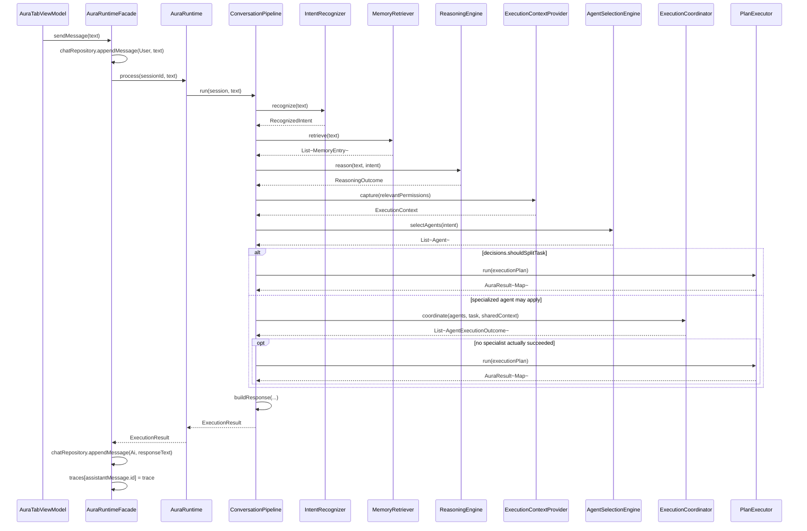
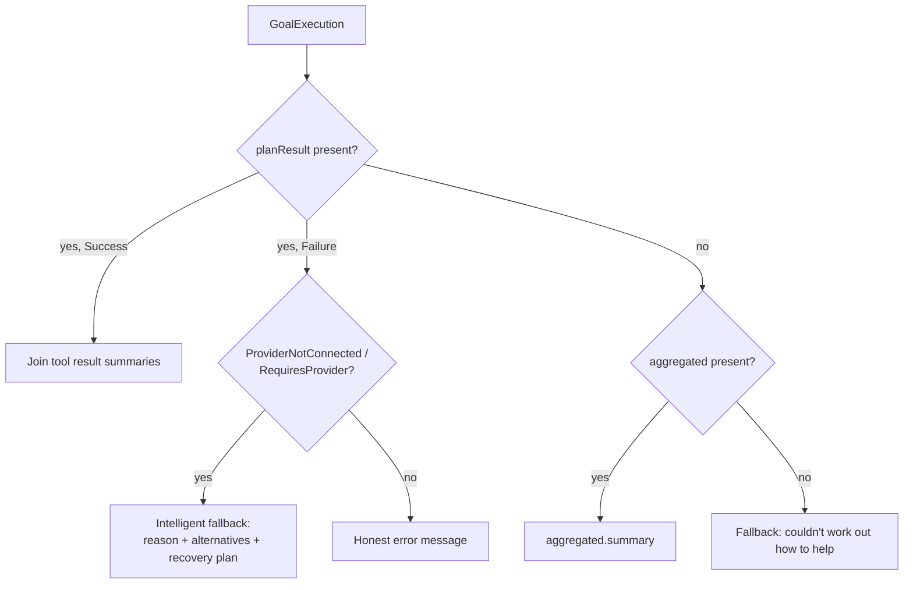

# AURA AI — Conversation Pipeline

`ConversationPipeline.run(session, userMessage): ExecutionResult` in full, including both of the
brief's own worked examples traced by hand against the real code — not a simplified
approximation of what happens, the literal sequence. See [RUNTIME_PIPELINE.md](RUNTIME_PIPELINE.md)
for how each stage maps to an existing subsystem and [EXECUTION_TRACE.md](EXECUTION_TRACE.md) for
what every field mentioned below means.

---

## 1. The full sequence

---

## 2. Choosing how the goal actually gets carried out

`executeGoal` is the one place this phase's own logic decides *how* a `ReasoningOutcome` becomes
real action, using two facts that were already true before this phase existed:

1. `com.aura.ai.core.agents.impl.*` only has real, tool-executing agents for 4 of `IntentType`'s
   10 values: `Research` (`ResearchAgent`), `Calendar` (`CalendarAgent`), `Automation`
   (`AutomationAgent`), `Shopping` (`ShoppingAgent`). Every other intent's selection resolves to
   `PlannerAgent` (which only *generates* a plan) plus `MemoryAgent` (which only gathers context)
   — real, correct behavior from Phase 6, just not by itself a way to *do* anything.
2. `com.aura.ai.ai.PlanExecutor` (Phase 3) already knows how to run any `ExecutionPlan` — tool
   steps through `ActionEngine`, no-tool steps through `AIProviderManager` — including the
   document-creation shape (`research → generate → export → save → notify`) it was written for.

So: a multi-step plan (`decisions.shouldSplitTask`) always runs through `PlanExecutor` directly.
A single-step goal runs through the agent system first; only if *no* specialized agent actually
succeeded (meaning nothing beyond planning happened) does the pipeline fall back to
`PlanExecutor` for that one step. This is what stops `"research something"` from opening two
browser searches (`ResearchAgent`'s own, and `PlanExecutor`'s if it ran too) while still making
`"open Spotify"` actually open Spotify, despite no `OpenAppAgent` existing.

---

## 3. Worked example: `"Open Spotify"` — no provider required

| Stage | What actually happens |
|---|---|
| Intent | `KeywordIntentRecognizer` matches `"open "` → `IntentType.OpenApp`, slot `appName = "Spotify"` |
| Memory | `MemoryRetriever.retrieve` → no related memories (nothing stored yet) |
| Reasoning | `shouldSplitTask = false`, `requiresAI = false`, `executionPlan` = 1 step: `open_app("Spotify")` |
| Agent selection | `[MemoryAgent, PlannerAgent]` — no agent declares `OpenApp` in `supportedIntents` |
| Execution | Both agents run (`MemoryAgent`: no memories; `PlannerAgent`: regenerates the same plan) — neither is a specialist, so `PlanExecutor.run(executionPlan)` runs instead |
| Tool | `ActionEngine.execute("open_app", {"appName": "Spotify"})` → `OpenAppTool` launches the app for real |
| Provider | Never consulted — the plan has no step with a `null` tool |
| Response | `"Opened Spotify."` |

Exactly the brief's own shape: Reasoning → (effectively) Automation-class handling → `open_app`
Tool → Done, with zero calls to `AIProviderManager` anywhere in the trace.

---

## 4. Worked example: `"research and write my AIML assignment"` — provider required

(The brief's own phrasing, `"Write my AIML assignment"`, classifies as `Conversation` under the
real `KeywordIntentRecognizer` — no trigger phrase matches "write my AIML assignment" alone — and
correctly falls to a single conversational sub-goal rather than the document pipeline, since
`TemplatePlanner`'s/`RuleBasedTaskDecomposer`'s document-creation detection requires *both* a
document keyword and a plausible intent (`Research`/`Coding`/`Unknown`). Adding "research" is
what makes intent classification agree with the brief's own narrative — traced here so every
stage in the brief's illustration is genuinely exercised, not just the "provider not connected"
ending.)

| Stage | What actually happens |
|---|---|
| Intent | `"research"` matches → `IntentType.Research` |
| Reasoning | `"assignment"` matches a document keyword *and* `Research` is a plausible document-creation intent → `shouldSplitTask = true`, 5-step plan: `web_search → (generate, no tool) → export_pdf → save_file → notify` |
| Agent selection | `[MemoryAgent, PlannerAgent, ResearchAgent]` — computed regardless of execution path, so it's still in the trace |
| Execution | `shouldSplitTask = true` → straight to `PlanExecutor.run(executionPlan)`, no agents actually invoked this turn |
| Step 1 | `web_search` runs for real — a genuine browser search opens |
| Step 2 | No tool → `AIProviderManager.generate(...)` → every provider is `ScaffoldAIProvider`-based → `AuraError.ProviderNotConnected` |
| `PlanExecutor` | Stops immediately (steps 3–5 depend on step 2's output, which doesn't exist) — returns `AuraResult.Failure(ProviderNotConnected)` |
| Response Builder | Detects `ProviderNotConnected` specifically → builds the fallback below |

**Response:** *"That needs a connected AI provider, which isn't set up yet. Produce the local
steps only (research, export, save, notify) and leave the AI-generated content as a placeholder
for the user to fill in. Connect an AI provider once one is available — none is functional yet in
this build."*

Every sentence of that fallback is an existing field, not new text generation:
`ReasoningOutcome.alternatives.first().description` and
`ReasoningOutcome.recoveryPlan.actions.first().description` — both computed by `ReasoningEngine`
back in Phase 5, specifically for this situation, and never actually surfaced to a user until this
phase gave them somewhere to go.

---

## 5. Response Builder priority

`planResult` (a concrete, tool-level outcome) is always preferred over `aggregated` (an agent's
own self-reported summary) when both could apply, since it's the more literal description of what
happened. The very last branch (`"I wasn't able to work out how to help with that"`) is reachable
only if `ReasoningEngine.reason` itself failed outright — a case honest enough to name, never
observed in practice during this phase's own verification.
