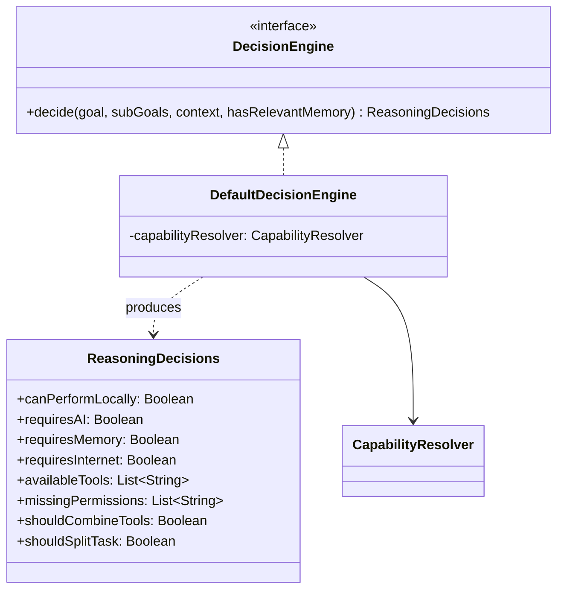
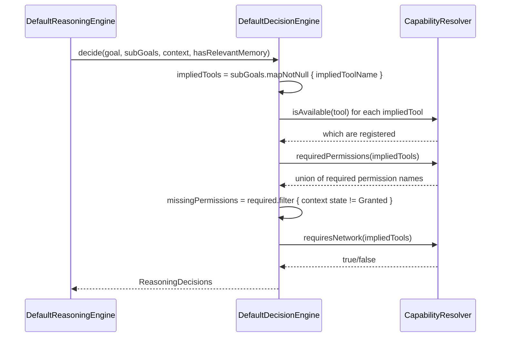

# AURA AI — Decision Engine

The literal center of Phase 5: `DefaultDecisionEngine.decide` answers all 8 questions the brief
requires in one call. This document is the field-by-field reference; see
[EXECUTION_FLOW.md](EXECUTION_FLOW.md) for how `ReasoningEngine` calls it as part of a full
reasoning pass, and [REASONING_ENGINE.md](REASONING_ENGINE.md) for the module map these types live in.

---

## 1. Inputs and output



`decide` is a plain (non-suspending) function — everything it needs (the goal's `SubGoal`
breakdown, a captured `ExecutionContext`, whether `GoalManager` found relevant memory) is already
computed by the time `DefaultReasoningEngine` calls it. See
[GOAL_DECOMPOSITION.md](GOAL_DECOMPOSITION.md) for where `SubGoal`s come from and
[CONSTRAINT_ENGINE.md](CONSTRAINT_ENGINE.md) for `ExecutionContext`.

---

## 2. The 8 questions, one at a time

### "Can Android perform this?" → `canPerformLocally`

```kotlin
canPerformLocally = subGoals.none { it.requiresAI }
```

True only if every sub-goal either has a local tool or needs no tool at all. A goal that
decomposes into "research → generate → export → save → notify" is **not** fully local — the
"generate" sub-goal has no local tool, so `canPerformLocally` is `false` even though 4 of 5
sub-goals are perfectly local.

### "Does this require AI?" → `requiresAI`

```kotlin
requiresAI = subGoals.any { it.requiresAI }
```

The exact inverse condition, checked with `any` instead of `none` — both fields are always exact
opposites of each other by construction, kept as two separate fields anyway because the brief
asks two separate questions and a caller (or the trace) should be able to name which one it's
answering.

### "Does this require memory?" → `requiresMemory`

```kotlin
requiresMemory = hasRelevantMemory || mentionsPersonalContext(goal)
```

True if `GoalManager` already found relevant memory for this goal (see
[GOAL_DECOMPOSITION.md](GOAL_DECOMPOSITION.md)), **or** if the goal's own wording implies personal
context regardless of whether anything was found — `" my "`, `" i "`, `" i'm "`, `" me "`,
`" mine "`, `" our "`. That second half matters: a goal like "what's my exam date?" clearly
*needs* memory even if `GoalManager` came back empty — and a caller needs to see that gap (see
`ReasoningTrace`'s "Determine missing information" stage), not have `requiresMemory` silently
report `false` just because nothing was found.

### "Does this require internet?" → `requiresInternet`

```kotlin
requiresInternet = capabilityResolver.requiresNetwork(impliedTools)
```

True if any tool implied by this goal's sub-goals needs live connectivity. `CapabilityResolver`'s
own hand-maintained map is the source of truth here — see
[CONSTRAINT_ENGINE.md §2](CONSTRAINT_ENGINE.md#2-the-permission-and-network-maps) for exactly
which of AURA's 11 registered tools need it (`web_search`, `shopping_search`, `navigate` — 3 of 11).

### "Which tools are available?" → `availableTools`

```kotlin
availableTools = impliedTools.filter { capabilityResolver.isAvailable(it) }
```

The names of tools this goal's sub-goals imply *and* that are actually registered right now —
not every tool AURA could theoretically use, only the ones this specific goal cares about.

### "Which permissions are missing?" → `missingPermissions`

```kotlin
val required = capabilityResolver.requiredPermissions(impliedTools)
missingPermissions = required.filter { context.permissionState[it] != PermissionState.Granted }
```

Deliberately conservative: a permission whose state is [`PermissionState.Unknown`][unknown] (not
just confirmed [`Denied`][denied]) still counts as "missing" — this module never claims something
is available unless it's positively confirmed. See
[CONSTRAINT_ENGINE.md §3](CONSTRAINT_ENGINE.md#3-permissionstate-and-why-unknown-is-not-denied)
for why `Unknown` and `Denied` are kept as distinct states throughout core-reasoning even though
both fail this check the same way.

[unknown]: CONSTRAINT_ENGINE.md#3-permissionstate-and-why-unknown-is-not-denied
[denied]: CONSTRAINT_ENGINE.md#3-permissionstate-and-why-unknown-is-not-denied

### "Should multiple tools be combined?" → `shouldCombineTools`

```kotlin
shouldCombineTools = availableTools.size > 1
```

True when satisfying this goal is expected to invoke more than one distinct registered tool — the
document pipeline (`web_search` + `export_pdf` + `save_file` + `notify`, 4 distinct tools) combines
tools; "open Spotify" (`open_app`, 1 tool) doesn't.

### "Should the task be split?" → `shouldSplitTask`

```kotlin
shouldSplitTask = subGoals.size > 1
```

True whenever `TaskDecomposer` produced more than one `SubGoal`. Distinct from
`shouldCombineTools` on purpose: a goal could split into multiple sub-goals that all end up using
the *same* tool (not combining), or stay a single sub-goal that still needs no tool combination.
The document-creation pipeline happens to trigger both at once, but the two questions are asking
different things and can disagree.

---

## 3. Sequence



---

## 4. Confidence scoring

`ConfidenceEvaluator` runs immediately after `DecisionEngine`, combining 4 independent sub-scores
into one `ConfidenceScore.overall` — the brief's "confidence scoring" requirement:

| Sub-score | Weight | What it measures |
|---|---|---|
| `intentConfidence` | 0.30 | How sure `IntentRecognizer` was about what the user meant (passed straight through from `RecognizedIntent.confidence`) |
| `toolCoverageConfidence` | 0.30 | What fraction of this goal's `SubGoal`s resolved to a real local tool (`!requiresAI`) |
| `constraintConfidence` | 0.25 | What fraction of `ConstraintEngine`'s checks came back satisfied |
| `memoryConfidence` | 0.15 | `1.0` if memory wasn't needed, or was needed and found; `0.3` if needed and not found |

```kotlin
overall = intentConfidence * 0.30 + toolCoverage * 0.30 + constraintScore * 0.25 + memoryScore * 0.15
```

Each sub-score stays on the `ConfidenceScore` record — the same "show your work" philosophy as
`core-memory`'s `ScoredMemory` — so a caller (or the trace) can say *why* confidence was low, not
just that it was. `ConfidenceScore.isConfident` is a convenience threshold at `overall >= 0.5`,
not itself a hard gate on anything — `ReasoningVerdict` is driven by the trace's blockers and
warnings (see [EXECUTION_FLOW.md](EXECUTION_FLOW.md)), not by confidence directly.
