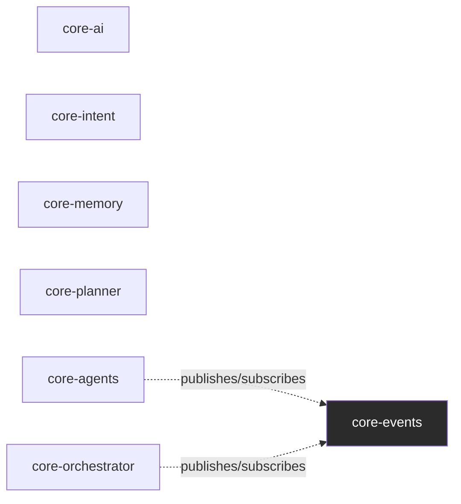
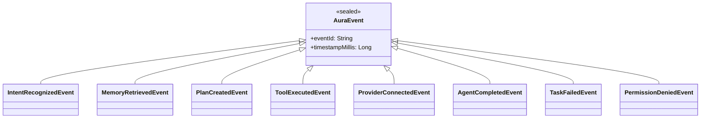
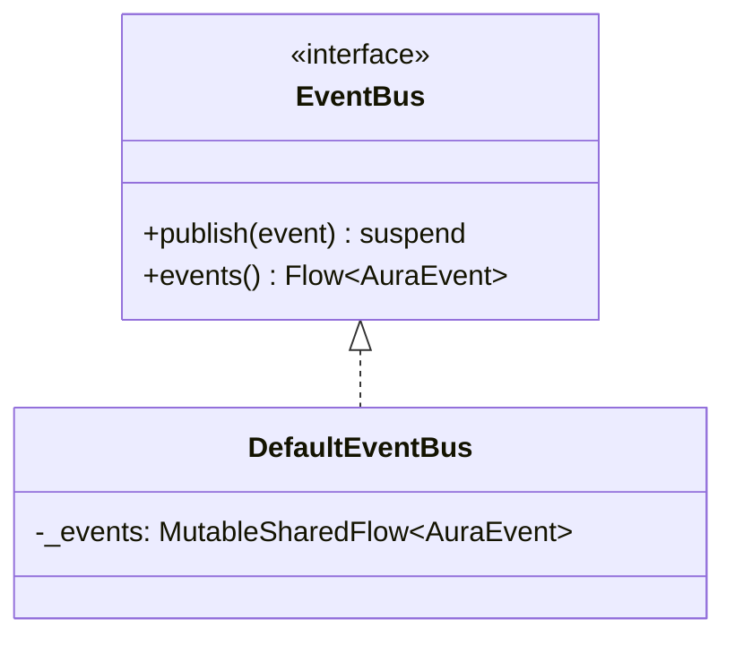
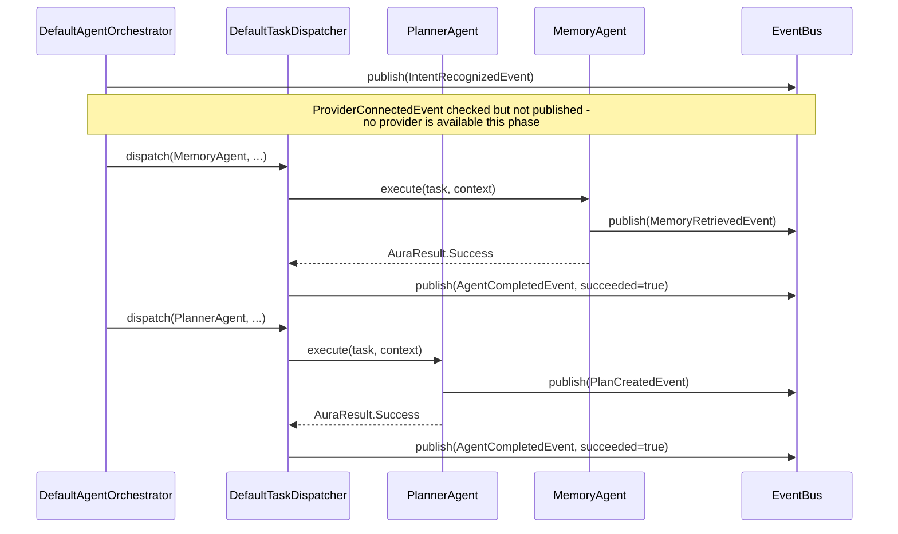

# AURA AI — Event Bus

The internal pub/sub channel — "every module communicates using events" — and the second of the
brief's two sanctioned inter-agent channels alongside `SharedContext` (see
[AGENT_SYSTEM.md §6](AGENT_SYSTEM.md#6-no-agent-depends-on-another-agent)).

---

## 1. Why `core-events` has zero dependencies



Every event carries only primitive data — `String`, `Int`, `Float`, `Boolean` — never a rich type
from another module (no `RecognizedIntent`, no `MemoryEntry`, no `ExecutionPlan` on the wire).
That's a deliberate constraint, not an oversight: if `MemoryRetrievedEvent` carried a
`List<MemoryEntry>`, `core-events` would have to depend on `core-memory`, and every other module
that wants to *publish* an event would need a dependency on whatever type it's reporting on.
Keeping events primitive-only is what lets `core-events` sit at the very bottom of the dependency
graph — genuinely dependency-free, not even depending on `core-ai` — and be safe for every other
module in this codebase to depend on without ever risking a cycle.

---

## 2. `AuraEvent` — the 8 events



| Event | Published by | Meaning |
|---|---|---|
| `IntentRecognizedEvent` | `DefaultAgentOrchestrator` | An utterance was classified — the first event of every orchestration pass |
| `MemoryRetrievedEvent` | `MemoryAgent` | A memory lookup ran |
| `PlanCreatedEvent` | `PlannerAgent` | `Planner` produced an `ExecutionPlan` |
| `ToolExecutedEvent` | `ToolBackedAgent.runTool` | A `core-tools.Tool` ran to completion, success or failure |
| `ProviderConnectedEvent` | `DefaultAgentOrchestrator` | An `AIProvider` became usable — defined for completeness; never fires this phase (see §4) |
| `AgentCompletedEvent` | `DefaultTaskDispatcher` | One agent finished a task, success or failure |
| `TaskFailedEvent` | `DefaultTaskDispatcher`, `CodingAgent`, `VisionAgent` | A task did not succeed, after retries |
| `PermissionDeniedEvent` | `DefaultTaskDispatcher` | An agent needs a permission that isn't confirmed granted |

`eventId`/`timestampMillis` live on the sealed base class, not duplicated into each subtype's own
`data class` fields — two events with identical content published at different times are still
"the same fact" for equality purposes, which only matters if something ever compares two `AuraEvent`
instances directly (nothing does yet, but keeping identity metadata out of `equals()` is the
correct default regardless).

---

## 3. `EventBus`



`DefaultEventBus` wraps one `MutableSharedFlow<AuraEvent>`:

- **`replay = 0`** — a live bus, not a log. A subscriber only sees events published after it
  starts collecting; nothing is buffered for late subscribers.
- **`extraBufferCapacity = 128`, `onBufferOverflow = DROP_OLDEST`** — publishing never suspends
  waiting for a slow subscriber. A burst of events from a parallel `ExecutionCoordinator` wave
  (several agents publishing `ToolExecutedEvent` at once) can't stall the agent that published
  them; a subscriber that falls far enough behind loses the oldest buffered events rather than
  backpressuring the publisher. An event bus for coordination/telemetry should never be able to
  stall the thing it's observing.

```kotlin
inline fun <reified T : AuraEvent> EventBus.on(): Flow<T> = events().filterIsInstance()
```

The common case — subscribe to exactly one event type — without every call site writing its own
`events().filterIsInstance<T>()`.

---

## 4. Sequence: one orchestration pass, every event it produces



Two publishing conventions, kept consistent everywhere: **agent-specific/domain events**
(`MemoryRetrievedEvent`, `PlanCreatedEvent`, `ToolExecutedEvent`) are published by the agent that
has the detail to report — only the agent making the call knows the tool name or memory count at
the moment it happens. **Orchestration-lifecycle events** (`AgentCompletedEvent`, `TaskFailedEvent`,
`PermissionDeniedEvent`, `IntentRecognizedEvent`) are published by the orchestrator layer
(`DefaultTaskDispatcher`, `DefaultAgentOrchestrator`), since they're about the *coordination*, not
about what any one agent did internally.

`ProviderConnectedEvent` is the one event with a check already wired but no path to actually
firing yet: `DefaultAgentOrchestrator` checks `activeProvider.value.isAvailable()` on every
`orchestrate` call, but every `AIProvider` this codebase ships is `ScaffoldAIProvider`-based and
`isAvailable()` always returns `false`. The day a real provider is connected, this event starts
firing with zero further code changes — the same "seam is real, connection isn't" honesty every
phase since Phase 3 has kept.
