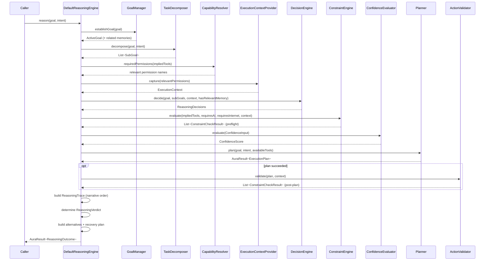
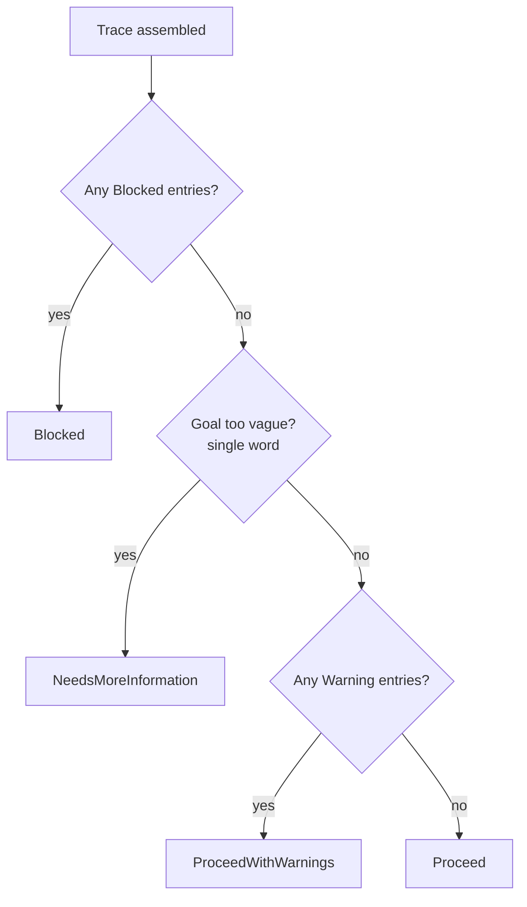

# AURA AI — Execution Flow

The full path through `ReasoningEngine.reason`, and the brief's own worked example — "Create my
AIML assignment and save it as PDF" — traced stage by stage with the literal trace lines it
produces. See [REASONING_ENGINE.md](REASONING_ENGINE.md) for the module map,
[DECISION_ENGINE.md](DECISION_ENGINE.md) and [GOAL_DECOMPOSITION.md](GOAL_DECOMPOSITION.md) for
the stages this document only summarizes, and [CONSTRAINT_ENGINE.md](CONSTRAINT_ENGINE.md) for
what each constraint check actually verifies.

---

## 1. Full sequence

Every stage after "understand the goal" reads state computed by an earlier stage — `ExecutionContext`
is captured only once `TaskDecomposer` has revealed which tools/permissions are actually relevant,
`DecisionEngine` reads that context, `ConstraintEngine` reads `DecisionEngine`'s conclusions, and so
on — so nothing downstream can contradict a fact an earlier stage already established.

---

## 2. Worked example, traced end to end

**Input:** `"Create my AIML assignment and save it as PDF"`, with `intent.type = Research` (or
`Unknown`) from `IntentRecognizer` — either is a "plausible intent" for document-creation
detection (see [GOAL_DECOMPOSITION.md](GOAL_DECOMPOSITION.md)).

### Stage 1 — Understand goal

`GoalManager.establishGoal` retrieves related memory. Assume none exists yet for this example.

> **Reason:** Goal understood: "Create my AIML assignment and save it as PDF". No related memories found.

### Stage 2 — Determine missing information

The goal mentions "my" (personal context), so `DecisionEngine` sets `requiresMemory = true`; no
related memory was found in Stage 1.

> **Reason:** This goal references personal context, but no related memory was found — some information may be missing.

*(This is a [`TraceOutcome.Warning`](DECISION_ENGINE.md), not a blocker — the goal is specific
enough to decompose and plan regardless.)*

### Stage 3 — Research required?

`TaskDecomposer` recognizes "assignment" as a document keyword and produces the 5-step pipeline
(see [GOAL_DECOMPOSITION.md §3](GOAL_DECOMPOSITION.md#3-two-decomposition-shapes)). Sub-goal 1 is
`web_search`.

> **Reason:** Research required — the plan includes a web search step.

### Stage 4 — AI generation required?

Sub-goal 2 ("Generate the content") has no implied tool — `requiresAI = true`.

> **Reason:** AI required because request needs content generation.

Followed immediately by a provider-availability check (no provider is connected in this phase —
see [REASONING_ENGINE.md §5](REASONING_ENGINE.md#5-whats-real-vs-scaffolded)):

> **Reason:** No AI provider is currently connected — steps that need generation will fail until one is.

*(A [`TraceOutcome.Warning`](DECISION_ENGINE.md) — this is what degrades the final verdict to
`ProceedWithWarnings` rather than `Proceed`.)*

### Stage 5 — Export required?

Sub-goal 3 is `export_pdf`.

> **Reason:** Export required — the plan includes an export step.

### Stage 6 — Storage permission?

`CapabilityResolver.requiredPermissions(["export_pdf", "save_file"])` returns an empty list (see
[CONSTRAINT_ENGINE.md §2](CONSTRAINT_ENGINE.md#2-the-permission-and-network-maps)).

> **Reason:** Storage available — no permission is required; files are written to the app's own private storage.

*(This is the brief's own example line, produced exactly.)*

### Supporting checks

`ConstraintEngine` also reports, alongside the narrative stages above:

> **Reason:** PDF exporter registered.
>
> **Reason:** file saver registered.
>
> **Reason:** web search registered.
>
> **Reason:** notifier registered.
>
> **Reason:** This goal needs network access, but the device is offline (or connectivity is unknown).
>
> **Reason:** Battery is sufficient (100%).

*(The network line depends on the device's actual state at call time — `web_search` needs
connectivity, per [CONSTRAINT_ENGINE.md §2](CONSTRAINT_ENGINE.md#2-the-permission-and-network-maps);
shown here as "offline or unknown" since that's what `core-reasoning`'s own defaults report before
`:app`'s real `AndroidNetworkStatusProvider` is in the loop — see
[REASONING_ENGINE.md §5](REASONING_ENGINE.md#5-whats-real-vs-scaffolded).)*

### Stage 7 — Generate execution plan

`Planner.plan` (Phase 3's `TemplatePlanner`) is invoked with the goal, intent, and every currently
registered tool. It recognizes the same document-creation shape independently (see
[GOAL_DECOMPOSITION.md §2](GOAL_DECOMPOSITION.md#2-taskdecomposer--should-the-task-be-split)) and
returns its own 5-step `ExecutionPlan`.

> **Reason:** Execution plan generated with 5 step(s).

### Plan validation

`ActionValidator` checks the actual plan against the same `ExecutionContext`. Step 2 ("Generate
the content") has `toolName = null`:

> **Reason:** Step 2 ("Generate the content") has no local tool and no AI provider is connected — it will fail until one is.

*(Every other step passes — `web_search`, `export_pdf`, `save_file`, and `notify` are all
registered with no missing permissions.)*

### Outcome

No entry in this trace is `Blocked` (every tool is registered, no permission is missing) — but two
are `Warning` (no AI provider connected; the plan-validation gap on step 2). The goal itself is 8
words, not vague.

**Verdict: `ProceedWithWarnings`.**

`ReasoningOutcome` for this example also carries:

- **`alternatives`**: one `AlternativePlan` — "produce the local steps only (research, export,
  save, notify) and leave the AI-generated content as a placeholder for the user to fill in,"
  tradeoff "no AI-written content until a provider is connected."
- **`recoveryPlan`**: one `RecoveryAction` — "Connect an AI provider once one is available — none
  is functional yet in this build," `actionable = false` (see
  [CONSTRAINT_ENGINE.md §7](CONSTRAINT_ENGINE.md#7-failure-recovery-planning)).
- **`executionPlan`**: the real 5-step `ExecutionPlan` from `Planner` — steps 1, 3, 4, and 5 will
  run successfully today; step 2 will fail with `AuraError.RequiresProvider` until an AI provider
  is connected, exactly as Phase 3's own `TemplatePlanner` documentation always said it would.

This is the honest end state Phase 5 is meant to produce: a real, runnable plan, a clear
explanation of the one part that can't run yet, and a concrete alternative and recovery path for
that gap — not a refusal, and not a plan that silently pretends the gap doesn't exist.
