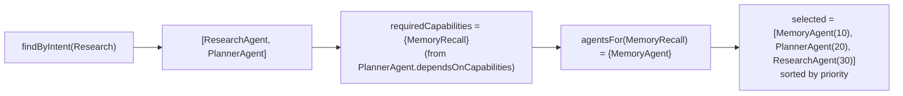
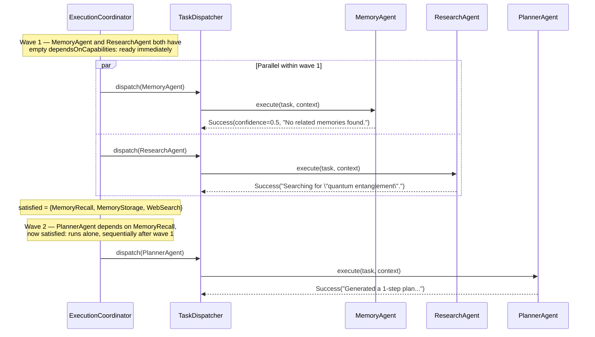

# AURA AI — Execution Pipeline

One goal, traced through every stage of `AgentOrchestrator.orchestrate`, showing genuine parallel
execution, sequential execution, and dependency ordering from the same real run — not three
separate contrived examples. See [ORCHESTRATOR.md](ORCHESTRATOR.md) for what each stage does in
isolation and [EVENT_BUS.md](EVENT_BUS.md) for the event vocabulary referenced throughout.

---

## 1. Input

```
goal = "Research quantum entanglement"
```

## 2. Intent recognition

`IntentRecognizer.recognize(goal)` matches the `research` trigger phrase →
`RecognizedIntent(type = Research, confidence ≈ 0.65, slots = {"topic": "Research quantum entanglement"}, rawText = goal)`.

`DefaultAgentOrchestrator` publishes `IntentRecognizedEvent(utterance = goal, intentType = "Research", confidence = 0.65)` —
the first event of the pass. It then checks `activeProvider.value.isAvailable()`; every provider
this phase ships is scaffolded, so this returns `false` and `ProviderConnectedEvent` is *not*
published (see [EVENT_BUS.md §4](EVENT_BUS.md#4-sequence-one-orchestration-pass-every-event-it-produces)).

## 3. Agent selection



Full detail on this resolution: [CAPABILITY_REGISTRY.md §3](CAPABILITY_REGISTRY.md#3-worked-example-how-memoryagent-gets-selected).
No `additionalAgentNames` were passed, so selection is exactly these 3 agents.

## 4. Execution — dependency-ordered waves



This is the coordinator's one wave algorithm ([ORCHESTRATOR.md §3](ORCHESTRATOR.md#3-executioncoordinator--dependency-ordering))
producing all three brief-required behaviors in a single real run: `MemoryAgent`/`ResearchAgent`
run **in parallel** (wave 1); `PlannerAgent` runs **sequentially** after them, purely because
**dependency ordering** (`dependsOnCapabilities = {MemoryRecall}`) said to wait.

### What each agent actually does

| Agent | Action | `SharedContext` write | Event published |
|---|---|---|---|
| `MemoryAgent` | `memoryRetriever.retrieve(goal)` → 0 results (nothing stored yet) | `relatedMemoryCount = "0"` | `MemoryRetrievedEvent(query=goal, memoryCount=0)` |
| `ResearchAgent` | `runTool("web_search", {"query": "quantum entanglement"})` → opens a browser search | `researchSummary = "Searching for \"quantum entanglement\"."` | `ToolExecutedEvent(toolName="web_search", succeeded=true, ...)` |
| `PlannerAgent` | `planner.plan(goal, intent, availableTools)` → `TemplatePlanner` recognizes no document-creation keywords, falls to `singleStepPlan` → 1-step plan (`web_search`) | `planId`, `planStepCount = "1"` | `PlanCreatedEvent(goal, planId, stepCount=1)` |

Each `TaskDispatcher.dispatch` call also publishes `AgentCompletedEvent(succeeded = true, ...)` on
success — 3 more events, one per agent, alongside the 3 domain events above. No permission was
missing for any of the 3 agents, so no `PermissionDeniedEvent` fires this run.

## 5. Aggregation

```
succeeded = [MemoryAgent, ResearchAgent, PlannerAgent]   (all 3)
failed    = []
overallConfidence = mean(0.5, 1.0, 1.0) ≈ 0.83
summary  = "MemoryAgent: No related memories found. |
            ResearchAgent: Searching for \"quantum entanglement\". |
            PlannerAgent: Generated a 1-step plan for \"Research quantum entanglement\"."
mergedData = { memoryCount: "0", planId: "<uuid>", stepCount: "1" }
```

`overallConfidence` is pulled down from a perfect 1.0 specifically by `MemoryAgent`'s honest 0.5 —
it found nothing, and says so in its own confidence, not just its summary text. This is exactly
what "confidence aggregation" is for: the aggregate result correctly reflects that one of the
three contributing agents had nothing to add, without that agent's *failure* (it didn't fail — an
empty result is a valid, successful answer) skewing the picture the way counting it as 0 would.

## 6. Result

```kotlin
OrchestrationResult(
    goal = "Research quantum entanglement",
    intent = RecognizedIntent(Research, 0.65, ...),
    selectedAgents = ["MemoryAgent", "PlannerAgent", "ResearchAgent"],
    outcomes = [<MemoryAgent outcome>, <ResearchAgent outcome>, <PlannerAgent outcome>], // wave execution order
    aggregated = AggregatedResult(succeeded = [...3], failed = [], overallConfidence = 0.83, ...),
    sharedContextSnapshot = {
        "relatedMemoryCount" to "0",
        "researchSummary" to "Searching for \"quantum entanglement\".",
        "planId" to "<uuid>",
        "planStepCount" to "1",
    },
)
```

Seven events were published across this one pass: `IntentRecognizedEvent`, `MemoryRetrievedEvent`,
`ToolExecutedEvent`, `PlanCreatedEvent`, and three `AgentCompletedEvent`s (one per agent). Every
one of them was observable by any `EventBus.on<T>()` subscriber the moment it happened,
independent of this method's own return value — the explainable trail the brief's event-driven
architecture exists to produce.
