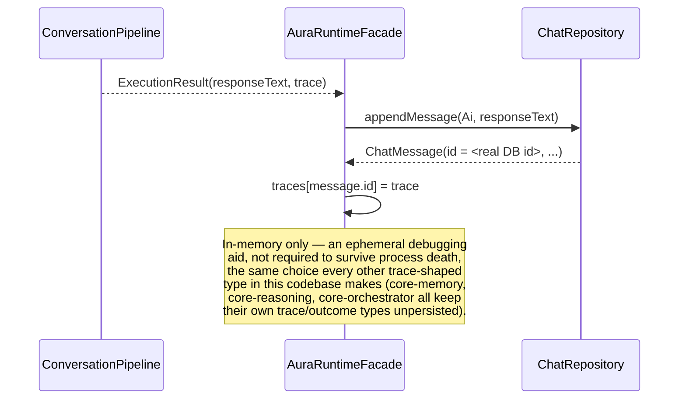
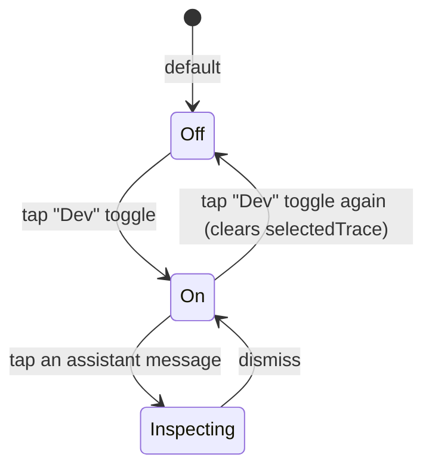

# AURA AI — Execution Trace

Everything one turn's `ExecutionTrace` carries, and how developer mode shows it. See
[CONVERSATION_PIPELINE.md](CONVERSATION_PIPELINE.md) for how each field gets populated and
[AURA_RUNTIME.md](AURA_RUNTIME.md) for the layer (`AuraRuntimeFacade`) that caches traces by
message id.

---

## 1. The brief's 8 required fields, as `ExecutionTrace` properties

| Brief field | Property | Source |
|---|---|---|
| Execution Trace | `ExecutionTrace` itself | — |
| Reasoning Trace | `reasoningTrace: ReasoningTrace` | `ReasoningOutcome.trace` (Phase 5) |
| Selected Agents | `selectedAgents: List<String>` | `AgentSelectionEngine.selectAgents(intent)`, always computed regardless of execution path |
| Selected Tools | `selectedTools: List<String>` | The tools a specialized agent actually invoked, or the executed plan's step tool names |
| Retrieved Memories | `retrievedMemories: List<MemoryEntry>` | `MemoryRetriever.retrieve(userMessage)` |
| Execution Plan | `executionPlan: ExecutionPlan?` | `ReasoningOutcome.executionPlan` (the literal `Planner` output) |
| Timing Metrics | `timing: TimingMetrics` | Wall-clock time around each pipeline stage |
| Confidence Score | `confidence: ConfidenceScore` | `ReasoningOutcome.confidence` (Phase 5's 4-factor breakdown) |

Five more fields ride along because they were cheap to keep and make the trace strictly more
useful for debugging: `sessionId`, `userMessage`, `recognizedIntent`, `executionContext`,
`verdict`, `providerRequired`/`providerConnected` (so "was a provider needed, and was one there"
is answerable without cross-referencing `decisions` and `executionContext` by hand), and
`alternatives`/`recoveryPlan` (so the fallback text shown to the user has its own source data
visible, not just the rendered sentence).

---

## 2. `TimingMetrics`

```kotlin
data class TimingMetrics(
    val totalMillis: Long,
    val stageMillis: Map<String, Long>,
)
```

Six stages are timed individually: `intentRecognition`, `memoryRetrieval`, `reasoning`,
`executionContext`, `agentSelection`, `execution` (the last one covers whichever of
`ExecutionCoordinator`/`PlanExecutor` actually ran — see
[CONVERSATION_PIPELINE.md §2](CONVERSATION_PIPELINE.md#2-choosing-how-the-goal-actually-gets-carried-out)).
`reasoning` is almost always the largest single number, since `ReasoningEngine.reason` is itself
composing `GoalManager`, `DecisionEngine`, `ConstraintEngine`, `ConfidenceEvaluator`, and
`Planner` — see [RUNTIME_PIPELINE.md §2](RUNTIME_PIPELINE.md#2-why-decision-engine-goal-manager-and-planner-dont-get-separate-calls)
for why that's one timed stage, not four.

---

## 3. Life of a trace



A trace is only ever reachable by the exact `ChatMessage.id` it resulted from — there is no way
to list all traces or browse trace history, only to ask "what happened for *this* message,"
which is what `AuraTabViewModel.inspectTrace(messageId)` does.

---

## 4. Developer mode



"The UI should display only User Message, Assistant Response. The debug trace should remain
optional" — enforced two ways, not just one:

1. **`AuraTabUiState.developerModeEnabled` defaults to `false`**, and nothing about how a
   `ChatBubble` renders changes based on it *except* whether it's tappable — the message text
   itself is identical either way.
2. **`AuraTabViewModel.inspectTrace` is a no-op when developer mode is off** — even if a UI bug
   somehow triggered it, no trace would be looked up or shown; the guard is in the ViewModel, not
   just the Composable's conditional click handling.

When on, tapping any assistant message calls `AuraRuntimeFacade.traceFor(message.id)` and shows
the result in a dismissible overlay — every field above, rendered as plain text (`formatTrace` in
`AuraTabScreen.kt`), not bespoke widgets per field, since this exists for debugging correctness,
not as a polished product surface. A message sent before developer mode was ever turned on, or
during a previous process lifetime, has no cached trace — `traceFor` returns `null` and the tap
does nothing, honestly, rather than showing stale or fabricated data.
