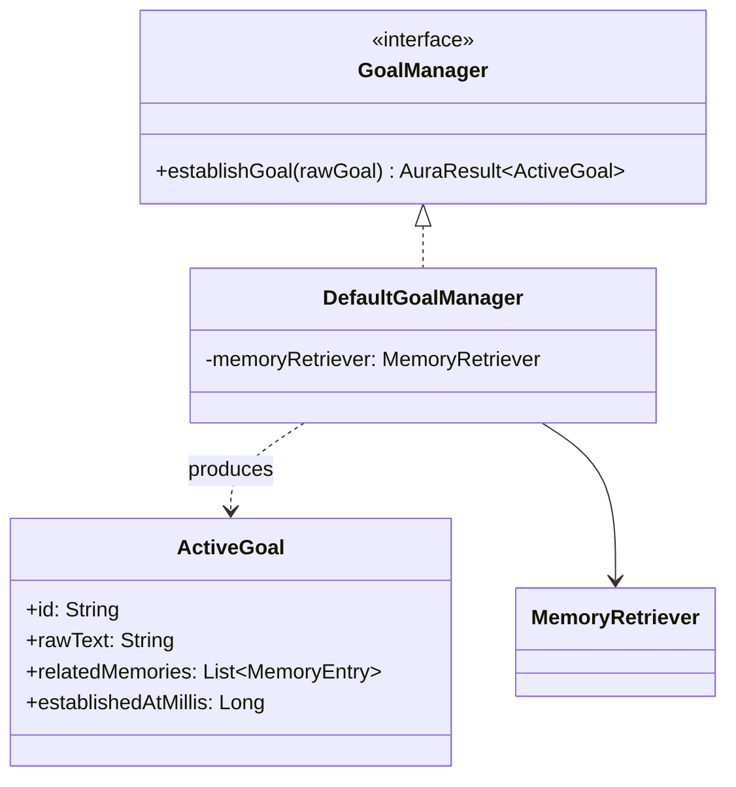
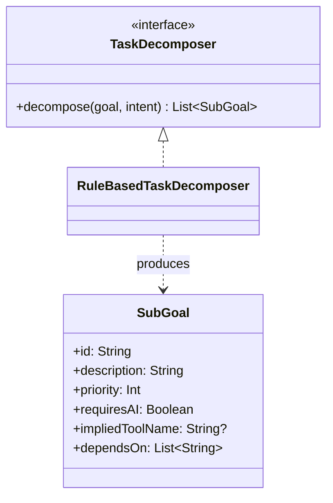
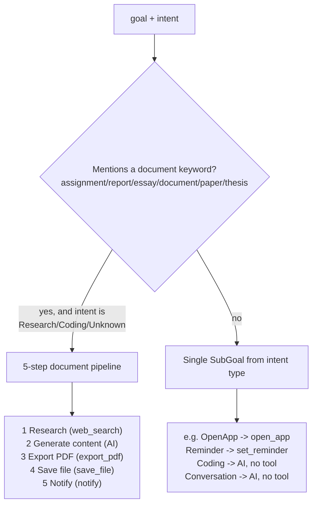

# AURA AI — Goal Decomposition

How a raw goal string becomes an `ActiveGoal` grounded in memory, then an ordered set of
`SubGoal`s — the brief's "Goal Manager," "Task Decomposer," and "goal decomposition"/"task
prioritization" requirements. See [REASONING_ENGINE.md](REASONING_ENGINE.md) for how this fits
into the full reasoning pass and [DECISION_ENGINE.md](DECISION_ENGINE.md) for how `SubGoal`s feed
into the 8 decisions.

---

## 1. `GoalManager` — "Understand goal"

`DefaultGoalManager` is a thin wrapper around `core-memory`'s `MemoryRetriever` — Phase 4's own
"retrieve only relevant memories" machinery, reused rather than reimplemented. It's the literal
first thing `ReasoningEngine.reason` calls: the brief's own worked example opens with "Understand
goal," and understanding a goal means checking what AURA already knows about it before deciding
anything else.

`ActiveGoal.relatedMemories` being empty is itself a signal read directly downstream — by
`DecisionEngine` (a goal mentioning "my exam" with no related memory still sets `requiresMemory =
true`, see [DECISION_ENGINE.md](DECISION_ENGINE.md)) and by `ConfidenceEvaluator` (a needed-but-
missing memory lowers `memoryConfidence` to 0.3 rather than 1.0).

---

## 2. `TaskDecomposer` — "Should the task be split?"

`SubGoal` is deliberately **not** `com.aura.ai.core.planner.PlanStep`. They answer different
questions at different times:

| | `SubGoal` | `PlanStep` |
|---|---|---|
| Question | *What* needs to happen? | *How*, specifically — which tool, what arguments? |
| Produced by | `TaskDecomposer`, before planning | `Planner`, during planning |
| `null` tool means | This needs AI (`requiresAI = true`) | Same convention, one layer later |

Reasoning decomposes the goal on its own terms rather than reading `TemplatePlanner`'s output,
because reasoning has to make its 8 decisions (including whether AI is needed at all) *before* it
decides whether to invoke the planner — it can't depend on a plan it hasn't asked for yet. The two
independently reach the same shape for the same input, which is the point: they're two views of
one real pipeline, not one computed from the other. See
[EXECUTION_FLOW.md](EXECUTION_FLOW.md) for how reasoning's `SubGoal`s and the planner's actual
`PlanStep`s are cross-checked once a plan *is* generated (`ActionValidator`).

### Decomposition rules

The document-pipeline keyword list and detection logic deliberately mirrors
`com.aura.ai.core.planner.TemplatePlanner`'s own — both are independently recognizing the same
real request shape (the brief's own "create my assignment"/"create my AIML assignment and save it
as PDF" examples), from two different layers, rather than one reading the other's private logic.

### Task prioritization

`SubGoal.priority` is a plain ascending integer — lower runs first. For the document pipeline,
priority doubles as dependency order (1 through 5); `dependsOn` makes that explicit rather than
implicit in list order, the same pattern `PlanStep.dependsOn` already uses. A future decomposer
free to reorder independent sub-goals (e.g. two unrelated tool calls that don't depend on each
other) would set equal priorities and let a scheduler decide order — nothing in this phase needs
that yet, since every decomposition this rule set produces is either a single sub-goal or a
strictly linear chain.

---

## 3. Two decomposition shapes

**Document creation** ("create my assignment," "create my AIML assignment and save it as PDF"):

| # | Sub-goal | Implied tool | Requires AI | Depends on |
|---|---|---|---|---|
| 1 | Research the topic | `web_search` | No | — |
| 2 | Generate the content | — | **Yes** | 1 |
| 3 | Export as PDF | `export_pdf` | No | 2 |
| 4 | Save the file | `save_file` | No | 3 |
| 5 | Notify the user | `notify` | No | 4 |

This is the only shape this phase produces with more than one `SubGoal` — `shouldSplitTask` is
`true` for it and `false` for everything else.

**Everything else** — one `SubGoal` per `IntentType`, mirroring
`TemplatePlanner.singleStepPlan`'s own intent-to-tool mapping (`OpenApp` → `open_app`, `Reminder`
→ `set_reminder`, `Calendar` → `create_calendar_event`, `Navigation` → `navigate`, `Email` →
`compose_email`, `Shopping` → `shopping_search`, `Research` → `web_search`, `Automation` →
`app_automation`; `Coding`, `Conversation`, and `Unknown` all produce a `null`-tool sub-goal that
needs AI).

---

## 4. Alternative planning

When decomposition reveals a gap `ReasoningEngine` can't close today (an AI-required sub-goal with
no connected provider), `DefaultReasoningEngine` produces one `AlternativePlan` — the brief's
"alternative planning" requirement — describing a fallback that skips the ungenerable part rather
than failing the whole goal: for the document pipeline, "produce the local steps only (research,
export, save, notify) and leave the AI-generated content as a placeholder." See
[EXECUTION_FLOW.md](EXECUTION_FLOW.md) for the full outcome this attaches to.
