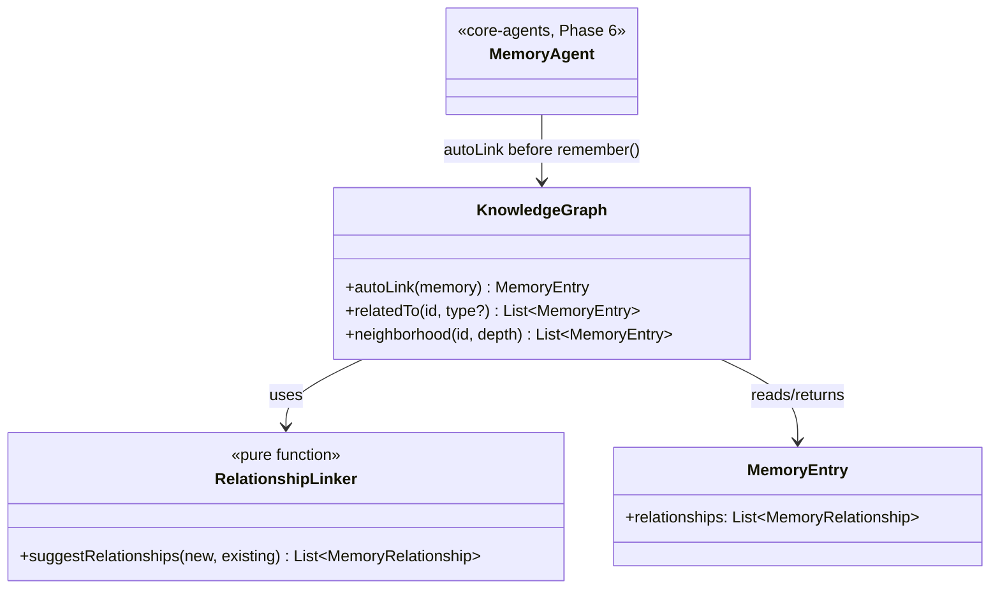

# AURA AI — Knowledge Graph

Version 1.0 Critical item 5 ([TODO_V1.md §2.5](TODO_V1.md#25-knowledge-graph)): "remember that Sarah
is my manager and prefers async updates" becomes a queryable relationship, not just one more
tagged memory string — without breaking `core-memory`'s existing tier×category retrieval engine,
which is unchanged.

---

## 1. The graph was already half-built — Phase 4 just never used it

`MemoryEntry.relationships: List<MemoryRelationship>` and `RelationshipType`
(`RelatesTo`/`DependsOn`/`Supersedes`/`PartOf`/`Contradicts`) have existed since Phase 4. No code
ever populated or read them. This milestone is that other half: something that *writes*
relationships (`RelationshipLinker`) and something that *queries* them
(`KnowledgeGraph`/`DefaultKnowledgeGraph`) — not a new `GraphNode`/`GraphEdge` schema, which would
have duplicated a field that already existed.



---

## 2. Six new entity types

`MemoryCategory` gained `Person`, `Document`, `Meeting`, `Assignment`, `Research`, `File` —
alongside the existing `Project`/`Task`, these are the eight nouns the brief named ("Projects,
People, Documents, Meetings, Assignments, Tasks, Research, Files"). `RuleBasedMemoryClassifier`
gained real trigger phrases for each ("is my manager" → `Person`, "meeting with" → `Meeting",
"researching" → `Research`, …) — adding the enum values alone wouldn't have made them reachable
from actual conversation text; classification needed matching rules too.
`RuleBasedMemoryExtractor.defaultImportance` was updated for all six (the compiler's own exhaustive
`when` check caught this — nothing to remember to update by hand).

---

## 3. `RelationshipLinker` — honest word-overlap, not real entity resolution

```kotlin
object RelationshipLinker {
    fun suggestRelationships(newMemory: MemoryEntry, existing: List<MemoryEntry>): List<MemoryRelationship>
}
```

Two rules, both pure/deterministic:

1. A structural memory (`Task`/`Assignment`/`Meeting`/`Document`/`Research`/`File`) that shares a
   significant word (≥4 letters, not a stopword) with an existing `Project` links to it as
   `PartOf` — "my assignment for RootAI" finds "I am working on RootAI."
2. Any memory mentioning a name that matches an existing `Person` memory links to it as
   `RelatesTo` — "meeting with Sarah" finds "Sarah is my manager."

This is genuinely honest about its limits: it's substring/word-overlap matching, not coreference
resolution or named-entity recognition. "Sarah" only resolves because the word "Sarah" literally
appears in both memories' text — a nickname, a typo, or a pronoun ("she," "my manager") wouldn't
match. Real entity resolution is provider-assisted NLP, out of scope for an offline, on-device
default — `docs/TODO_V1.md` §2.5 anticipated this ("likely provider-assisted once 2.1 lands");
`RelationshipLinker` is the honest, always-available baseline underneath whatever a future
provider-assisted extractor adds, not a replacement for it.

---

## 4. Where linking actually happens

`MemoryAgent.remember()` (core-agents, unchanged in every other respect) now calls
`KnowledgeGraph.autoLink(memory)` immediately before `LongTermMemoryStore.remember(...)` — so a
newly-extracted memory arrives in the store already linked, once, rather than being
re-linked on every future read. `autoLink` only fetches `Project` and `Person` candidates
(`LongTermMemoryStore.byCategory`, not a full-store scan) — the only two categories
`RelationshipLinker` ever links *to* — so this stays cheap regardless of how large long-term
memory grows.

---

## 5. Relationship-aware retrieval, without touching `MemoryRetriever`

`KnowledgeGraph.relatedTo(id)` and `.neighborhood(id, depth)` are additive query methods —
`DefaultMemoryRetriever`'s existing recall/rank/merge behavior is completely unchanged, satisfying
"without breaking the current memory engine" literally. `relatedTo` searches **both directions**:
an outgoing edge the queried memory declares itself, and an incoming edge from some other memory
that names it as a target — callers never need to know or care which side originally created the
link, since `RelationshipLinker` only ever writes to the *newer* memory's side.
`GoalManager`/`ReasoningEngine` can call `KnowledgeGraph` alongside `MemoryRetriever` exactly as
`docs/TODO_V1.md` §2.5 asked; wiring a specific call site into `GoalManager` itself is a natural,
narrow follow-up once a concrete goal-side use case is prioritized, not required to make the graph
itself real and queryable today.

---

## 6. What's still honestly not done

- **Persistence** — like the rest of `core-memory` (`docs/PLATFORM_REVIEW.md` finding 5), the
  graph lives in `InMemoryLongTermMemoryStore` and doesn't survive a process restart. Not a new
  gap this milestone introduced — the same, already-tracked High-priority item
  ("Persistent core-memory/core-plugin storage," `docs/TODO_V1.md` §3) would carry relationships
  along with everything else once it's picked up. Building Room-backed graph persistence
  specifically for this milestone, ahead of the rest of `core-memory`, would have meant two
  different persistence stories inside one module — a shortcut this codebase's own conventions
  argue against.
- **Real entity resolution** — see §3.
- **A dedicated `GoalManager` call site** — see §5.

---

## 7. Testing

`core-memory/src/test` (new — this module's first test source set): 6 tests for
`RelationshipLinker` (project/task word-overlap linking, person/meeting linking, both firing at
once, no-overlap producing no suggestions, a `Person` never linking `PartOf` another `Person`, and
unrelated content producing nothing) and 6 for `DefaultKnowledgeGraph` (`autoLink` attaching a
suggestion before storage, `relatedTo` finding an outgoing edge, `relatedTo` finding an *incoming*
edge the queried memory never declared itself, type-filtered `relatedTo`, transitive
`neighborhood` expansion across a chain, and `neighborhood` terminating cleanly on a direct
two-memory cycle instead of looping forever).
