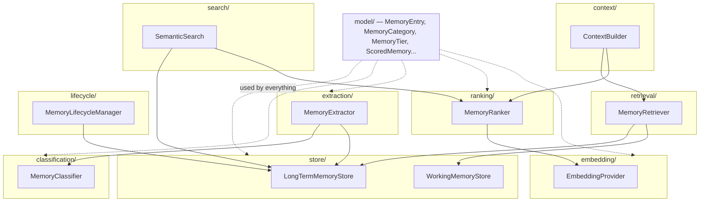
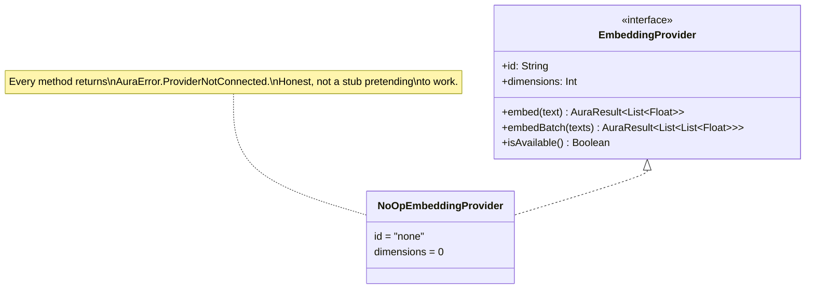
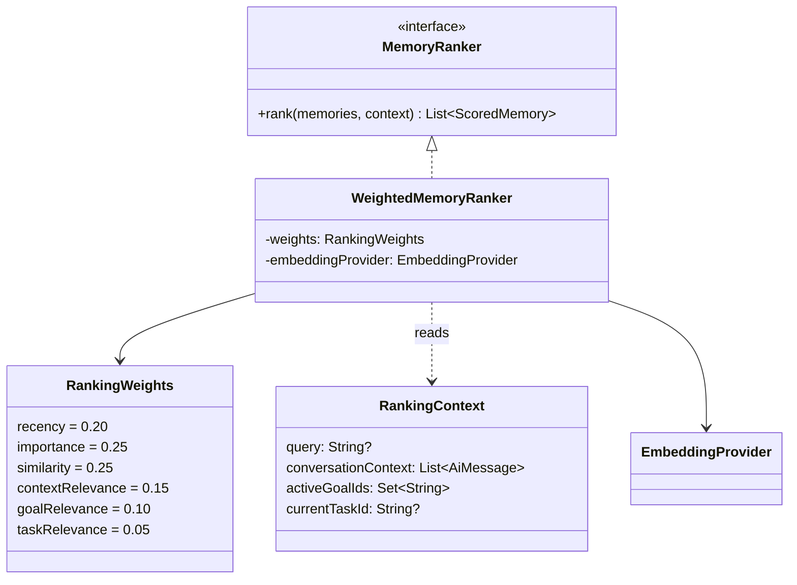

# AURA AI — Memory Architecture

**What this phase is:** a memory *intelligence* layer on top of Phase 3's raw `ConversationBuffer`
— classification, extraction, ranking, retrieval, semantic search, context construction, and
forgetting, all built inside the existing `core-memory` module. **What this phase is not:** a
connection to any embedding model or cloud AI provider. Every seam where one would plug in is
real, typed, and DI-wired; none of them call out to anything yet.

See [MEMORY_SCHEMA.md](MEMORY_SCHEMA.md) for the `MemoryEntry` field reference and
[MEMORY_FLOW.md](MEMORY_FLOW.md) for sequence diagrams of how these components interact at
runtime. This document is the structural picture: what package holds what, what depends on what,
and why.

---

## 1. Why one module, many packages

Phase 3 organized AURA into 8 Gradle modules along architectural boundaries (intent, planning,
actions, providers...). The brief's 14 Phase 4 items — Memory Retrieval, Memory Ranking, Memory
Classification, Memory Embeddings, Context Builder, Conversation Context, Working Memory,
Long-Term Memory, Preference/Goal/Project/Task/Knowledge Memory, Semantic Search — are not that
kind of boundary. They're facets of one concern (memory) that all share one schema
(`MemoryEntry`), read and write the same two stores, and would create a tangle of
inter-module Gradle dependencies for no isolation benefit. They're built as sub-packages inside the
existing `core-memory` module instead:

```
core-memory/src/main/kotlin/com/aura/ai/core/memory/
├── ConversationBuffer.kt          Conversation Context (raw dialogue turns)
├── TextOverlap.kt                 Jaccard similarity — the keyword fallback every
│                                   embedding-aware component shares
├── model/                         MemoryEntry and every type it's built from
├── store/                         Working Memory + Long-Term Memory
├── classification/                Memory Classification
├── extraction/                    Automatic memory extraction
├── ranking/                       Memory Ranking
├── embedding/                     Memory Embeddings (provider-agnostic)
├── retrieval/                     Memory Retrieval
├── search/                        Semantic Search Interface
├── context/                       Context Builder
└── lifecycle/                     Memory Forgetting
```

Preference / Goal / Project / Task / Knowledge Memory are not five separate packages either — they
are `MemoryCategory` values on the one `MemoryEntry` schema. See
[MEMORY_SCHEMA.md §3](MEMORY_SCHEMA.md#3-the-two-orthogonal-axes-memorycategory--memorytier) for
why that's a deliberate design decision, not a shortcut.

---

## 2. Component map



Everything ultimately depends only on `core-ai` (for `AuraResult`, `AuraError`, `AiMessage`) — the
same foundation module every Phase 3 core module builds on. No new Gradle dependencies were
introduced this phase.

---

## 3. The brief's 14 items, mapped to what actually ships

| Brief item | Package | Interface | Default implementation |
|---|---|---|---|
| Conversation Context | (root) | `ConversationBuffer` | `SlidingWindowConversationBuffer` *(Phase 3, unchanged)* |
| Working Memory | `store` | `WorkingMemoryStore` | `InMemoryWorkingMemoryStore` |
| Long-Term Memory | `store` | `LongTermMemoryStore` | `InMemoryLongTermMemoryStore` |
| Preference / Goal / Project / Task / Knowledge Memory | `model` | — | `MemoryCategory` values on `MemoryEntry` |
| Memory Classification | `classification` | `MemoryClassifier` | `RuleBasedMemoryClassifier` |
| Memory Extraction *(implicit — "implement automatic memory extraction")* | `extraction` | `MemoryExtractor` | `RuleBasedMemoryExtractor` |
| Memory Ranking | `ranking` | `MemoryRanker` | `WeightedMemoryRanker` |
| Memory Embeddings (provider-agnostic) | `embedding` | `EmbeddingProvider` | `NoOpEmbeddingProvider` |
| Memory Retrieval | `retrieval` | `MemoryRetriever` | `DefaultMemoryRetriever` |
| Semantic Search Interface | `search` | `SemanticSearch` | `HybridSemanticSearch` |
| Context Builder | `context` | `ContextBuilder` | `DefaultContextBuilder` |
| Memory Forgetting | `lifecycle` | `MemoryLifecycleManager` | `DefaultMemoryLifecycleManager` |

Every interface/implementation pair is bound in `:app`'s `AiCoreModule` (Hilt `@Binds`), following
the exact pattern Phase 3 established: swapping any default implementation for a smarter one later
is a one-line change in that file, nowhere else.

---

## 4. Two memory stores, three memory layers

`ConversationBuffer` (Phase 3), `WorkingMemoryStore`, and `LongTermMemoryStore` are three distinct
layers with different lifetimes and shapes — not redundant with each other:

| Layer | Shape | Lifetime | Example |
|---|---|---|---|
| `ConversationBuffer` | Raw `AiMessage` turns | Rolling window (~20 turns), gone once it rolls past | The literal back-and-forth of the current conversation |
| `WorkingMemoryStore` | `MemoryEntry`, `tier = Working` | TTL-driven, or process lifetime if no TTL | "The user just mentioned they're stressed about Monday's exam" |
| `LongTermMemoryStore` | `MemoryEntry`, `tier = LongTerm` | Durable, survives across sessions (in-memory only this phase — see §7) | "I prefer Kotlin" |

Both memory stores are process-lifetime, `Mutex`-guarded, `MutableStateFlow`-backed in-memory maps
this phase — not persisted to disk. `LongTermMemoryStore`'s interface is the seam a future
Room-backed implementation slots behind; nothing above it (ranking, retrieval, search, context
building) would need to change.

---

## 5. Embeddings: provider-agnostic by design



`EmbeddingProvider` mirrors `core-providers`' `AIProvider` pattern from Phase 3 exactly: one
interface, swappable local-or-cloud implementations, nothing above this layer (`MemoryRanker`,
`SemanticSearch`) ever depends on which one is active. `NoOpEmbeddingProvider` is the only
implementation this phase ships, and it never succeeds — every method returns
`AuraError.ProviderNotConnected`, the same honest-failure convention `ScaffoldAIProvider`
established in Phase 3, rather than returning a fake or random vector that would silently corrupt
every downstream similarity score.

Nothing in this phase calls an embedding model. Everywhere similarity is needed, the code *tries*
`EmbeddingProvider.embed()` first and transparently falls back to `TextOverlap.jaccardSimilarity`
(word-overlap on the raw text) when it fails — which, today, is always. This fallback pattern is
implemented once (`TextOverlap`) and reused everywhere similarity matters
(`WeightedMemoryRanker`, `HybridSemanticSearch` via the ranker, `DefaultContextBuilder`'s
deduplication), not reimplemented per component.

Plugging in a real provider later — local (on-device model) or cloud — means writing one class
implementing `EmbeddingProvider`, changing one `@Binds` line in `AiCoreModule`, and nothing else:
every consumer already knows how to use a connected provider's vectors via cosine similarity
(`VectorMath.cosineSimilarity`) and already knows how to fall back gracefully if it's briefly
unavailable.

---

## 6. Ranking: six factors, one weighted sum



All six factors the brief lists are computed independently and combined by a weighted sum, with
every sub-score preserved on the returned `ScoredMemory` (see
[MEMORY_SCHEMA.md §8](MEMORY_SCHEMA.md#8-scoredmemory--a-memory-plus-why-it-ranked-where-it-did))
rather than collapsed into just the final number:

| Factor | Weight | Source |
|---|---|---|
| Recency | 0.20 | `MemoryEntry.recencyScore()` — exponential decay from `lastAccessedAtMillis` |
| Importance | 0.25 | `MemoryEntry.importance`, set at extraction time |
| Semantic Similarity | 0.25 | Embedding cosine similarity, falling back to Jaccard overlap |
| Conversation Context | 0.15 | Jaccard overlap between the memory and the current conversation window |
| User Goals | 0.10 | 1.0 if the memory *is* an active goal, 0.75 if it `relatesTo` one, else 0 |
| Current Task | 0.05 | Same relevance function, applied to `currentTaskId` |

Weights are a constructor-supplied `RankingWeights` data class, not hardcoded constants — a future
caller that wants to bias ranking differently (e.g. a "what does the user care about right now"
query weighting `contextRelevance` far higher) can do so without touching the ranker itself.

---

## 7. What's real vs. scaffolded

| Component | Status |
|---|---|
| `MemoryEntry` schema, all 11 brief-required fields | ✅ Real |
| Working / Long-Term stores | ✅ Real (in-memory, process-lifetime — not yet persisted to Room/disk) |
| Rule-based classification (4/4 worked examples correct) | ✅ Real |
| Rule-based extraction, clause splitting, date parsing | ✅ Real |
| Weighted ranking, all 6 factors | ✅ Real |
| Keyword/Jaccard similarity fallback | ✅ Real |
| Context building — retrieve, rank, dedupe, budget-truncate | ✅ Real |
| Memory forgetting — archive, delete, expire, merge duplicates | ✅ Real |
| Embedding-based similarity | ❌ Scaffolded — `NoOpEmbeddingProvider` always fails honestly |
| Persistence across process restarts | ❌ Not built this phase — both stores are in-memory |
| Vector database / ANN index | ❌ Not built this phase — see §8 |

---

## 8. Future vector database integration

Nothing in this phase's design assumes in-memory linear scan is permanent. The seams a real vector
database would plug into already exist:

- **`EmbeddingProvider`** is the seam for the *model* that turns text into vectors — a local
  on-device model or a cloud embedding API both implement the same interface (§5).
- **`LongTermMemoryStore`** is the seam for *where vectors are stored and searched*. Today,
  `InMemoryLongTermMemoryStore.recall()` does a linear substring/tag scan over a `Map`. A
  vector-database-backed implementation (e.g. wrapping SQLite's `sqlite-vec` extension for
  on-device use, or a managed ANN service for a cloud tier) would implement the same
  `LongTermMemoryStore` interface, replacing linear scan with approximate nearest-neighbor search
  — `MemoryRanker`, `SemanticSearch`, `ContextBuilder`, and `MemoryLifecycleManager` would not
  need to change at all, since they only ever depend on the interface.
- **`ScoredMemory.similarityScore`** already has a defined place in every downstream computation;
  swapping Jaccard overlap for real cosine similarity over ANN-retrieved candidates changes *only*
  the number's quality, not its shape or where it's consumed.
- **`EmbeddingState.Computed.modelId`** already exists specifically so a vector store can tell
  which model produced a given stored vector — necessary once more than one embedding model has
  ever been active, e.g. across an app upgrade that changes the default model.

The concrete migration path, when it happens: implement `EmbeddingProvider` against a real model,
implement a vector-aware `LongTermMemoryStore` (or a new `VectorMemoryIndex` composed alongside
it, populated incrementally as `EmbeddingState.Computed` entries accumulate), update two
`@Binds` lines in `AiCoreModule`. Every ranking, retrieval, search, and context-building call site
is already written against the interfaces, not the implementations, so none of them are expected
to change.
