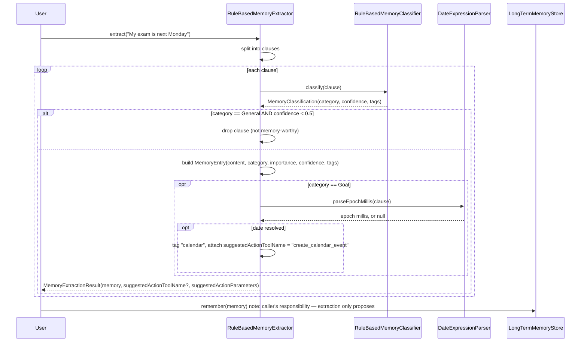
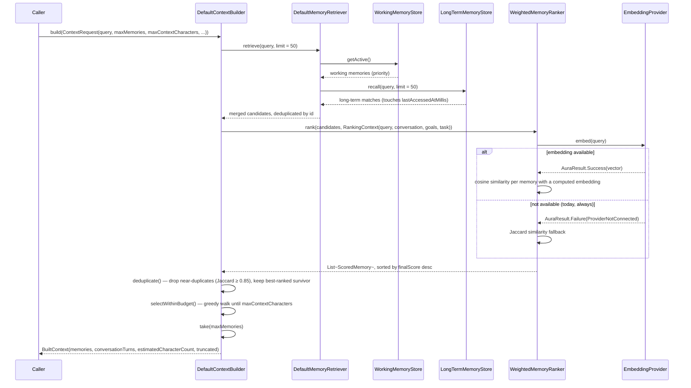
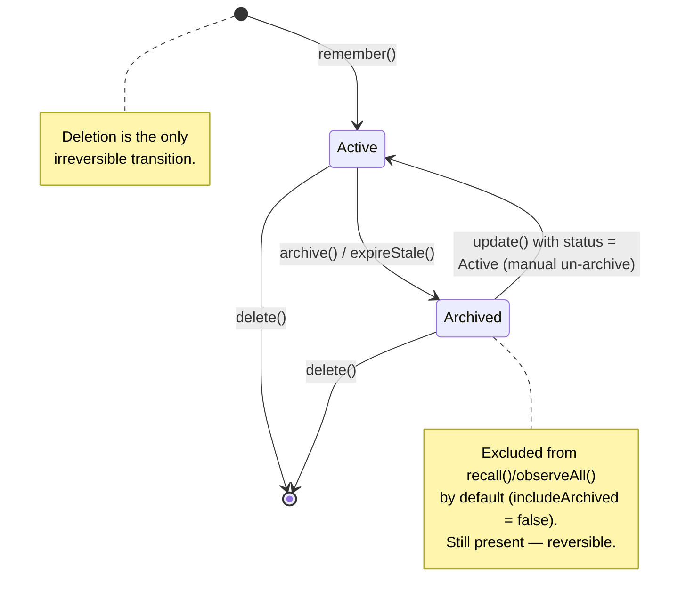
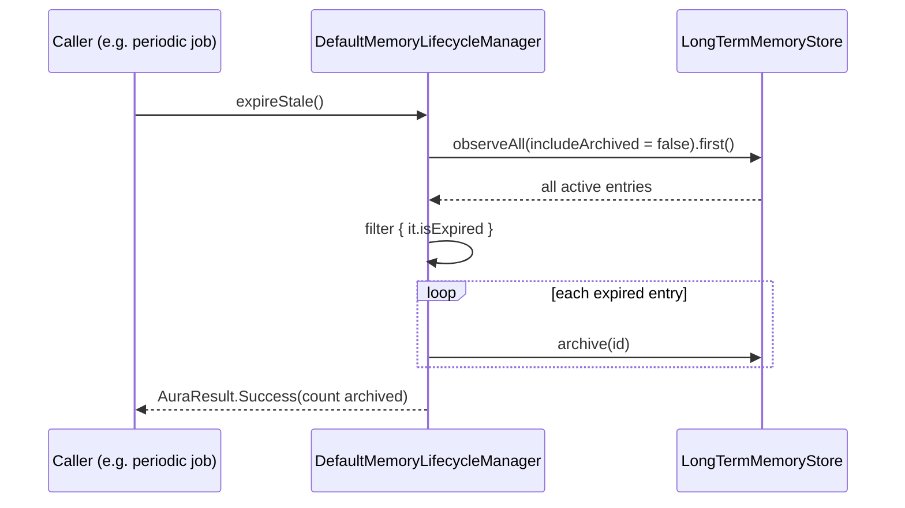
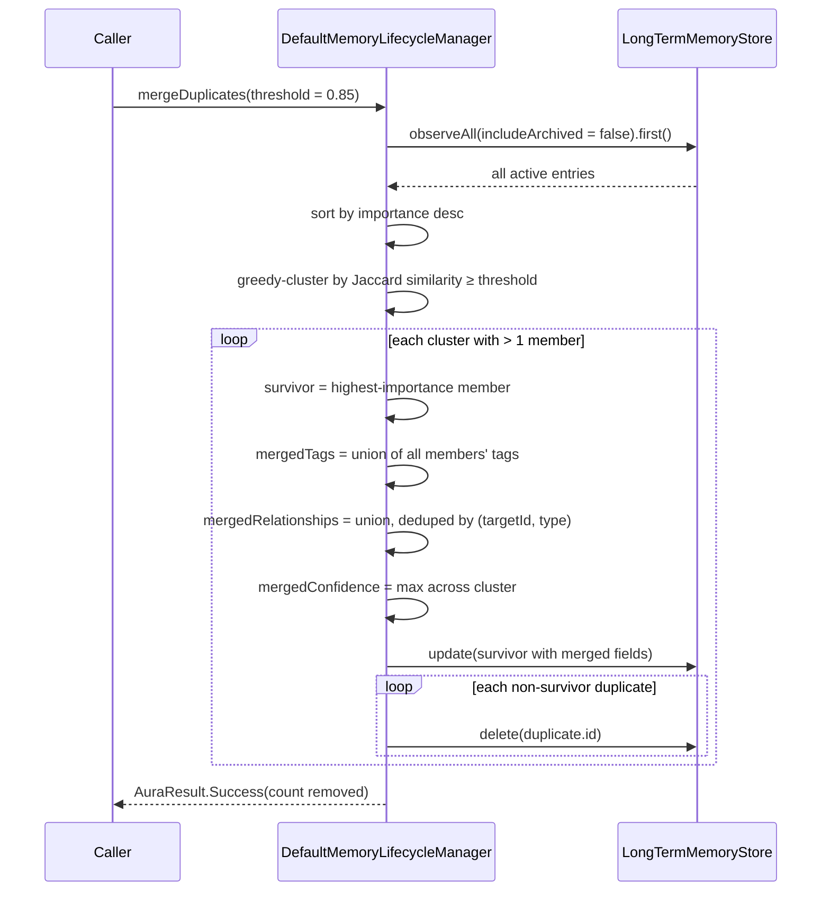
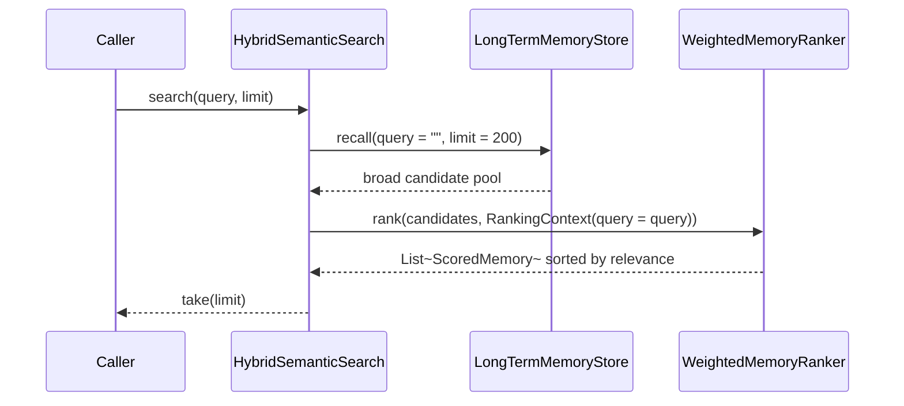
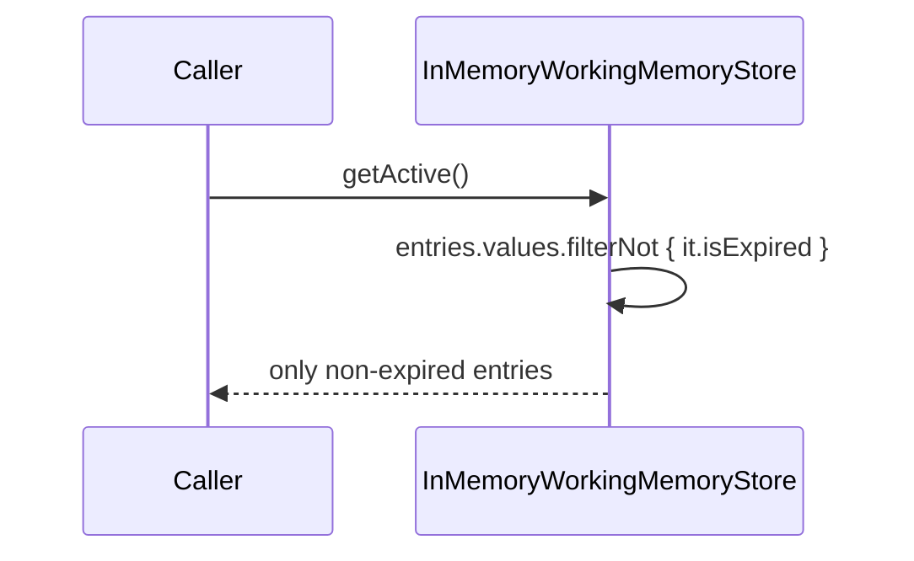

# AURA AI — Memory Flow

Runtime behavior: how a `MemoryEntry` gets created, how it's chosen for context, how it decays and
is eventually forgotten. See [MEMORY_SCHEMA.md](MEMORY_SCHEMA.md) for field definitions and
[MEMORY_ARCHITECTURE.md](MEMORY_ARCHITECTURE.md) for the component map these sequences move
through.

---

## 1. Extraction flow — from raw text to a stored memory

`MemoryExtractor.extract()` does not itself write to any store — it returns proposals. A caller
(today, wherever conversation turns are processed; a future conversation orchestrator) decides
whether to `remember()` the result and whether to actually run `suggestedActionToolName`. This
keeps extraction a pure, side-effect-free function to reason about and test independently of
storage or action execution.

---

## 2. The four worked examples, traced

| Input | Clause classification | Rule that fires | Result |
|---|---|---|---|
| "My birthday is June 20" | `Preference`, confidence ≈ 0.70 | trigger `"my birthday"` | `MemoryEntry(category = Preference, tags = ["preference"])` |
| "I am working on RootAI" | `Project`, confidence ≈ 0.70 | trigger `"i am working on"` | `MemoryEntry(category = Project, tags = ["project"])` |
| "My exam is next Monday" | `Goal`, confidence ≈ 0.70 | triggers `"my exam"` + weekday `"monday"` (2 hits → higher confidence) | `MemoryEntry(category = Goal, tags = ["goal", "calendar"])` **+** `suggestedActionToolName = "create_calendar_event"`, `suggestedActionParameters = {title: "My exam is next Monday", dateMillis: <next Monday, 00:00 local>}` |
| "I prefer Kotlin" | `Preference`, confidence ≈ 0.70 | trigger `"i prefer"` | `MemoryEntry(category = Preference, tags = ["preference"])` |

"My exam is next Monday" is the only one of the four that produces **two** outputs at once — the
`Goal` memory itself, and a suggested `create_calendar_event` action — exactly the brief's "Goal +
Calendar Memory" example. `DateExpressionParser` resolves "next Monday" to the *next upcoming*
Monday from whatever `LocalDate.now()` is at extraction time, matching how the phrase is used in
casual speech; "today" and "tomorrow" are handled the same way.

`RuleBasedMemoryClassifier` scores every category's trigger list against the clause and picks the
highest hit count (ties broken by rule order), the same scored-keyword-matching approach as Phase
3's `KeywordIntentRecognizer` — not first-match, because some phrases genuinely score on more than
one category (e.g. "I need to finish my project" touches both `Task` and `Project`).

---

## 3. Context-building flow — "before every AI request"

This is the literal implementation of the brief's four requirements:

- *"Retrieve only relevant memories"* → `MemoryRetriever` casts a wide net, `MemoryRanker` narrows
  it to what's actually relevant to this query/conversation/goal/task.
- *"Construct optimized context"* → the ranked, deduplicated, budget-fit `BuiltContext`.
- *"Limit context size"* → `maxContextCharacters` (a character-count proxy for a token budget —
  see `ContextRequest`'s own doc comment for why it's named "characters" and not "tokens") and
  `maxMemories`, both enforced.
- *"Avoid duplicate memories"* → the `deduplicate()` step, using the same Jaccard-overlap
  machinery every other similarity check in this module shares.

`BuiltContext.truncated` is true only when real candidates were dropped for being *over budget* —
deduplication removing a near-duplicate is deliberately not counted as truncation, since dropping
a redundant copy is a quality improvement, not a budget-forced loss of information.

---

## 4. Lifecycle state transitions

Two of the brief's four forgetting operations are direct `LongTermMemoryStore` passthroughs
(`archive`, `delete`); the other two are policy `DefaultMemoryLifecycleManager` builds on top:

### Expire

Expiry **archives**, never deletes — a `ttlMillis` set too aggressively shouldn't mean
permanently lost information. Only an explicit `delete()` call removes data for good.

### Merge duplicates

Clustering is a single greedy pass (each entry joins the first existing cluster its content is
similar enough to, else starts a new one) rather than exhaustive pairwise comparison — appropriate
for the moderate entry counts an in-memory store is designed for; a future persisted store with a
much larger corpus would want this replaced with a proper approximate-duplicate index.

---

## 5. Semantic search flow

Deliberately a thin composition rather than a third place reimplementing "try embeddings, fall
back to keywords" — that logic lives exactly once, in `WeightedMemoryRanker`'s similarity factor,
and `SemanticSearch` reuses it rather than duplicating it.

---

## 6. Working memory expiry (no lifecycle manager involved)

Unlike long-term memory, working memory needs no explicit expire step — expired entries are
filtered out at read time:

This is intentionally simpler than long-term expiry: working memory has no "archived" concept to
preserve — it's meant to be cheap and disposable by design (see
[MEMORY_ARCHITECTURE.md §4](MEMORY_ARCHITECTURE.md#4-two-memory-stores-three-memory-layers)), so
silently excluding expired entries is enough.
