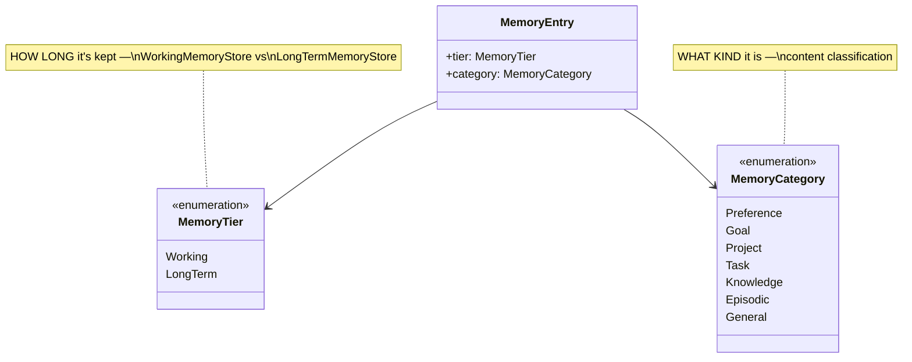
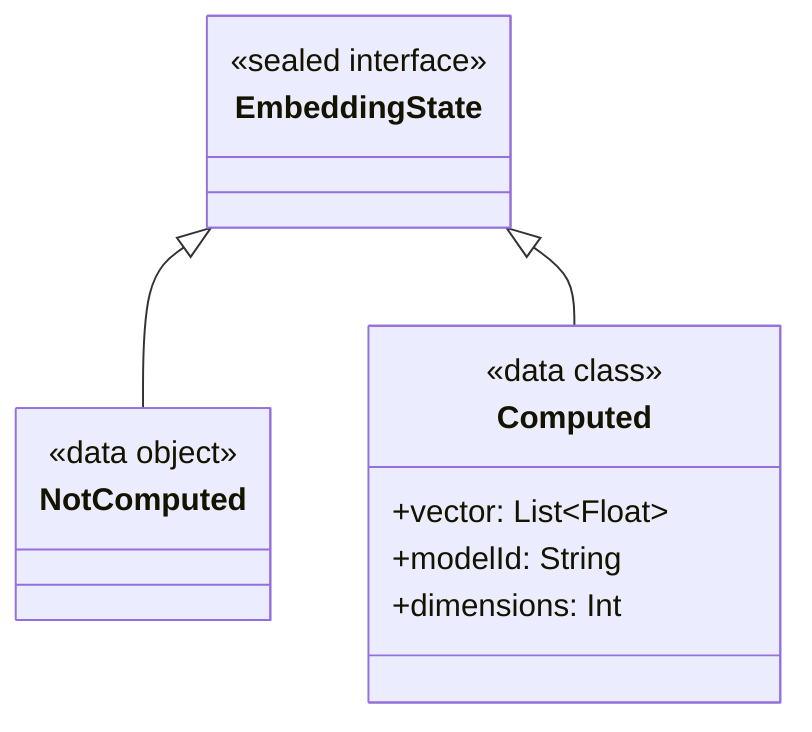

# AURA AI — Memory Schema

The one record shape every Phase 4 component reads and writes: `MemoryEntry`
(`core-memory/src/main/kotlin/com/aura/ai/core/memory/model/MemoryEntry.kt`). This document is
the field-by-field reference; see [MEMORY_ARCHITECTURE.md](MEMORY_ARCHITECTURE.md) for how the
components around this schema fit together and [MEMORY_FLOW.md](MEMORY_FLOW.md) for how a
`MemoryEntry` gets created, scored, and eventually forgotten.

---

## 1. `MemoryEntry` — field by field

The brief asks for eleven things every memory should contain. All eleven are here; the table notes
where a field is stored directly vs. computed on demand, and why.

| Brief's field | `MemoryEntry` property | Type | Stored or computed? |
|---|---|---|---|
| Unique ID | `id` | `String` (UUID) | Stored, generated at construction |
| Timestamp | `createdAtMillis` | `Long` | Stored, set at construction |
| Importance Score | `importance` | `Float` (0–1) | Stored — set at classification/extraction time |
| Recency Score | `recencyScore()` | `Float` (0–1) | **Computed**, not stored — see §2 |
| Category | `category` | `MemoryCategory` | Stored — see §3 |
| Tags | `tags` | `List<String>` | Stored |
| Relationships | `relationships` | `List<MemoryRelationship>` | Stored — see §4 |
| Embedding Placeholder | `embedding` | `EmbeddingState` | Stored — see §5 |
| Source | `source` | `MemorySource` | Stored — see §6 |
| Confidence | `confidence` | `Float` (0–1) | Stored — set by the classifier |
| TTL (optional) | `ttlMillis` | `Long?` | Stored, nullable — see §7 |

Two more fields exist beyond the brief's list, because the architecture needs them:

| Property | Type | Purpose |
|---|---|---|
| `tier` | `MemoryTier` | *How long* this memory is kept — orthogonal to `category`. See §3. |
| `status` | `MemoryStatus` | Lifecycle state (`Active` / `Archived`). See [MEMORY_FLOW.md §4](MEMORY_FLOW.md#4-lifecycle-state-transitions). |
| `lastAccessedAtMillis` | `Long` | The raw data recency is computed from — touched on every `recall()`. |

```kotlin
data class MemoryEntry(
    val id: String = UUID.randomUUID().toString(),
    val content: String,
    val category: MemoryCategory,
    val tier: MemoryTier = MemoryTier.LongTerm,
    val status: MemoryStatus = MemoryStatus.Active,
    val importance: Float = 0.5f,
    val confidence: Float = 1f,
    val tags: List<String> = emptyList(),
    val relationships: List<MemoryRelationship> = emptyList(),
    val embedding: EmbeddingState = EmbeddingState.NotComputed,
    val source: MemorySource = MemorySource(MemorySourceType.Conversation),
    val createdAtMillis: Long = System.currentTimeMillis(),
    val lastAccessedAtMillis: Long = createdAtMillis,
    val ttlMillis: Long? = null,
) {
    val isExpired: Boolean get() = /* ttlMillis != null && now >= createdAtMillis + ttlMillis */
}
```

---

## 2. Why recency is a function, not a field

A stored `recencyScore: Float` goes stale the instant time passes — it would need constant
background recomputation just to stay honest. Instead, `MemoryEntry.lastAccessedAtMillis` is the
only stored timestamp, and recency is computed fresh, every time it's needed, by an extension
function:

```kotlin
fun MemoryEntry.recencyScore(
    nowMillis: Long = System.currentTimeMillis(),
    halfLifeMillis: Long = 3 days,
): Float = 0.5.pow(ageMillis / halfLifeMillis).coerceIn(0f, 1f)
```

Exponential decay: a memory not touched in one half-life (3 days, by default) has lost half its
recency score; two half-lives, three-quarters; and so on. `halfLifeMillis` is a parameter, not a
constant, specifically so a future tuning pass can give different categories different decay
rates (a `Goal` arguably shouldn't decay as fast as an `Episodic` memory) without changing the
schema.

`recall()` on `LongTermMemoryStore` touches `lastAccessedAtMillis` on every entry it returns —
recall is itself an access, and recency scoring depends on that being true.

---

## 3. The two orthogonal axes: `MemoryCategory` × `MemoryTier`

The brief lists "Working Memory," "Long-Term Memory," "Preference Memory," "Goal Memory,"
"Project Memory," "Task Memory," and "Knowledge Memory" as seven separate items. They aren't seven
storage implementations here — they're two independent axes on one schema, because durability
(how long something is kept) and content type (what kind of thing it is) are genuinely orthogonal:
a `Goal` can be `Working` (a fleeting concern) or `LongTerm` (a standing objective) equally
naturally.



| `MemoryCategory` | Meaning | Example |
|---|---|---|
| `Preference` | A standing like/dislike/choice | "I prefer Kotlin," "my birthday is June 20" |
| `Goal` | Something worked toward, no fixed deliverable | "my exam is next Monday" |
| `Project` | A named, ongoing effort with scope | "I am working on RootAI" |
| `Task` | A discrete, actionable to-do | "remind me to submit the form" |
| `Knowledge` | A durable fact that isn't personal preference | "the meeting room is 4B" |
| `Episodic` | Something that happened, a past event | "yesterday I finished the draft" |
| `General` | The classifier's honest fallback — doesn't cleanly fit above | — |

| `MemoryTier` | Meaning | Backing store |
|---|---|---|
| `Working` | Session-scoped, cheap, expected to expire | `WorkingMemoryStore` |
| `LongTerm` | Durable, searchable, ranked, persisted across sessions | `LongTermMemoryStore` |

---

## 4. Relationships

```kotlin
enum class RelationshipType { RelatesTo, DependsOn, Supersedes, PartOf, Contradicts }

data class MemoryRelationship(
    val targetMemoryId: String,
    val type: RelationshipType,
)
```

| `RelationshipType` | Meaning |
|---|---|
| `RelatesTo` | Generic association — the default when a stronger relation isn't known |
| `DependsOn` | This memory only makes sense in light of the target — e.g. a Task that depends on a Goal |
| `Supersedes` | This memory replaces the target as current truth — e.g. a corrected preference |
| `PartOf` | This memory is a component of a larger one — e.g. a Task that's part of a Project |
| `Contradicts` | This memory conflicts with the target — surfaced during ranking/forgetting rather than silently resolved |

Relationships feed directly into ranking's "User Goals" and "Current Task" factors
(`WeightedMemoryRanker.relevanceTo`): a memory that `RelatesTo` an active goal id scores a
relevance boost even if its own content doesn't textually mention the goal.

---

## 5. `EmbeddingState` — the "Embedding Placeholder"



Every `MemoryEntry` created today carries `EmbeddingState.NotComputed` — no embedding provider is
connected this phase (see [MEMORY_ARCHITECTURE.md §5](MEMORY_ARCHITECTURE.md#5-embeddings-provider-agnostic-by-design)).
The shape is deliberately provider-agnostic: `Computed.modelId` is what lets a later phase tell a
locally-generated vector apart from a cloud-generated one without needing a different field, or a
different `MemoryEntry` shape, per provider.

`List<Float>`, not `FloatArray`: `FloatArray` breaks Kotlin data class `equals()`/`hashCode()`
(arrays compare by reference, not content), which would silently miscompare two `Computed` states
holding identical vectors. At the sizes real embedding models produce, the extra boxing is worth
that correctness.

---

## 6. Source

```kotlin
enum class MemorySourceType { Conversation, Inference, System, Import }

data class MemorySource(
    val type: MemorySourceType,
    val reference: String? = null,
)
```

`reference` is source-specific: the conversation turn id for `Conversation`, the memory id(s) it
was inferred from for `Inference`. `Import` exists for a future sync/import path — nothing produces
it yet.

---

## 7. TTL and expiry

`ttlMillis: Long?` — `null` means "never expires." When set, `MemoryEntry.isExpired` becomes true
once `now >= createdAtMillis + ttlMillis`. What happens to an expired entry differs by tier:

- **`WorkingMemoryStore`** entries are silently excluded from `getActive()`/`observeActive()` once
  expired — no lifecycle action needed, they simply stop being returned.
- **`LongTermMemoryStore`** entries are *not* auto-filtered by expiry; `MemoryLifecycleManager.expireStale()`
  has to be run (or scheduled) to scan for and archive them. See
  [MEMORY_FLOW.md §4](MEMORY_FLOW.md#4-lifecycle-state-transitions) for exactly why archiving,
  not deleting, is the expiry action.

---

## 8. `ScoredMemory` — a memory plus why it ranked where it did

```kotlin
data class ScoredMemory(
    val memory: MemoryEntry,
    val recencyScore: Float,
    val importanceScore: Float,
    val similarityScore: Float,
    val contextRelevanceScore: Float,
    val goalRelevanceScore: Float,
    val taskRelevanceScore: Float,
    val finalScore: Float,
)
```

Kept separate from `MemoryEntry` because these scores are only meaningful *in the context of a
specific ranking request* — a query, a conversation, an active goal. Baking them into the stored
entry would make them stale the moment that context changes. `MemoryRanker`, `SemanticSearch`, and
`ContextBuilder` all return `ScoredMemory`, so a caller always sees *why* a memory was chosen, not
just that it was — see [MEMORY_ARCHITECTURE.md §6](MEMORY_ARCHITECTURE.md#6-ranking-six-factors-one-weighted-sum)
for how each sub-score is computed.
