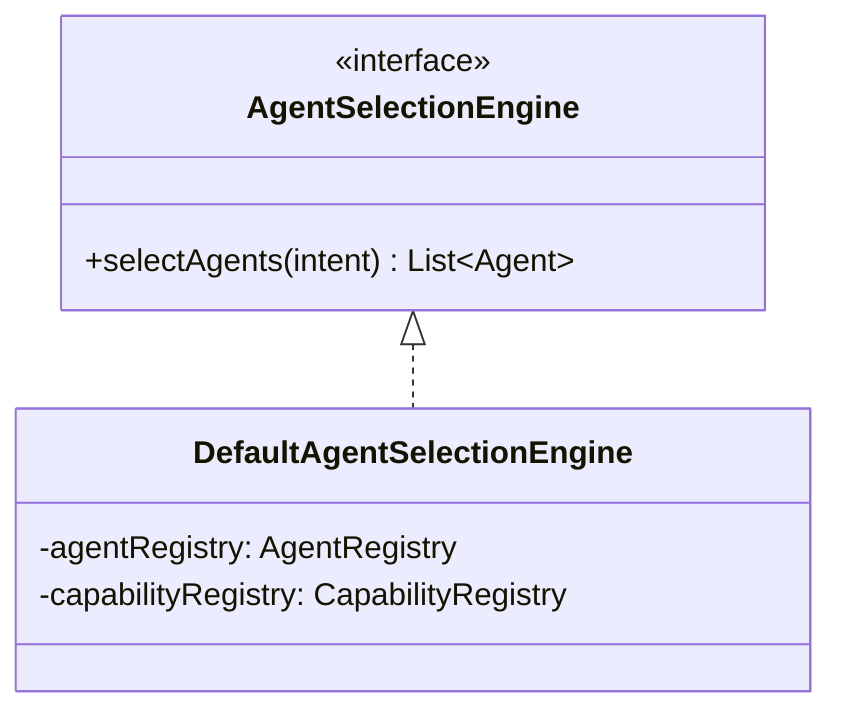
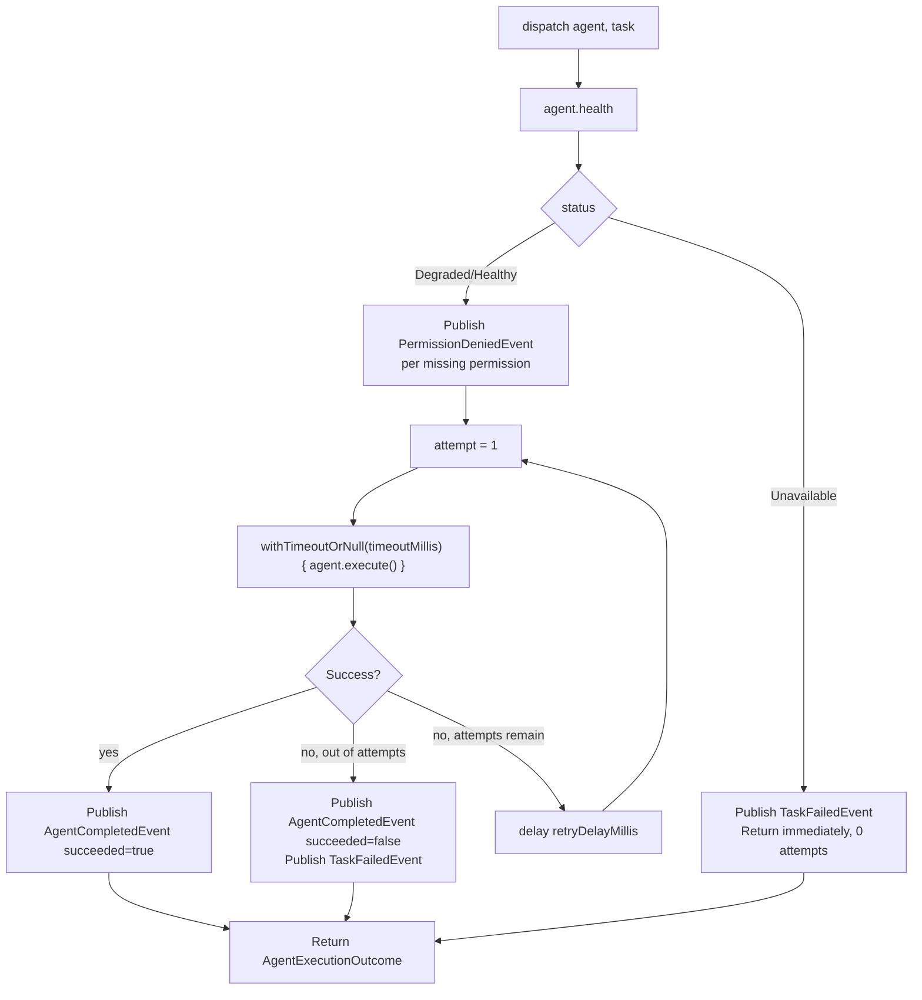
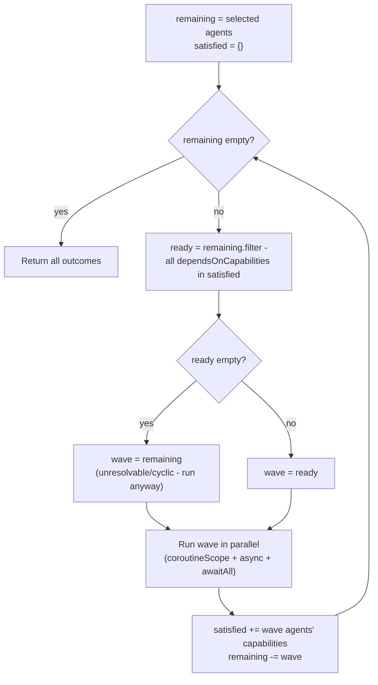
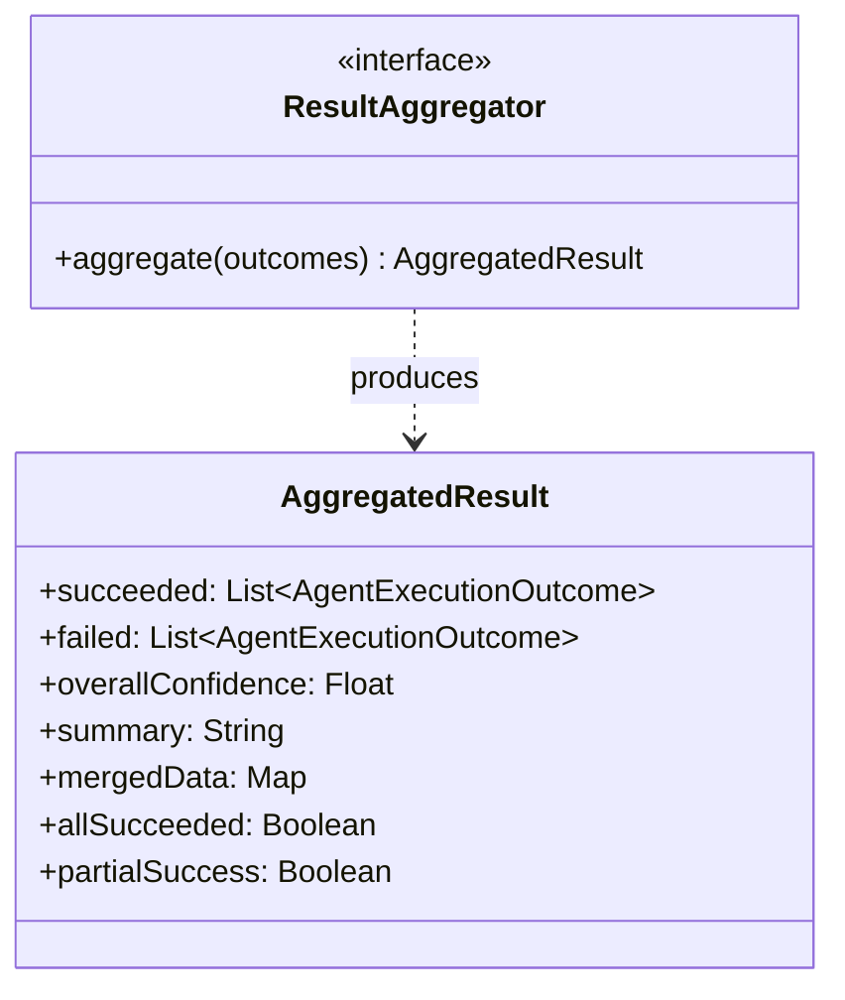
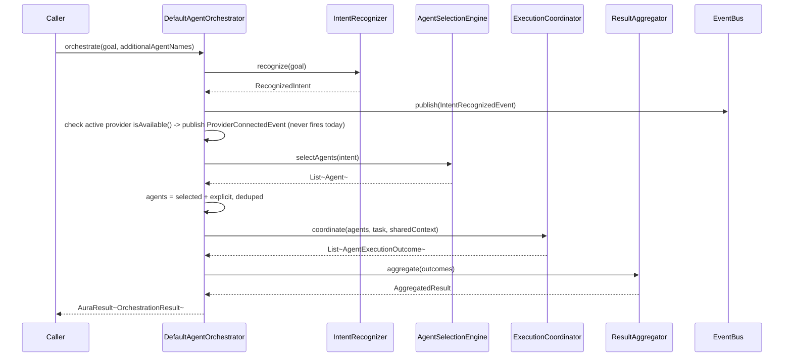

# AURA AI — Agent Orchestrator

The four components that turn "9 registered agents" into "the right agents ran, in the right
order, and here's the combined answer." See [AGENT_SYSTEM.md](AGENT_SYSTEM.md) for the `Agent`
contract these operate on and [EXECUTION_PIPELINE.md](EXECUTION_PIPELINE.md) for a full worked
example tracing every stage below in sequence.

---

## 1. `AgentSelectionEngine` — "which agents are needed"



Selection is two passes, not one:

1. **Primary** — every registered agent whose `supportedIntents` contains the recognized
   `IntentType` (`AgentRegistry.findByIntent`).
2. **Supporting** — every capability any primary agent declared via `dependsOnCapabilities`,
   resolved back to the agent(s) that provide it (`CapabilityRegistry.agentsFor`), even if that
   supporting agent's own `supportedIntents` doesn't match at all.

```kotlin
val primary = agentRegistry.findByIntent(intent.type)
val requiredCapabilities = primary.flatMap { it.dependsOnCapabilities }.toSet()
val supporting = requiredCapabilities.flatMap { capabilityRegistry.agentsFor(it) }.mapNotNull { agentRegistry.get(it) }
return (primary + supporting).distinctBy { it.name }.sortedBy { it.priority }
```

This second pass is why `MemoryAgent` (whose `supportedIntents` is honestly empty — see
[AGENT_SYSTEM.md §3](AGENT_SYSTEM.md#3-the-9-agents)) ever runs at all: `PlannerAgent` matches
*every* intent and declares `dependsOnCapabilities = {MemoryRecall}`, so `MemoryAgent` is pulled
in as a closure of that dependency on every single orchestration pass. Full detail on why this
closure exists: [CAPABILITY_REGISTRY.md](CAPABILITY_REGISTRY.md).

`additionalAgentNames` on `AgentOrchestrator.orchestrate` is a third, explicit path — force-including
an agent (`VisionAgent`, `NotificationAgent`) that neither pass would select, for a caller that
knows it wants to run one specifically.

---

## 2. `TaskDispatcher` — health gating, retries, timeouts



`DispatchPolicy(maxAttempts = 2, retryDelayMillis = 250, timeoutMillis = 15_000)` — sane
production defaults, overridable per call rather than hardcoded. Three things happen before a
single line of the agent's own `execute()` runs:

1. `agent.health()` is checked first. `AgentHealthStatus.Unavailable` (a required tool isn't
   registered at all) skips execution entirely — there's no point attempting something that
   structurally cannot succeed.
2. Every permission in `health.missingPermissions` gets its own `PermissionDeniedEvent` —
   published once, regardless of how many retry attempts follow, since the permission gap doesn't
   change between attempts.
3. Only then does the retry loop begin, each attempt wrapped in `withTimeoutOrNull` — a timeout is
   treated exactly like a normal failure for retry purposes (reuses `AuraError.Unknown`; timeout
   isn't its own `AuraError` case, since core-ai's error hierarchy is a closed vocabulary shared
   by every module and this phase deliberately doesn't touch it — see
   [AGENT_SYSTEM.md](AGENT_SYSTEM.md) for why core-events avoids the same kind of coupling).

---

## 3. `ExecutionCoordinator` — dependency ordering



One algorithm produces all three of the brief's execution modes:

- **Fully parallel** — no selected agent declares `dependsOnCapabilities`: everything lands in
  wave 1, `awaitAll()`'d together.
- **Fully sequential** — a chain where each agent depends on the capability the previous one
  provides: exactly one agent per wave.
- **Mixed** (the common case) — independent agents share a wave; a dependent agent waits for the
  next one. `MemoryAgent` + `ResearchAgent` (both dependency-free) run in wave 1; `PlannerAgent`
  (depends on `MemoryRecall`) runs alone in wave 2.

The "nothing is ready" branch is a deliberate safety valve, not a real cycle-detector: rather than
deadlock on an unresolvable or circular dependency (which nothing in this phase's 9 agents can
actually produce — none of their `dependsOnCapabilities` sets form a cycle), the coordinator runs
whatever's left anyway. A degraded outcome — an agent running before a capability it wanted is
technically ready — always beats the orchestration hanging forever.

---

## 4. `ResultAggregator` — confidence aggregation



`overallConfidence` is the mean of every *succeeded* agent's own `AgentResult.confidence` — a
failed agent contributes nothing to the average rather than counting as a confidence of zero,
since confidence describes the quality of an answer, and a failure isn't a low-quality answer,
it's the absence of one (already visible separately via `failed`). `mergedData` folds every
succeeded agent's `AgentResult.data` together, later agents' keys winning on collision — the same
"good enough, not over-engineered" merge strategy used throughout this codebase (e.g.
`core-memory`'s lifecycle merge-duplicates).

`partialSuccess` exists specifically because partial success is a normal, expected outcome in a
multi-agent system, not an edge case: if `CalendarAgent` succeeds and `NotificationAgent` (forced
in via `additionalAgentNames`) fails because notifications aren't granted, that's a genuinely
useful result — the calendar event was created — not a total failure.

---

## 5. `AgentOrchestrator` — composing all four



`orchestrate(goal: String)` is deliberately the *only* required input — the orchestrator calls
`IntentRecognizer` itself rather than asking the caller to. This makes it a genuine single entry
point: raw text in, every relevant agent's contribution out, with the full explainable event trail
already published to `EventBus` along the way.
