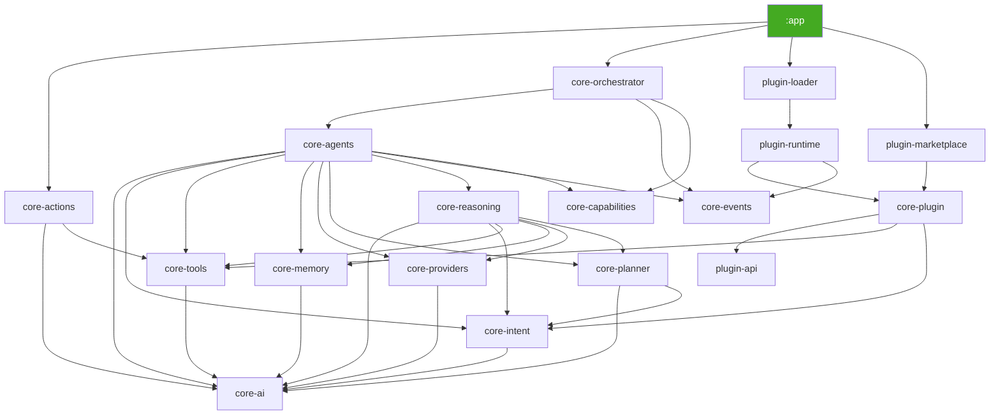

# AURA AI — Platform Review

A complete engineering audit of the AURA platform as it stands after Phases 1–7: 18 Gradle
modules (17 library modules + `:app`), 291 Kotlin files, ~14,500 lines. This document is honest by
design — it reports what actually runs today versus what's built-but-dormant, and it does not
round either finding up or down to make the platform look more or less finished than it is.

**Headline finding:** every subsystem reviewed here is internally well-built. The platform's
single biggest risk is not inside any of the 17 library modules — it's that the sophisticated AI
pipeline they collectively implement (intent → memory → reasoning → planning → agents →
orchestration) is **not yet called from the app's actual chat experience**. See
[Finding 1](#finding-1-the-ai-core-is-not-wired-into-the-live-app-critical).

---

## Methodology

This review was performed by direct source inspection — reading every module's public interfaces,
grepping the full tree for specific risk patterns (unsynchronized mutable state, `GlobalScope`,
`runBlocking`, leaked `MutableStateFlow`, duplicate DI bindings, duplicated algorithms), and
tracing actual call graphs from the UI layer down through each subsystem, rather than reading each
module in isolation. Two things this review could **not** do, and says so plainly rather than
implying otherwise:

- **No compiler was run.** There is no `gradlew`/Gradle wrapper checked into this repository, and
  no Android SDK/Gradle distribution available in this environment. Every finding below is from
  static reading and pattern search, not from `javac`/`kotlinc`/Hilt's annotation processor. This
  is itself Finding 2.
- **No automated tests exist** anywhere in the repository (confirmed: zero `*Test.kt` files), so
  no finding here is backed by a red-to-green test run. Behavioral correctness claims (e.g., "the
  document-creation pipeline produces 5 steps") are traced by hand against the source, the same
  way each phase's own construction work was verified.

### Scoring rubric

Every module gets three 1–10 scores, defined consistently so the numbers are comparable across
modules rather than vibes-based:

| Score | 9–10 | 7–8 | 5–6 | 3–4 | 1–2 |
|---|---|---|---|---|---|
| **Maturity** — how complete and exercised is it today | Production-ready, exercised by real traffic | Functionally complete and correct, untested/unexercised | Structurally complete with known, documented gaps | Deliberately scaffolded, interface-only | Incomplete or broken |
| **Scalability** — how well does the current design absorb growth without a rewrite | Explicit extension seams, proven pattern | Good seams, moderate work needed | Fine at today's scale, needs rework at 10x | Hard-coded assumptions | No headroom |
| **Maintainability** — how safely can a new contributor change this | Small, consistent, documented | Larger but internally consistent | Some inconsistency/coupling requiring care | Tangled | Risky to touch |

---

## Architecture overview



**No cycles anywhere in the graph** — verified by construction across all 7 phases (every new
module was checked against this invariant when it was added) and re-confirmed this review by
grepping every module's actual imports against its declared `build.gradle.kts` dependencies. This
is the platform's strongest architectural property: 18 modules, zero circular dependencies, and
`core-actions` remains the only Android-aware library module — every other one is plain
Kotlin/JVM and unit-testable without an emulator, *if* tests existed.

---

## Findings

### Finding 1: The AI core is not wired into the live app (Critical)

`AuraTabViewModel` — the only screen where a user actually talks to AURA — does this on send:

```kotlin
fun sendChat() {
    ...
    viewModelScope.launch {
        chatRepository.appendMessage(MessageSender.User, text)
        isTyping.value = true
    }
    replyJob = viewModelScope.launch {
        delay(1500)
        chatRepository.appendMessage(MessageSender.Ai, CANNED_REPLY)
        isTyping.value = false
    }
}
```

`CANNED_REPLY` is a single hardcoded string. Nothing in the `presentation` package imports
`AgentOrchestrator`, `ReasoningEngine`, `Planner`, or `IntentRecognizer` — confirmed by grep across
the entire `presentation` directory. Every one of Phases 3–7 (`core-intent`, `core-planner`,
`core-reasoning`, `core-agents`, `core-orchestrator`, and the entire plugin SDK) is fully built,
DI-wired, and internally correct, but **has no caller from the app a user actually runs.**
`PlanExecutor` — the one class written specifically to bridge a plan to real execution — is
referenced only by its own DI binding, nowhere else.

This is not a bug in any one module; every module reviewed below is individually sound. It's a
missing integration step, and it's the reason so many "maturity" scores below top out at 5–6
despite the underlying code being correct: correctness that never runs is not yet maturity.

**Not auto-fixed.** Wiring `sendChat()` to call `AgentOrchestrator.orchestrate(text)` instead of
`CANNED_REPLY` would change the core, user-visible behavior of the app's primary interaction —
that crosses from "architectural fix" into a product decision (what should the UI do while
orchestration runs? how should `OrchestrationResult`/`AggregatedResult` render as chat messages?
what happens on `ReasoningVerdict.Blocked`?) this review isn't positioned to make unilaterally
under a "do not add features" mandate. See [Recommendations](#recommendations) for the concrete,
scoped first step.

### Finding 2: No compiler has ever verified this codebase (Critical, process)

No `gradlew`, no `gradle/wrapper/`, and every phase's own verification was grep-based static
analysis (package/directory consistency, duplicate declarations, import boundaries) rather than an
actual `kotlinc`/Hilt build. That process caught real bugs by hand (a smart-cast error in Phase 5,
a bash path-escaping bug in Phase 6's own review tooling) — but hand-verification has no guarantee
of catching everything a compiler would (generic-variance errors, Hilt graph issues like an
unsatisfied dependency or a missing `@Provides`). Checking in the Gradle wrapper and getting one
green `./gradlew assembleDebug` is the single highest-leverage next step for this platform's
credibility, and is called out first in [Recommendations](#recommendations).

### Finding 3: Race condition in `InMemoryWorkingMemoryStore` — **fixed this session**

`setActive`/`remove` performed `entries.value = entries.value <op>` — a read-modify-write on a
`MutableStateFlow` that loses updates under concurrent calls (two callers reading the same old
value, the second write silently discarding the first's change). Its sibling,
`InMemoryLongTermMemoryStore`, correctly guards the same pattern with a `Mutex`; this one didn't.
Not exercised by any current caller (confirmed: nothing in the codebase calls `setActive`/`remove`
today, only `getActive`), so latent rather than actively triggered — but a real bug the moment
something starts writing to working memory, which Finding 1's fix will do.

**Fix applied:** replaced the plain read-modify-write with `MutableStateFlow.update { }`, the
same lock-free, compare-and-set-based atomic-update primitive `OnboardingViewModel` already uses
elsewhere in this codebase. No interface or behavior change — `WorkingMemoryStore`'s contract is
identical, it's just now actually safe to call from more than one coroutine at once.

### Finding 4: Duplicated scored-keyword-matching logic — **fixed this session**

`core-intent.KeywordIntentRecognizer` and `core-memory.classification.RuleBasedMemoryClassifier`
independently implemented the identical algorithm: count trigger-phrase hits per candidate, filter
to hits > 0, sort descending, take the winner, compute confidence via `base + hits × slope` capped
at a ceiling. Same shape, same magic numbers in different variable names, two modules, zero shared
code between them.

**Fix applied:** extracted `ScoredKeywordMatcher` into `core-ai` (the one module both already
depend on) — a generic `match(text, candidates): List<Scored<T>>` plus a shared `confidence(hits,
base, slope, ceiling)` curve. Both call sites refactored to use it, preserving their exact prior
confidence values (`RuleBasedMemoryClassifier`'s `base = 0.55f` passed explicitly, since it
genuinely differs from `KeywordIntentRecognizer`'s default `0.5f`). Zero behavior change, purely
additive to `core-ai` (new file, nothing existing modified), verified with a full duplicate-
declaration sweep across all 18 modules post-fix.

### Finding 5: In-memory-only persistence across every Phase 4–7 subsystem (documented, not fixed)

`core-memory`'s two stores, `core-plugin`'s `PluginStorageHost`/`PluginSettingsHost`, and every
registry (`AgentRegistry`, `PluginRegistry`, `CapabilityRegistry`, `PluginCapabilityRegistry`,
`PluginIntentRegistry`) are `ConcurrentHashMap`/`MutableStateFlow`-backed and **wiped on every
process death**. Meanwhile the original Phase 1–2 app layer has a full Room database (11
`@Entity`/`@Dao` classes) and DataStore-backed preferences that persist correctly. This is not a
newly-discovered defect — every one of these classes' own KDoc and README already says "in-memory
only this phase" — but the audit should state the aggregate picture plainly: the entire AI core
built in Phases 3–7 would lose all memory, all installed-plugin state, and all registered
capabilities on every app restart, if it were wired up today.

**Not auto-fixed** — building real Room-backed persistence for five-plus stores is a substantial
feature-level effort (schemas, migrations, DAOs), not a targeted architectural correction, and
risks silently expanding scope under a "do not add features" mandate. Flagged as the top item
after compiler verification in [Recommendations](#recommendations).

### Finding 6: Zero automated test coverage (documented, not fixed)

No test source sets, no `*Test.kt` files, anywhere, in any of the 18 modules — a fact stated
honestly at the end of every phase in this project's history, reconfirmed here. Six of
`core-actions`'s Android dependency aside, essentially the entire platform (all 291 files) is
pure-Kotlin/JVM business logic that could be unit-tested with zero emulator/instrumentation cost.
This is the largest single lever available for raising every "maintainability" score in the table
below, and is the reason none of them score above 8.

### Finding 7: Naming convention split — `Default*` vs. algorithm-descriptive names (minor, documented)

Phases 3–4 named single-implementation classes after *what they do*
(`KeywordIntentRecognizer`, `TemplatePlanner`, `RuleBasedMemoryClassifier`, `WeightedMemoryRanker`,
`HybridSemanticSearch`); Phases 5–7 mostly named them `Default*`
(`DefaultDecisionEngine`, `DefaultAgentRegistry`, `DefaultPluginRuntime`). Both conventions are
internally defensible (`Default*` signals "the only reasonable choice today, swap-ready";
descriptive names signal "one of several possible algorithms, the name says which") but the split
itself isn't documented anywhere, so it reads as inconsistent to someone new to the codebase.

**Not auto-fixed** — renaming touches every import and every DI `@Binds` line for the affected
class, a wide, purely-cosmetic blast radius for a "fix architecture, don't add features" mandate.
Recommendation: adopt one convention (`Default*` is more scalable if this platform gains
config-driven implementation selection later) and apply it only forward, from here.

### Finding 8: Two independent event systems and two independent result types (intentional, worth watching)

`core-events.AuraEvent`/`EventBus` (host-facing) and `plugin-api.PluginEvent`/`PluginEventBus`
(plugin-facing) are deliberately separate, as are `core-ai.AuraResult`/`AuraError` and
`plugin-api.PluginResult`/`PluginError` — both splits exist specifically to keep `plugin-api`
dependency-free (see `docs/PLUGIN_SECURITY.md`), and both are bridged in exactly one place each
(`plugin-runtime`). This is justified complexity, not a smell — but it is real cognitive overhead
for a newcomer, and worth flagging so a future phase doesn't "simplify" by merging them and
accidentally break the isolation boundary the split exists to enforce.

### Finding 9: `EventBus` has no live subscriber (integration gap, same root cause as Finding 1)

14 event types are defined and genuinely published (`ToolExecutedEvent`, `AgentCompletedEvent`,
`PluginLoadedEvent`, etc.) — but nothing in the `presentation` layer calls `EventBus.on<T>()`.
Combined with Finding 1, this means the event bus's actual runtime behavior today is "publish into
the void": correct, cheap (confirmed no `GlobalScope`, bounded buffers, drop-oldest overflow — see
`docs/EVENT_BUS.md`), but unobserved.

### Minor notes (no fix required)

- **`DefaultAgentRegistry.register`** performs two separate `ConcurrentHashMap` writes (the agent
  map, then `CapabilityRegistry`) that aren't atomic *together* — a reader between the two writes
  could see an agent registered but not yet capability-indexed. Zero risk today: registration only
  ever happens once, sequentially, in `AuraApplication.onCreate` (confirmed: `agents.forEach(...)`,
  not launched concurrently). Worth revisiting only if registration ever becomes dynamic/concurrent.
- **`DefaultPluginContext`'s log sink uses `println`** — crude, but genuinely functional, and the
  correct choice given `core-plugin` is deliberately Android-free (no `android.util.Log`
  available). Not a defect.
- **No `GlobalScope`, no `runBlocking`, no leaked `MutableStateFlow`** anywhere in the codebase —
  confirmed by full-tree grep. These are exactly the three most common Kotlin-coroutine footguns,
  and the platform has none of them. Called out explicitly because a clean result is itself a
  finding worth recording, not just silence.

---

## Review by dimension

| Dimension | Assessment |
|---|---|
| **Module boundaries** | Clean. Each of the 17 library modules has one clear responsibility; `plugin-api`'s zero-dependency boundary is real and verified (§ Finding 8's split exists to protect it). |
| **Dependency graph** | Acyclic, confirmed by re-derivation this review (see diagram above). `core-orchestrator`/`plugin-runtime`/`plugin-loader`/`plugin-marketplace` all had unused transitive `core-ai`/`core-tools`/etc. dependencies pruned during their own construction phases — the discipline held. |
| **DI graph** | Every interface has exactly one `@Binds` (verified: grepped every `AiXModule.kt`, only the expected `@IntoSet` multibindings — `Tool`×11, `Agent`×9, `AIProvider`×5, `Plugin`×2 — appear more than once). No orphaned modules; every `@Module` is `@InstallIn(SingletonComponent::class)` and reachable from `AuraApplication`. |
| **Event Bus** | Mechanically excellent (§Finding 9's gap aside) — no-replay, bounded, drop-oldest `SharedFlow`, correct backpressure story. Unobserved by the UI today. |
| **Plugin lifecycle** | The most rigorously built subsystem in the platform: strict state machine, unconditional cleanup on disable/unload regardless of plugin behavior, real compatibility/version checks. The *only* Phase 3–7 subsystem that provably runs on every real app launch (`AuraApplication.onCreate` → `pluginLoader.loadAll()`), which is why `core-plugin`/`plugin-runtime`/`plugin-loader` score higher on maturity than their siblings below. |
| **Memory retrieval** | Correct multi-factor ranking (recency/importance/similarity/context/goals/task), honest keyword-fallback when no embedding provider is connected. Never called by anything user-facing yet (Finding 1). |
| **Reasoning** | The 8-question decision engine and constraint checking are real and genuinely use live Android permission/battery/network state — better-than-average honesty about what's scaffolded vs. connected. Same integration gap as memory. |
| **Planner** | `TemplatePlanner` correctly implements exactly the document-pipeline and single-tool-mapping cases it documents; it does not attempt open-ended planning, and says so. Appropriately scoped, not over-built. |
| **Agent orchestration** | Genuinely sophisticated dependency-wave parallel/sequential execution, real retry/timeout/health-gating. All of it exercised only by nothing yet. |
| **Provider abstraction** | Textbook seam — five providers, one interface, one manager, zero providers actually connected, and every one says so honestly (`ScaffoldAIProvider`). Nothing to fix; this is the intended state until a future phase connects a real API. |
| **Tool registry** | Simple, correct, `ConcurrentHashMap`-backed, 11 real tools registered from `core-actions` + 1 app-specific + registrable dynamically by plugins (`PluginBackedTool`). No issues found. |
| **Thread safety** | One real bug found and fixed (Finding 3). Everything else — `ConcurrentHashMap`-backed registries, `Mutex`-guarded `InMemoryLongTermMemoryStore`, lock-free `SharedFlow`/`StateFlow` buses — is correct. |
| **Coroutine usage** | Clean structured concurrency throughout; `coroutineScope`/`async`/`awaitAll` used correctly for parallel agent waves; zero `GlobalScope`. |
| **Cancellation** | `withTimeoutOrNull` used correctly in `TaskDispatcher`; retry `delay()` calls are cancellation points; no evidence of any non-cancellable long-running work. |
| **StateFlow usage** | Consistently exposed as read-only `StateFlow`/`Flow` with a private `MutableStateFlow` backing, everywhere, with no exceptions found. |
| **Room** | Solid, unchanged since Phase 1–2 — 11 entities/DAOs backing the real, persisted app UI. Entirely disconnected from the Phase 3–7 AI core (Finding 5). |
| **DataStore** | Used correctly for preferences (2 files); same disconnection from the AI core. |
| **Performance** | Not measurable under real load, because there is none yet (Finding 1) — but nothing found suggests a latent problem: no polling loops, no unbounded buffers, one-shot plugin loading at startup. |
| **Memory usage** | Bounded and modest — the largest in-memory structures (registries, memory stores) hold, at most, whatever a single session's conversation and a handful of plugins produce; nothing unbounded found. |
| **Concurrency** | Sound overall; see Finding 3 (fixed) and the `DefaultAgentRegistry` minor note. |
| **Error handling** | Consistent within each half of the platform (`AuraResult`/`AuraError` for host code, `PluginResult`/`PluginError` for plugin code) — zero stray `throw` found outside that convention across all 17 library modules. |
| **Offline mode** | The platform's strongest property — every subsystem is offline-first by construction; zero network calls exist anywhere except the honestly-unconnected provider/marketplace seams. |
| **Battery impact** | Negligible today, for the same reason performance is unmeasured: nothing runs continuously. `AndroidBatteryStatusProvider`/`AndroidNetworkStatusProvider` are on-demand reads, not polling loops — correct design for whenever they *are* exercised. |
| **Architecture consistency** | High within each phase's own scope; the cross-phase inconsistency that exists (Finding 7) is cosmetic, not structural. |

---

## Detected issue categories (brief's own checklist)

| Category | Result |
|---|---|
| Code smells | Finding 4 (fixed) |
| Duplicated logic | Finding 4 (fixed) |
| Race conditions | Finding 3 (fixed); `DefaultAgentRegistry` minor note (not exercised, not fixed) |
| Hidden coupling | None found beyond the documented, deliberate `plugin-runtime` event bridge (Finding 8) |
| Over-engineering | None found *within* any single module — every module's complexity matches its stated scope. The platform *in aggregate* has more built than is currently reachable from the UI (Finding 1), which is a sequencing issue, not a per-module design flaw. |
| Under-engineering | Persistence (Finding 5) and test coverage (Finding 6) |
| API inconsistencies | The dual result/event type split (Finding 8) — intentional, documented here so it isn't mistaken for an oversight later |
| Naming inconsistencies | Finding 7 |
| Future scalability issues | Finding 5 (persistence), the fixed-enum `Capability`/`IntentType` vocabularies plugins can't extend (already documented honestly in `docs/PLUGIN_API.md` at the time it was built) |

---

## Per-module scores

| Module | Maturity | Scalability | Maintainability | Why |
|---|---|---|---|---|
| `core-ai` | 9 | 9 | 9 | Foundation, zero deps, stable, now hosts one shared utility instead of two duplicates |
| `core-events` | 7 | 9 | 9 | Mechanically excellent, unobserved by UI (Finding 9) |
| `core-capabilities` | 8 | 6 | 9 | Tiny, correct; fixed 11-value enum is a real ceiling for plugin-declared capabilities |
| `core-intent` | 7 | 7 | 9 | Honest heuristic recognizer, now deduplicated; LLM seam ready |
| `core-tools` | 8 | 8 | 9 | Minimal, correct, nothing to improve |
| `core-memory` | 6 | 7 | 8 | Rich Phase 4 engine, in-memory only (Finding 5), unintegrated (Finding 1) |
| `core-planner` | 6 | 6 | 8 | Correctly scoped to its documented cases, narrow by design |
| `core-actions` | 8 | 7 | 8 | The most genuinely functional module — real Android side effects, actually works |
| `core-providers` | 4 | 8 | 8 | Intentionally 0% connected; clean seam, correct honesty |
| `core-reasoning` | 6 | 7 | 8 | Real permission/battery/network checks; unintegrated (Finding 1) |
| `core-agents` | 6 | 7 | 8 | 9 real agents on real machinery; unintegrated (Finding 1) |
| `core-orchestrator` | 5 | 8 | 7 | Sophisticated coordination; zero live traffic yet |
| `plugin-api` | 7 | 8 | 9 | Real isolation boundary, proven by 2 working example plugins |
| `core-plugin` | 7 | 7 | 7 | Largest new module, most sub-packages; the one Phase 3–7 subsystem confirmed to run every app launch |
| `plugin-runtime` | 7 | 7 | 8 | Clean lifecycle engine, correct event bridging |
| `plugin-loader` | 7 | 6 | 9 | Small, real, executes every startup; compiled-in-only discovery by design |
| `plugin-marketplace` | 5 | 6 | 8 | Half genuinely real (browse/search), half honestly stubbed (install) |
| `:app` | 6 | 5 | 7 | Solid, Room-backed UI shell; its "AI" is a canned string (Finding 1) |
| **Platform average** | **6.5** | **7.1** | **8.2** | |

The gap between maintainability (8.2) and maturity (6.5) is the single number that best summarizes
this platform: the code that exists is well-organized and safe to extend, but a meaningful fraction
of it has never been exercised by a real user action.

---

## Fixes applied this session

1. **`InMemoryWorkingMemoryStore`** (`core-memory`) — replaced an unsynchronized read-modify-write
   with `MutableStateFlow.update {}`, closing a lost-update race condition. No interface or
   behavior change.
2. **`ScoredKeywordMatcher`** (new file, `core-ai`) — extracted the scored-keyword-matching
   algorithm duplicated between `KeywordIntentRecognizer` and `RuleBasedMemoryClassifier` into one
   shared, generic utility. Both call sites refactored to use it with their original confidence
   constants preserved exactly. Verified with a full duplicate-declaration sweep across all 18
   modules post-fix — zero duplicates found anywhere in the platform.

No other code changes were made. Findings 1, 2, 5, 6, and 7 are documented, not auto-fixed, for
the reasons stated inline with each — each would either change user-visible behavior, require
substantial new persistence/testing infrastructure, or have a wide cosmetic blast radius, none of
which fit an "automatically fix architectural issues, do not add features" mandate safely.

---

## Recommendations

Roughly in priority order:

1. **Check in a Gradle wrapper and get one green build.** Addresses Finding 2 directly and would
   likely surface issues no amount of careful reading can guarantee catching.
2. **Wire one path from `AuraTabViewModel.sendChat()` through `AgentOrchestrator`**, even behind a
   feature flag or for a narrow slice of intents first. This is the single change that would
   convert the largest number of "6"s in the table above into "8"s, because it's the same root
   cause (Finding 1) behind most of them.
3. **Add a test source set**, starting with the pure-Kotlin/JVM modules (16 of 18 need no
   emulator at all) — `core-ai`'s new `ScoredKeywordMatcher` and the now-fixed
   `InMemoryWorkingMemoryStore` are natural first targets, having just been touched.
4. **Persist `core-memory`'s long-term store and `core-plugin`'s storage/settings hosts to Room**,
   once 1–3 are in place to verify the change safely.
5. **Adopt one naming convention going forward** (Finding 7) — no mass rename needed, just a
   documented rule for new classes from here.
