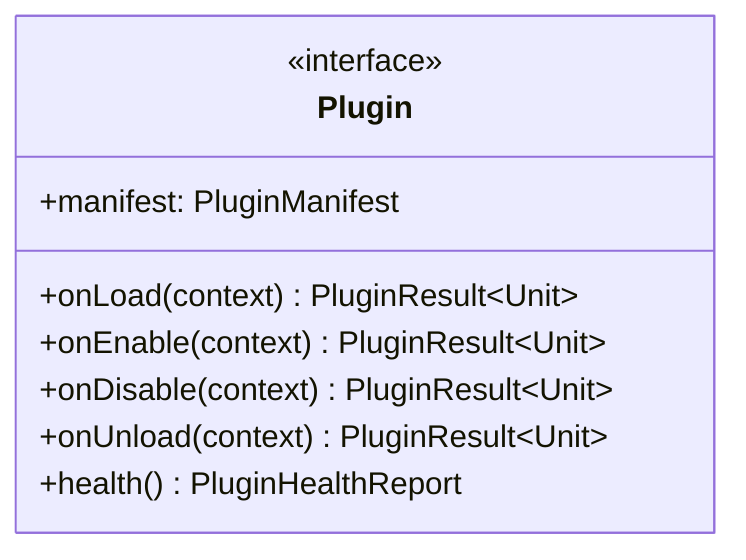
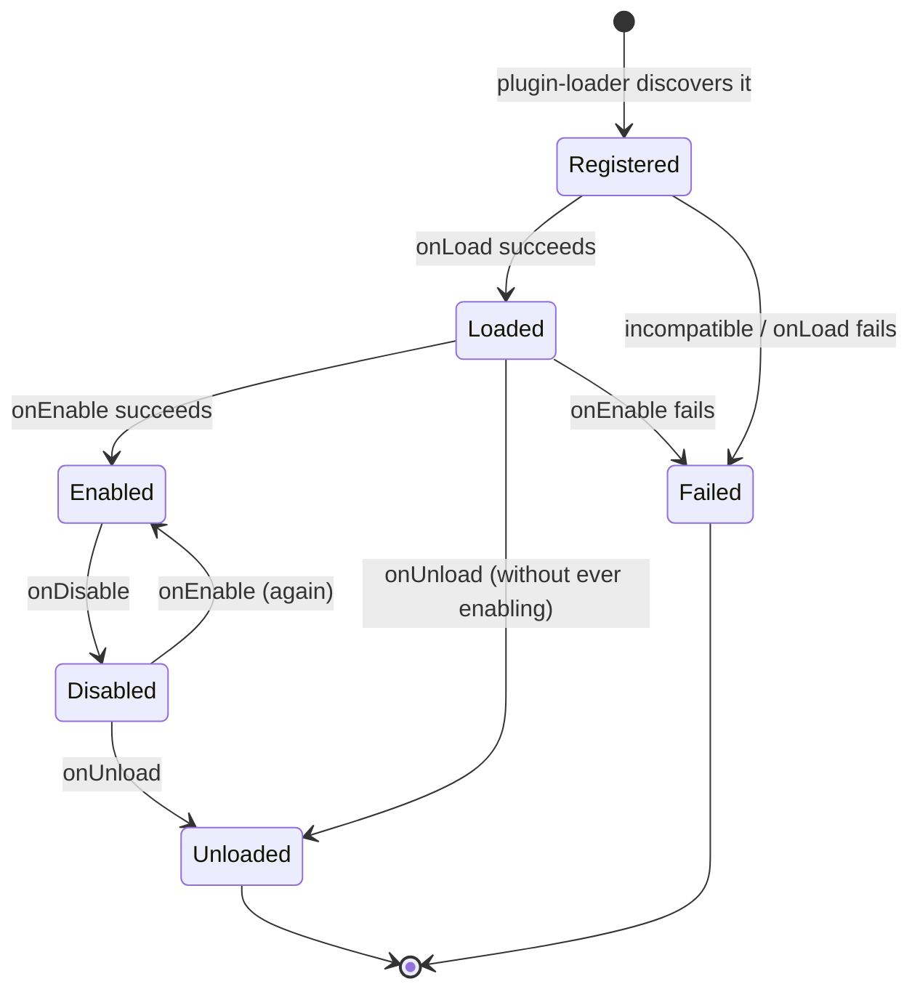
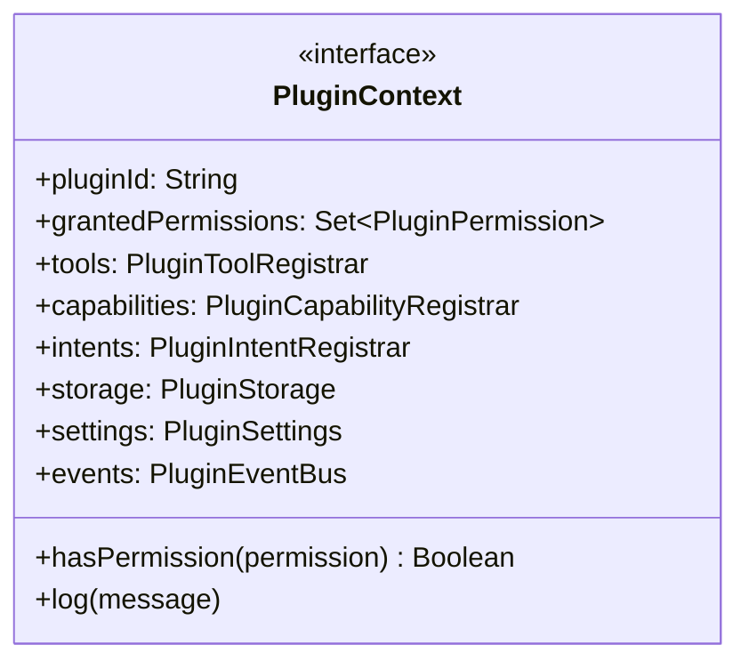
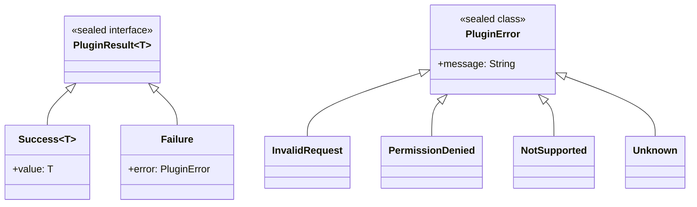
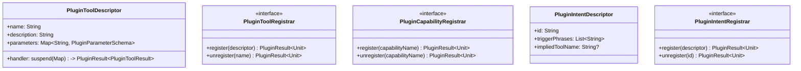

# AURA AI — Plugin API

The SDK surface a plugin author's code compiles against — `plugin-api`, in full. See
[PLUGIN_SDK.md](PLUGIN_SDK.md) for the module map and [PLUGIN_GUIDE.md](PLUGIN_GUIDE.md) for a
worked example using every type on this page.

---

## 1. `Plugin` and its lifecycle





`onLoad` should validate configuration and declare settings — not register anything observable
yet. `onEnable` is where a plugin registers everything it offers; `onDisable` is its exact
inverse. A plugin can cycle `Enabled ⇄ Disabled` any number of times; `onUnload` is terminal for
that instance — a later reload creates an entirely new `Plugin` object.

---

## 2. `PluginManifest` and `PluginVersion`

```kotlin
data class PluginManifest(
    val id: String,
    val name: String,
    val description: String,
    val version: PluginVersion,
    val author: String = "",
    val minHostVersion: PluginVersion,
    val maxHostVersion: PluginVersion? = null,
    val requiredPermissions: Set<PluginPermission> = emptySet(),
)
```

`PluginVersion` is plain `major.minor.patch` semantic versioning with a `Comparable`
implementation — `core-plugin.PluginCompatibilityChecker` checks `minHostVersion ≤ HostSdk.VERSION
≤ (maxHostVersion ?: HostSdk.VERSION)`, and `plugin-runtime.PluginUpdateManager` uses the same
`Comparable` to reject a same-or-older "update." See
[PLUGIN_RUNTIME.md §2](PLUGIN_RUNTIME.md#2-compatibility-and-versioning).

---

## 3. `PluginContext` — the one handle into the host



Every capability a plugin has flows through one of these seven properties. Full detail on why
this is the sandbox boundary: [PLUGIN_SECURITY.md](PLUGIN_SECURITY.md).

---

## 4. `PluginPermission`

```kotlin
enum class PluginPermission {
    RegisterTools, RegisterCapabilities, RegisterIntents,
    AccessStorage, AccessSettings, PublishEvents, NotifyUser,
}
```

Not an Android runtime permission — a closed, host-defined vocabulary of *internal* capabilities.
`PluginManifest.requiredPermissions` is what a plugin asks for; `PluginContext.grantedPermissions`
is what it actually got (never more than requested — see
[PLUGIN_SECURITY.md](PLUGIN_SECURITY.md) for how that's decided). `PluginToolRegistrar.register`,
`PluginCapabilityRegistrar.register`, and `PluginIntentRegistrar.register` each fail with
`PluginError.PermissionDenied` — observably, not silently — when the corresponding permission
wasn't granted.

---

## 5. `PluginResult` and `PluginError`



Deliberately not `core-ai.AuraResult`/`AuraError` — plugin-api has zero dependency on `core-ai`,
so it defines its own, smaller, self-contained result type. `PermissionDenied` alone carries
structured data (`val permission: PluginPermission`) beyond a message, since it's the one failure
a plugin is expected to branch on programmatically (e.g. to explain to a user why a feature is
unavailable), not just log.

---

## 6. Dynamic registration: tools, capabilities, intents



Three deliberately different shapes for three deliberately different reasons:

- **Tools** map onto `core-tools.Tool` almost exactly — `PluginToolDescriptor`'s `handler` is the
  plugin's own logic, wrapped by `core-plugin.PluginBackedTool` into something
  `core-actions.ActionEngine`/`core-agents.ToolBackedAgent`/`core-orchestrator` can invoke without
  ever knowing it came from a plugin.
- **Capabilities** are a free-form `String`, not `core-capabilities.Capability` (a closed,
  11-value enum) — a plugin can't be constrained to a vocabulary decided before it existed. See
  [PLUGIN_SDK.md](PLUGIN_SDK.md) for the honest gap this creates (plugin capabilities don't yet
  participate in `core-orchestrator`'s agent-selection closure).
- **Intents** can't extend `core-intent.IntentType` (also closed) — a match is reported as
  `IntentType.Automation` with the plugin's own intent id carried in `RecognizedIntent.slots`. See
  [PLUGIN_RUNTIME.md §4](PLUGIN_RUNTIME.md#4-dynamic-intent-registration-in-practice).

---

## 7. Storage, Settings, Events, Health

| Type | Purpose | Scoped by |
|---|---|---|
| `PluginStorage` | A plugin's own internal state (`get`/`put`/`remove`/`keys`/`clear`) | Plugin id — one plugin can never see another's keys |
| `PluginSettings` | User-configurable values, with a `declare`d schema and default-value fallback | Plugin id |
| `PluginEventBus` | `publish`/`observe` — `PluginEvent.Custom` for plugin-to-plugin communication, plus every plugin's own lifecycle transitions | Shared bus, every event is self-identifying by `pluginId` |
| `PluginHealthReport` | `Plugin.health()`'s structured self-report (`status` + `detail`) | Per plugin, queried on demand by `core-plugin.PluginHealthMonitor` |

`PluginStorage`/`PluginSettings` are namespaced entirely on the host side
(`core-plugin.PluginStorageHost`/`PluginSettingsHost`) — a plugin's own code never sees a raw key
space shared with anyone else, and never sees the host's real Room database or DataStore.
