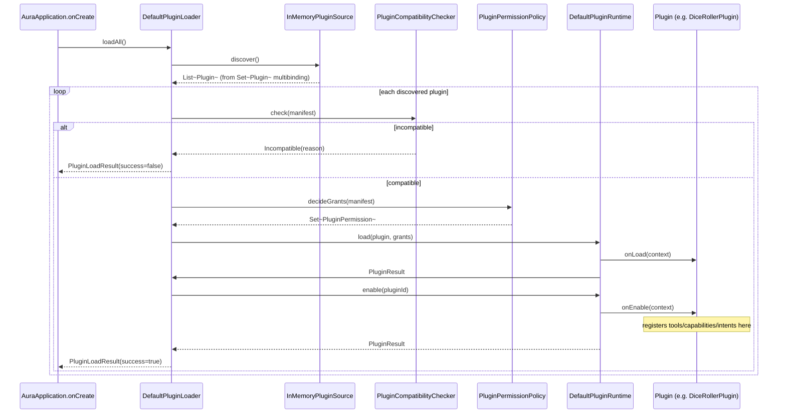
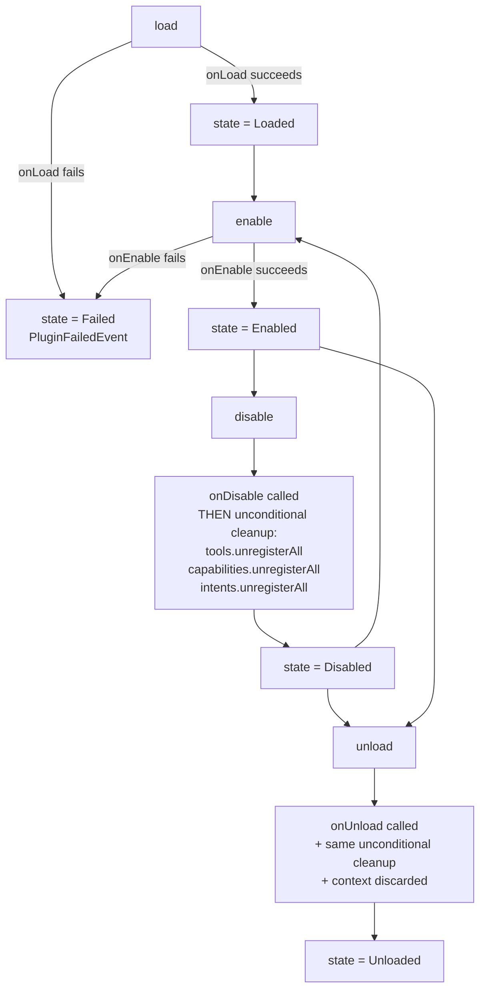
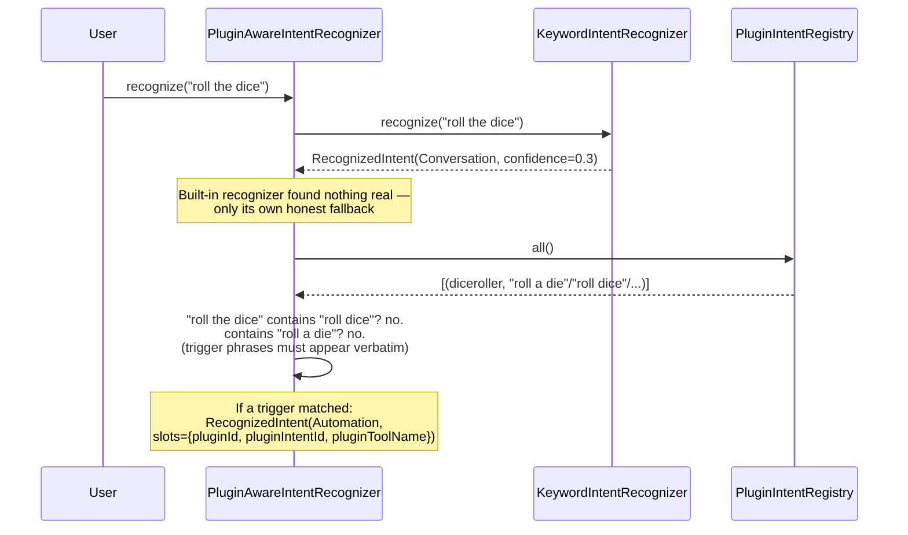
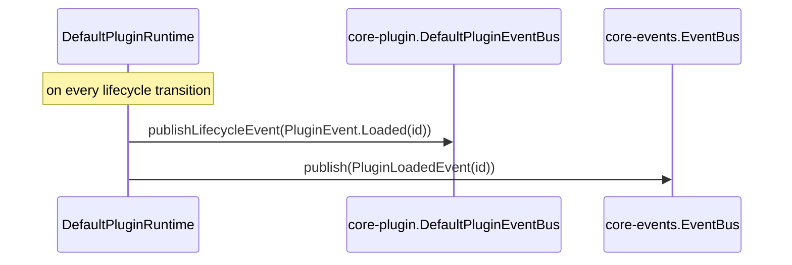
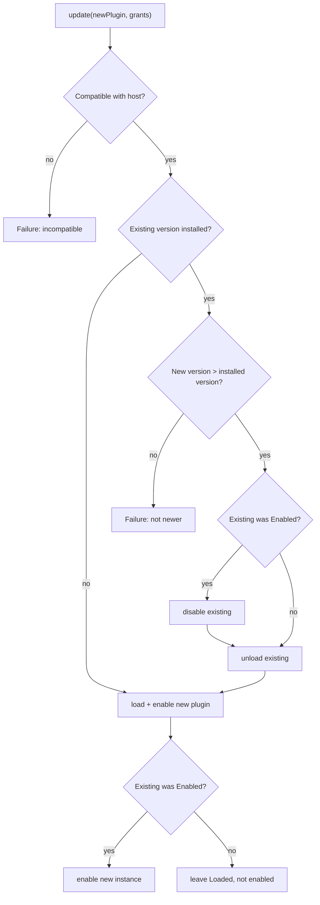

# AURA AI — Plugin Runtime

How a plugin actually gets from "compiled into the app" to "running, registered, and observable"
— `plugin-loader`, `plugin-runtime`, and the parts of `core-plugin` they drive. See
[PLUGIN_API.md](PLUGIN_API.md) for the types referenced throughout and
[PLUGIN_SECURITY.md](PLUGIN_SECURITY.md) for the isolation guarantees this machinery upholds.

---

## 1. Startup sequence

Every discovered plugin is checked, granted, loaded, and enabled — automatically, at the same
moment `core-tools.ToolRegistry` and `core-agents.AgentRegistry` are populated in
`AuraApplication.onCreate`. `DiceRollerPlugin` and `WordCounterPlugin` genuinely go through this
exact sequence every time the app starts.

---

## 2. Compatibility and versioning

`PluginCompatibilityChecker.check` runs before a single line of plugin code executes:

1. `manifest.id`/`manifest.name` must not be blank.
2. `HostSdk.VERSION >= manifest.minHostVersion`.
3. If `manifest.maxHostVersion` is set, `HostSdk.VERSION <= manifest.maxHostVersion`.

`HostSdk.VERSION` (`core-plugin.HostSdk`) is the running host's own SDK version — bumped when a
`plugin-api` change could break an existing plugin's assumptions. A plugin with no `maxHostVersion`
is implicitly compatible with every future host version, which is the honest default: most
`plugin-api` changes are additive and don't break existing plugins, so requiring every plugin to
guess an upper bound would be needless friction.

---

## 3. `PluginRuntime` — the lifecycle engine

The "unconditional cleanup" step is deliberate defensive design: `disable`/`unload` never trust a
plugin's own `onDisable`/`onUnload` to have actually cleaned up after itself. Every tool name the
plugin ever registered (tracked by `DefaultPluginToolRegistrar`, since `core-tools.ToolRegistry`
itself has no concept of "which plugin owns this tool"), every capability, every intent — all
unregistered by the host, every time, regardless of what the plugin's callback did or whether it
even succeeded. A misbehaving plugin can fail to clean up; it can't leave an orphaned registration
behind.

One `DefaultPluginContext` is created per plugin at `load` time and retained across
`enable`/`disable` cycles — a plugin's own storage and settings, and its tool registrar's
bookkeeping, survive being disabled and re-enabled.

---

## 4. Dynamic Intent Registration, in practice

`PluginAwareIntentRecognizer` decorates `KeywordIntentRecognizer` rather than replacing it — the
built-in recognizer always gets first attempt, and a plugin's trigger phrases are only ever
consulted once the built-in one has genuinely found nothing (its own `Conversation`, confidence
≤ 0.3 fallback). This ordering is what makes "dynamic" safe: a plugin can add new recognized
phrases, but can never shadow one the host already understands.

---

## 5. Why compiled-in plugins, not dynamic code loading

`plugin-loader`'s only `PluginSource` this phase, `InMemoryPluginSource`, discovers plugins from a
Hilt `Set<Plugin>` multibinding — the exact mechanism `core-tools`/`core-agents` already use for
`Tool`/`Agent`. Every plugin known to this host got there by being compiled directly into the app
binary.

This is a deliberate scope boundary, not an oversight. Genuine dynamic code loading — parsing a
manifest and instantiating a class from a `.dex`/`.jar` an untrusted third party provided at
runtime — is a materially different, much harder security problem: it means executing
arbitrary code inside the app's own process, which Android provides no built-in sandboxing for
short of a separate process plus a real permission-brokered IPC boundary. Building that safely is
a substantial engineering and security-review effort in its own right, and doing it *partially* —
loading external code without the isolation to back it up — would be worse than not building it
at all: it would look secure without being secure.

What *is* real: the [`PluginSource`](PLUGIN_API.md) interface is the seam a future dynamic-loading
implementation plugs into, and every piece of machinery downstream of "here's a `Plugin`
instance" — compatibility checking, permission grants, sandboxed context, lifecycle, dynamic
registration, events, storage, settings, health, updates — is already real and doesn't care where
the `Plugin` instance came from.

---

## 6. Plugin Events — the bridge

Two independent event vocabularies, bridged in exactly one place. `plugin-api.PluginEvent` is
what a plugin itself can observe (via `PluginContext.events`) — it never depends on `core-events`,
same isolation rule as everything else in that module. `core-events.AuraEvent` gained 6 new
plugin-lifecycle cases this phase (`PluginLoadedEvent`, `PluginEnabledEvent`, `PluginDisabledEvent`,
`PluginUnloadedEvent`, `PluginFailedEvent`, `PluginHealthChangedEvent`) — a purely additive change
to the sealed hierarchy Phase 6 established, verified safe by confirming no exhaustive `when`
anywhere in the codebase pattern-matches over every `AuraEvent` subtype. `DefaultPluginRuntime`
publishes both forms on every transition, so a plugin observing its own lifecycle and the rest of
the host observing *all* plugin activity never have to know about each other's event system.

---

## 7. Plugin Updates

`PluginUpdateManager` never silently downgrades or breaks compatibility — both are checked before
anything about the existing installation is touched. If the outgoing version was actively enabled,
the net effect from a caller's perspective is "same plugin id, newer code, briefly interrupted for
the swap" — not a gap where the plugin appears to vanish.
