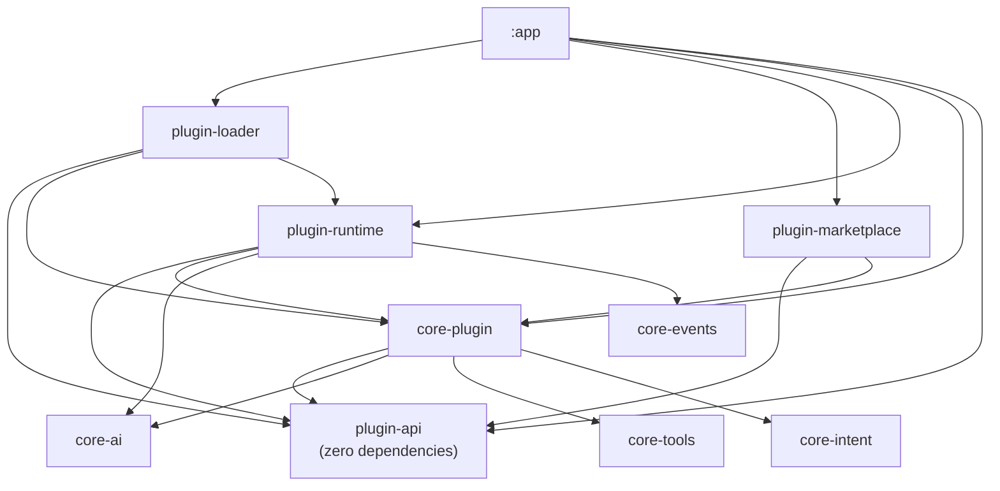

# AURA AI — Phase 7: Plugin SDK

**What this phase is:** a complete plugin framework — 5 new modules
(`plugin-api`, `core-plugin`, `plugin-runtime`, `plugin-loader`, `plugin-marketplace`), a real
sandbox boundary enforced by module structure rather than convention, and two working example
plugins proving the whole pipeline runs end to end. **What this phase is not:** a connection to
any cloud provider, and — deliberately, honestly — not a dynamic code-loading system that
sideloads arbitrary compiled code from the internet. See [PLUGIN_RUNTIME.md](PLUGIN_RUNTIME.md)
§5 for exactly why that scope line is drawn where it is.

Companion documents: **[PLUGIN_API.md](PLUGIN_API.md)** (the SDK surface, in detail),
**[PLUGIN_RUNTIME.md](PLUGIN_RUNTIME.md)** (lifecycle, updates, event bridging),
**[PLUGIN_SECURITY.md](PLUGIN_SECURITY.md)** (the isolation model and its honest limits),
**[PLUGIN_GUIDE.md](PLUGIN_GUIDE.md)** (writing a plugin, worked example).

---

## 1. Module map

`plugin-api` has no dependencies at all — not `core-ai`, not `kotlinx.coroutines` beyond `Flow`.
That's the sandbox boundary made structural: a `Plugin` implementation compiled only against
`plugin-api` has no import path to any internal AURA type, full stop. Everything else in the
graph is the *host's* side of the boundary — real access to `core-tools.ToolRegistry`,
`core-intent.IntentRecognizer`, and so on, that a plugin never sees directly. See
[PLUGIN_SECURITY.md](PLUGIN_SECURITY.md).

| Module | Depends on | Role |
|---|---|---|
| `plugin-api` | — | The SDK a plugin author's code compiles against |
| `core-plugin` | `plugin-api`, `core-ai`, `core-tools`, `core-intent` | Host-side registries, sandboxed `PluginContext`, dynamic registration bridges |
| `plugin-runtime` | `plugin-api`, `core-plugin`, `core-ai`, `core-events` | Lifecycle engine, event bridging, updates |
| `plugin-loader` | `plugin-api`, `core-plugin`, `plugin-runtime`, `core-ai` | Discovers plugins, checks compatibility, decides grants, hands off to the runtime |
| `plugin-marketplace` | `plugin-api`, `core-plugin`, `core-ai` | Browse/search/install — local-real, remote honestly unconnected |

Two small, deliberate touches to *existing* modules complete the integration:
`core-events.AuraEvent` gained 6 new plugin-lifecycle cases (purely additive — see
[PLUGIN_RUNTIME.md](PLUGIN_RUNTIME.md)), and `:app`'s `AiCoreModule` now binds `IntentRecognizer`
to `PluginAwareIntentRecognizer` instead of `KeywordIntentRecognizer` directly (a one-line swap,
the same pattern every phase since Phase 3 has used for exactly this kind of change).

---

## 2. The brief's 16 components, mapped

| Component | Where |
|---|---|
| Plugin interface | `plugin-api.Plugin` |
| Plugin manifest | `plugin-api.PluginManifest` |
| Plugin lifecycle | `Plugin.onLoad/onEnable/onDisable/onUnload` + `plugin-runtime.PluginRuntime` |
| Plugin permissions | `plugin-api.PluginPermission` + `core-plugin.PluginPermissionPolicy` |
| Plugin sandbox | `plugin-api.PluginContext` + module isolation — [PLUGIN_SECURITY.md](PLUGIN_SECURITY.md) |
| Plugin registration | `plugin-loader.PluginLoader` + `core-plugin.PluginRegistry` |
| Dynamic Tool Registration | `plugin-api.PluginToolRegistrar` + `core-plugin.PluginBackedTool` (a real `core-tools.Tool` adapter) |
| Dynamic Capability Registration | `plugin-api.PluginCapabilityRegistrar` + `core-plugin.PluginCapabilityRegistry` |
| Dynamic Intent Registration | `plugin-api.PluginIntentRegistrar` + `core-plugin.PluginAwareIntentRecognizer` |
| Plugin Events | `plugin-api.PluginEvent` (plugin-facing) bridged to `core-events.AuraEvent` (host-facing) by `plugin-runtime` |
| Plugin Storage | `plugin-api.PluginStorage` + `core-plugin.PluginStorageHost` |
| Plugin Settings | `plugin-api.PluginSettings` + `core-plugin.PluginSettingsHost` |
| Plugin Versioning | `plugin-api.PluginVersion` |
| Plugin Compatibility | `core-plugin.PluginCompatibilityChecker` |
| Plugin Updates | `plugin-runtime.PluginUpdateManager` |
| Plugin Health | `Plugin.health()` + `core-plugin.PluginHealthMonitor` |

Every one of these is real and runs today — see [PLUGIN_GUIDE.md](PLUGIN_GUIDE.md) for the two
working example plugins that exercise all sixteen.

---

## 3. What's real vs. scaffolded

| Component | Status |
|---|---|
| Plugin interface, manifest, lifecycle, registration | ✅ Real |
| Dynamic tool/capability/intent registration | ✅ Real — a plugin's tool is genuinely invokable through the same `ToolRegistry` every built-in tool uses |
| Sandbox isolation (module-boundary, permission model, scoped storage/settings) | ✅ Real |
| Versioning, compatibility checking, updates (hot-swap) | ✅ Real |
| Plugin health | ✅ Real |
| Plugin discovery *this phase* | ✅ Real, but scoped: plugins compiled into the app binary, discovered via `Set<Plugin>` (the same mechanism `Tool`/`Agent` already use) — not sideloaded from anywhere |
| `plugin-marketplace` browse/search | ✅ Real — lists what's actually installed |
| `plugin-marketplace` install/remote updates | ❌ Honestly scaffolded — no cloud connection this phase, same `NotSupported` convention as every other unconnected seam |

## 4. Where to look next

- Implementation-level detail per module: each module's own `README.md`.
- DI wiring: `app/src/main/java/com/aura/ai/ai/di/AiPluginModule.kt`, plus the `AiCoreModule`
  intent-recognizer swap.
- Working examples: `app/src/main/java/com/aura/ai/plugins/DiceRollerPlugin.kt` and
  `WordCounterPlugin.kt`.
