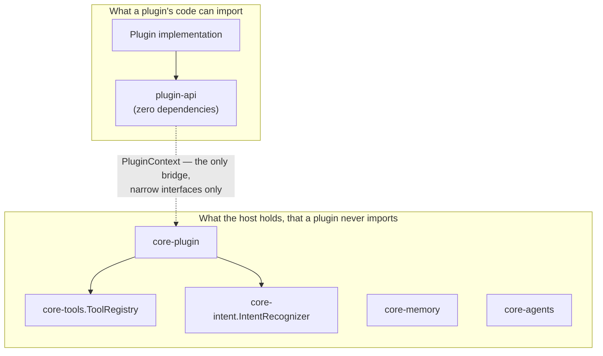
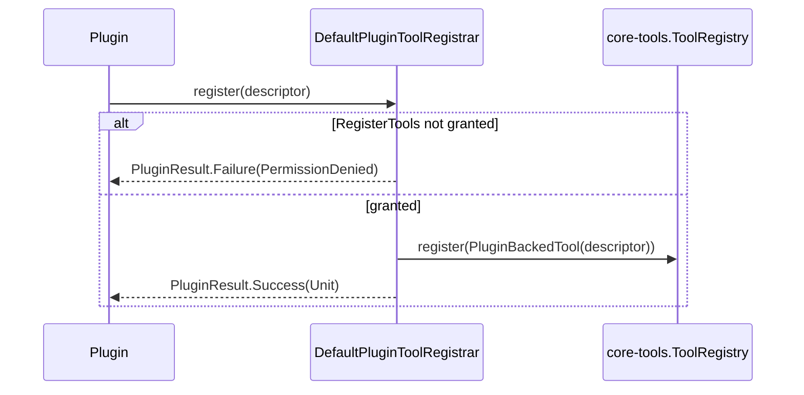

# AURA AI — Plugin Security

"Every plugin should be isolated. Plugins cannot directly access internal modules. Only expose
public APIs." What that means concretely in this codebase, what actually enforces it, and — just
as importantly — what it does *not* protect against. Honesty about the limits here matters as
much as the guarantees themselves.

---

## 1. The isolation model

The isolation guarantee has two layers, and they're different kinds of guarantee:

1. **Compile-time (real, structural):** `plugin-api` has zero project dependencies. A `Plugin`
   implementation compiled only against it has no import path to `core-tools`, `core-memory`,
   `core-agents`, or anything else internal — the classpath simply doesn't have them. This is
   enforced by Gradle module boundaries, not a lint rule or a convention someone could forget.
2. **Runtime (real, but same-process):** `PluginContext` is the *only* handle a loaded plugin
   receives. Every capability — registering a tool, reading storage — goes through one of its
   seven narrow interfaces, each permission-checked. See §3.

What this is **not**: OS-level process isolation. A loaded plugin's code runs in the same JVM, same
process, same memory space as the rest of the app. It cannot be *stopped* from calling arbitrary
JVM/Android APIs directly if it imports something beyond `plugin-api` — nothing at the JVM level
prevents a `Plugin` implementation from also depending on `android.*` classes directly, the way
any other Kotlin class in the app could. The guarantee this phase provides is that the *SDK
plugin-api hands out* gives no path to internal AURA state — not that arbitrary malicious bytecode
is contained. That distinction is exactly why `plugin-loader`'s only source this phase is plugins
*compiled into the app binary* (see [PLUGIN_RUNTIME.md §5](PLUGIN_RUNTIME.md#5-why-compiled-in-plugins-not-dynamic-code-loading))
— the trust model for compiled-in code is "same as any other class in this app," which is
appropriate; it would not be appropriate for genuinely third-party, sideloaded code without a much
stronger isolation mechanism (a separate process, real IPC, code signing) that this phase doesn't
attempt.

---

## 2. `PluginContext` as the enforced boundary

Every accessor on `PluginContext` is backed by a real host object
(`DefaultPluginContext` genuinely holds a `core-tools.ToolRegistry` reference), but a plugin only
ever sees the `plugin-api` interface type. Concretely:

| A plugin wants to... | It calls... | Which is really backed by... |
|---|---|---|
| Register a tool | `context.tools.register(descriptor)` | `core-tools.ToolRegistry`, via `PluginBackedTool` |
| Read/write its own data | `context.storage.get/put(...)` | `core-plugin.PluginStorageHost`, namespaced by plugin id |
| Publish a custom event | `context.events.publish(...)` | `core-plugin.DefaultPluginEventBus` |

A plugin never receives, and has no way to construct, a `ToolRegistry` or `PluginStorageHost`
reference itself — only what `PluginContext` explicitly hands it.

---

## 3. Permission enforcement

`PluginManifest.requiredPermissions` is what a plugin *asks* for; `PluginContext.grantedPermissions`
is what it *got* — always a subset, decided by `core-plugin.PluginPermissionPolicy` before
`plugin-runtime` ever calls `onLoad`. Every dynamic-registration call
(`PluginToolRegistrar.register`, `PluginCapabilityRegistrar.register`, `PluginIntentRegistrar.register`)
checks its specific permission and fails observably — `PluginResult.Failure(PluginError.PermissionDenied)`
— rather than silently no-op-ing, so a plugin (and the developer debugging it) can always tell
whether something actually happened.

**`DefaultPluginPermissionPolicy` grants exactly what's declared, nothing more — but nothing less
either.** This is an honest, deliberate default for *this phase's* trust level: every plugin
`plugin-loader` can currently discover is compiled directly into the app binary, the same trust
level as a built-in `Tool` or `Agent`, neither of which go through a user-facing grant prompt
either. The `PluginPermissionPolicy` interface is exactly where a stricter policy — one that
prompts the user before granting anything — plugs in later, the moment a source less trusted than
"compiled into this app" exists. Nothing above that interface would need to change.

---

## 4. Storage and settings isolation

`PluginStorageHost`/`PluginSettingsHost` namespace every operation by plugin id internally — a
plugin's own view (`context.storage`, `context.settings`) has no parameter through which to name a
*different* plugin's id, so there is no way for one plugin's code to read or overwrite another's
data, even by guessing. Both are in-memory only this phase (not yet persisted to disk) — the same
honest limitation `core-memory`'s stores have carried since Phase 4.

---

## 5. The marketplace trust boundary

`plugin-marketplace.LocalPluginMarketplaceClient.browse`/`search` only ever list what's already
registered in `core-plugin.PluginRegistry` — plugins that already went through the same
compile-time trust model as everything else. `install` and `checkForUpdates` fail honestly with
`PluginError.NotSupported`, because accepting a plugin from an actual remote catalog is exactly
the moment this phase's trust model (§1, §3) would need to become stricter before it's
appropriate — and that's future work, not something to fake now.

## 6. Summary: what's guaranteed, what isn't

| Guarantee | Real? |
|---|---|
| A `Plugin` compiled only against `plugin-api` cannot import an internal AURA type | ✅ Yes — structural, via module dependencies |
| A plugin can only affect the host through `PluginContext`'s narrow interfaces | ✅ Yes — every path is permission-checked |
| A plugin cannot read or write another plugin's storage/settings | ✅ Yes — namespaced at the host layer |
| A plugin is granted no more than it declared needing | ✅ Yes |
| A plugin's code is prevented from calling arbitrary Android/JVM APIs if it chooses to import them | ❌ No — same-process, no OS-level sandbox |
| Untrusted, dynamically-loaded third-party code is safely contained | ❌ Not attempted this phase — see [PLUGIN_RUNTIME.md §5](PLUGIN_RUNTIME.md#5-why-compiled-in-plugins-not-dynamic-code-loading) |
