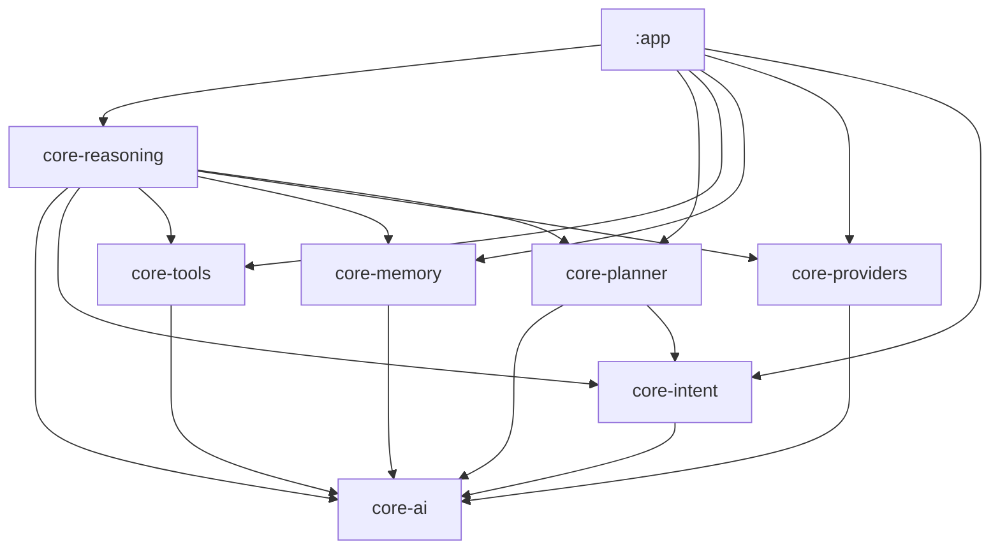

# AURA AI — Phase 5: Reasoning Engine

**What this phase is:** the reasoning layer that sits between `com.aura.ai.core.intent.IntentRecognizer`
and `com.aura.ai.core.planner.Planner` — a new module, `core-reasoning`, that decides *whether and
how* a goal should be acted on before a plan is generated, and validates what comes back once one
is. **What this phase is not:** a connection to any cloud AI provider. Every place reasoning would
consult a model (deciding whether generation is *needed*, judging *confidence*) is a real, local
heuristic; nothing here calls out to anything.

This is the cross-cutting entry point into Phase 5's four companion documents:

- **[DECISION_ENGINE.md](DECISION_ENGINE.md)** — the 8 questions the brief requires, in detail.
- **[EXECUTION_FLOW.md](EXECUTION_FLOW.md)** — the full sequence diagram and the brief's own
  worked example traced end to end, with the literal trace lines it produces.
- **[GOAL_DECOMPOSITION.md](GOAL_DECOMPOSITION.md)** — `GoalManager`, `TaskDecomposer`, and how a
  goal becomes an ordered set of `SubGoal`s.
- **[CONSTRAINT_ENGINE.md](CONSTRAINT_ENGINE.md)** — `ExecutionContext`, permission/battery/network
  awareness, `ConstraintEngine`, and `ActionValidator`.

---

## 1. Why a new module, and what it depends on

Reasoning genuinely needs visibility into more of the system than any prior core module did — it
has to know what tools exist (`core-tools`), whether AI generation is currently possible
(`core-providers`), whether relevant memory already exists (`core-memory`), what the user meant
(`core-intent`), and it hands its conclusion to planning (`core-planner`) as its final act. Rather
than force that through the app layer, `core-reasoning` depends on all five directly — still pure
Kotlin/JVM, still fully unit-testable with no Android framework, same as every core module except
`core-actions`.

No cycles: `core-planner` has no dependency on `core-reasoning` and never will — reasoning is a
*consumer* of planning (it calls `Planner.plan` as its last step), not the other way around.

| Module | Kotlin/JVM or Android? | New this phase? |
|---|---|---|
| `core-reasoning` | Kotlin/JVM | ✅ new |
| Everything else | unchanged | — |

Two small Android-backed classes and one Hilt module are new in `:app` (see
[CONSTRAINT_ENGINE.md §4](CONSTRAINT_ENGINE.md#4-the-real-android-backed-implementations) for why
they have to live there rather than in `core-reasoning` itself) — everything else this phase is
inside the new module.

---

## 2. The brief's 9 components, mapped to what actually ships

| Brief component | Package | Interface | Default implementation |
|---|---|---|---|
| Execution Context | `context` | `ExecutionContext` (data) / `ExecutionContextProvider` | `DefaultExecutionContextProvider` |
| Capability Resolver | `capability` | `CapabilityResolver` | `DefaultCapabilityResolver` |
| Goal Manager | `goal` | `GoalManager` | `DefaultGoalManager` |
| Task Decomposer | `decomposition` | `TaskDecomposer` | `RuleBasedTaskDecomposer` |
| Constraint Engine | `constraint` | `ConstraintEngine` | `DefaultConstraintEngine` |
| Confidence Evaluator | `confidence` | `ConfidenceEvaluator` | `DefaultConfidenceEvaluator` |
| Decision Engine | `decision` | `DecisionEngine` | `DefaultDecisionEngine` |
| Action Validator | `validation` | `ActionValidator` | `DefaultActionValidator` |
| Reasoning Engine | (root) | `ReasoningEngine` | `DefaultReasoningEngine` |

Every interface/implementation pair is bound in `:app`'s new `AiReasoningModule` (Hilt `@Binds`),
the same one-line-swap pattern every prior phase established.

---

## 3. What `ReasoningEngine.reason` actually decides

The brief's own list, verbatim, is `ReasoningDecisions` — one field each:

1. **Can Android perform this?** → `canPerformLocally`
2. **Does this require AI?** → `requiresAI`
3. **Does this require memory?** → `requiresMemory`
4. **Does this require internet?** → `requiresInternet`
5. **Which tools are available?** → `availableTools`
6. **Which permissions are missing?** → `missingPermissions`
7. **Should multiple tools be combined?** → `shouldCombineTools`
8. **Should the task be split?** → `shouldSplitTask`

Full detail on how each is computed: [DECISION_ENGINE.md](DECISION_ENGINE.md).

## 4. What "Implement" asked for, and where it lives

| Brief item | Where |
|---|---|
| Goal decomposition | `TaskDecomposer` — [GOAL_DECOMPOSITION.md](GOAL_DECOMPOSITION.md) |
| Constraint checking | `ConstraintEngine` — [CONSTRAINT_ENGINE.md](CONSTRAINT_ENGINE.md) |
| Confidence scoring | `ConfidenceEvaluator` — [DECISION_ENGINE.md §4](DECISION_ENGINE.md#4-confidence-scoring) |
| Alternative planning | `ReasoningOutcome.alternatives`, built by `DefaultReasoningEngine` — [EXECUTION_FLOW.md](EXECUTION_FLOW.md) |
| Task prioritization | `SubGoal.priority` — [GOAL_DECOMPOSITION.md](GOAL_DECOMPOSITION.md) |
| Execution validation | `ActionValidator` — [CONSTRAINT_ENGINE.md §6](CONSTRAINT_ENGINE.md#6-action-validator-post-plan-checking) |
| Failure recovery planning | `ReasoningOutcome.recoveryPlan` — [CONSTRAINT_ENGINE.md §7](CONSTRAINT_ENGINE.md#7-failure-recovery-planning) |
| Permission awareness | `PermissionChecker` — [CONSTRAINT_ENGINE.md](CONSTRAINT_ENGINE.md) |
| Offline awareness | `NetworkStatusProvider` — [CONSTRAINT_ENGINE.md](CONSTRAINT_ENGINE.md) |
| Battery awareness | `BatteryStatusProvider` — [CONSTRAINT_ENGINE.md](CONSTRAINT_ENGINE.md) |

---

## 5. What's real vs. scaffolded

| Component | Status |
|---|---|
| Goal understanding, decomposition, the 8 decisions, constraint checking, confidence scoring, action validation, alternative/recovery planning | ✅ Real — runs today, entirely locally |
| Permission checking | ✅ Real — `AndroidPermissionChecker` reads `ContextCompat.checkSelfPermission` |
| Offline/battery awareness | ✅ Real — `AndroidNetworkStatusProvider`/`AndroidBatteryStatusProvider` read live `ConnectivityManager`/`BatteryManager` state |
| Plan generation | ✅ Real — literally invokes `com.aura.ai.core.planner.Planner`, the same engine Phase 3 shipped |
| "Does this require AI" *judgment* | ✅ Real — a local heuristic (does any sub-goal have no local tool) |
| Actually satisfying an AI-required step | ❌ Scaffolded — same honest gap as every prior phase; `ConstraintEngine`/`ActionValidator` report it rather than hide it |

Permission, network, and battery checks are **not** scaffolded the way embeddings or AI providers
are — none of them need a cloud connection, so this phase ships real, working Android-backed
implementations for all three (see [CONSTRAINT_ENGINE.md §4](CONSTRAINT_ENGINE.md#4-the-real-android-backed-implementations)).
The only genuinely scaffolded gap left is the same one every phase has honestly carried forward:
no AI provider is connected, so a step that needs one still fails — reasoning's job is to predict
and explain that gap in advance, not to hide it.

## 6. Where to look next

- Implementation-level detail per component: `core-reasoning/README.md`.
- DI wiring: `app/src/main/java/com/aura/ai/ai/di/AiReasoningModule.kt`.
- The Phase 3 planning layer this phase sits in front of: [PHASE3_CORE_INTELLIGENCE.md](PHASE3_CORE_INTELLIGENCE.md).
- The Phase 4 memory layer `GoalManager` reads from: [MEMORY_ENGINE.md](MEMORY_ENGINE.md).
