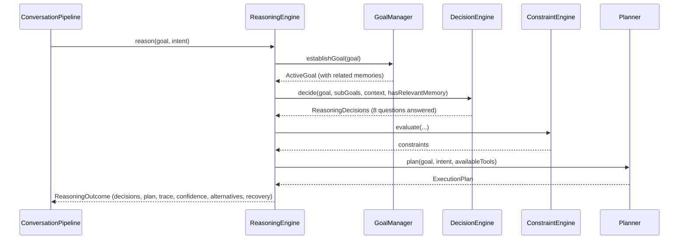

# AURA AI — Runtime Pipeline

The full execution flow the brief specified, mapped to exactly which existing class performs
each stage — and, just as important, which stages turn out to already be sub-steps of an earlier
one, because the module that performs them was built that way in an earlier phase. See
[AURA_RUNTIME.md](AURA_RUNTIME.md) for the three-layer structure this runs inside and
[CONVERSATION_PIPELINE.md](CONVERSATION_PIPELINE.md) for the implementation itself.

---

## 1. The brief's flow, mapped

| Brief stage | Real component | Called from |
|---|---|---|
| User Message | — | `AuraTabViewModel.sendChat()` |
| Conversation Session | `ConversationSession` (new, Phase 8) | `AuraRuntime.process` |
| Execution Context | `core-reasoning.context.ExecutionContextProvider` | `ConversationPipeline` directly, *and* internally by `ReasoningEngine` |
| Intent Recognition | `core-intent.IntentRecognizer` (bound to `PluginAwareIntentRecognizer`) | `ConversationPipeline` directly |
| Memory Retrieval | `core-memory.retrieval.MemoryRetriever` | `ConversationPipeline` directly, *and* internally by `ReasoningEngine`'s `GoalManager` |
| Reasoning Engine | `core-reasoning.ReasoningEngine` | `ConversationPipeline` |
| Decision Engine | `core-reasoning.decision.DecisionEngine` | **internally, by `ReasoningEngine`** |
| Goal Manager | `core-reasoning.goal.GoalManager` | **internally, by `ReasoningEngine`** |
| Planner | `core-planner.Planner` | **internally, by `ReasoningEngine`** |
| Agent Orchestrator | `core-orchestrator.selection.AgentSelectionEngine` | `ConversationPipeline` directly |
| Execution Coordinator | `core-orchestrator.coordination.ExecutionCoordinator` | `ConversationPipeline`, when a specialized agent applies |
| Tool Registry | `core-tools.ToolRegistry` | via `ToolBackedAgent`/`core-actions.ActionEngine`/`PlanExecutor` |
| Provider Manager | `core-providers.AIProviderManager` | via `PlanExecutor`, only for a step with no tool |
| Response Builder | `ConversationPipeline.buildResponse` (new, Phase 8) | `ConversationPipeline` |
| Conversation History | `ChatRepository` (existing, Phase 1–2) | `AuraRuntimeFacade` |
| UI | `AuraTabViewModel`/`AuraTabScreen` | — |

---

## 2. Why Decision Engine, Goal Manager, and Planner don't get separate calls

`core-reasoning.ReasoningEngine.reason(goal, intent)` was built in Phase 5 to compose exactly
these three itself:



Calling `DecisionEngine`, `GoalManager`, or `Planner` a *second* time from `ConversationPipeline`
would either duplicate work `ReasoningEngine` already did, or — worse — risk the two call sites
disagreeing (e.g. a `Planner.plan()` call from the pipeline using different `availableTools` than
the one `ReasoningEngine` used internally, producing two different plans for one turn). Calling
`ReasoningEngine.reason` once and reading `ReasoningOutcome.decisions`/`.executionPlan`/`.trace` is
the integration that respects "do not duplicate functionality" — the brief's own instruction —
literally, not just in spirit.

Two stages *do* get their own explicit call from `ConversationPipeline`, despite also running
inside `ReasoningEngine`:

- **Execution Context** — captured once by the pipeline (using the same
  `ExecutionContextProvider` `ReasoningEngine` uses internally) so `ExecutionTrace` can carry it
  for developer mode. `ReasoningEngine` doesn't expose the context it captured internally.
- **Memory Retrieval** — called directly so `ExecutionTrace.retrievedMemories` can carry the
  actual `MemoryEntry` list. `ReasoningOutcome` doesn't expose `GoalManager`'s internal
  `ActiveGoal.relatedMemories` — only derived facts (`decisions.requiresMemory`,
  `confidence.memoryConfidence`) make it out. This is the one place this phase's own honesty
  requires a small, accepted redundancy: `MemoryRetriever.retrieve(goal)` genuinely runs twice per
  turn (once here, once inside `GoalManager`). Both calls are the same, real, idempotent method —
  nothing is reimplemented, only invoked from two call sites — and the cost is a single in-memory
  substring scan, not measurable against everything else one turn does.

---

## 3. Selecting the execution path

```mermaid
flowchart TD
    A[ReasoningOutcome ready] --> B{decisions.shouldSplitTask?}
    B -- yes --> C["Run the plan directly via PlanExecutor<br/>(document-pipeline shape: research → generate →<br/>export → save → notify, exactly what PlanExecutor<br/>was built for in Phase 3)"]
    B -- no --> D["AgentSelectionEngine.selectAgents(intent)<br/>+ ExecutionCoordinator.coordinate(...)"]
    D --> E{Did a specialized agent<br/>(not PlannerAgent/MemoryAgent)<br/>succeed?}
    E -- yes --> F[Use that outcome — the agent<br/>already invoked the real tool]
    E -- no --> C
```

This is the one genuinely new piece of logic Phase 8 contributes — not a new capability, a
*routing decision* about which of two already-real execution paths (agents, or `PlanExecutor`
running the plan `Planner` already produced) actually carries a goal out, chosen specifically to
avoid invoking the same tool twice. See
[CONVERSATION_PIPELINE.md §2](CONVERSATION_PIPELINE.md#2-choosing-how-the-goal-actually-gets-carried-out)
for the full reasoning behind it, including why `"Open Spotify"` (no specialized agent exists for
`OpenApp`) and `"research and write my assignment"` (`ResearchAgent` exists for `Research`) take
different paths through the same decision.

---

## 4. Provider Manager — "only when needed"

`AIProviderManager` is only ever reached one way: `PlanExecutor.runStep` calls it exclusively for
a `PlanStep` with `toolName == null` — the same convention every phase since Phase 3 has used for
"this genuinely needs generation, not a registered tool." A goal whose plan is all tool steps
(`"Open Spotify"`, `"remind me to call mom"`, `"search for wireless headphones"`) never touches
`AIProviderManager` at all — no code path checks whether a provider is connected unless a step
with no tool is actually about to run. This is what "if no provider is connected, the runtime
should still work" means concretely: not that failures are hidden, but that the *majority* of
real, tool-shaped goals never depend on a provider existing in the first place.
