# AURA AI — Testing

Version 1.0 Critical item 7 ([TODO_V1.md §2.7](TODO_V1.md#27-testing)): "expand automated tests…
target 90% coverage for core modules, 80% overall" read as a coverage-percentage target, but no
coverage tool (Jacoco or otherwise) is wired into this project yet — see §4 for why that number
isn't reported here and what's reported instead.

---

## 1. Before this milestone

Five modules had a test source set: `core-providers` (27), `:app` (mostly Voice Runtime + Workflow
Engine tests), `core-actions` (`DefaultActionEngineTest`, `ReceiptScanToolTest`), `core-memory`
(`RelationshipLinkerTest`, `DefaultKnowledgeGraphTest`). Three modules that exist purely to make
*decisions* — `core-reasoning`, `core-orchestrator`, `core-agents` — had **zero**. That's the gap
this milestone closes: not more tests everywhere, but tests where a bug would be hardest to notice
and most expensive to ship, per `docs/TODO_V1.md` §2.7's own stated priority ("prioritize by blast
radius — ReasoningEngine/DecisionEngine/ConstraintEngine (pure logic, highest value per test)").

| Module | Tests before | Tests after |
|---|---:|---:|
| `core-reasoning` | 0 | 44 |
| `core-orchestrator` | 0 | 18 |
| `core-agents` | 0 | 12 |
| `core-providers`, `core-actions`, `core-memory`, `:app` | 70 | 70 (unchanged) |
| **Total** | **70** | **144** |

---

## 2. `core-reasoning` — the "8 questions" engine, now actually verified

```mermaid
classDiagram
    class DefaultDecisionEngineTest {
        9 scenarios: local vs AI, memory triggers,
        tool availability, permissions, combine/split
    }
    class DefaultConfidenceEvaluatorTest {
        weighted 30/30/25/15 formula, each factor
        isolated, coerceIn(0,1)
    }
    class DefaultConstraintEngineTest {
        tool/permission/network/battery/AI-provider
        checks, deduped by tool name
    }
    class RuleBasedTaskDecomposerTest {
        document pipeline vs single sub-goal,
        every IntentType to its documented tool
    }
    class DefaultGoalManagerTest {
        memory-retrieval success/failure propagation
    }
    class DefaultCapabilityResolverTest {
        registry delegation, the one hard-coded
        permission, the three network-needing tools
    }
```

44 tests across 6 files, one per concrete class doing real logic (`decision/`, `confidence/`,
`constraint/`, `decomposition/`, `goal/`, `capability/`). Every fixture is a hand-written fake
(`FakeCapabilityResolver`, `FakeToolRegistry`, `FakeMemoryRetriever`) rather than a mock — the
interfaces involved are small enough that a fake reads as clearly as a mock would, and this keeps
the pattern consistent with every fake already in this codebase's test suites.

**A real, self-caught test bug**: an early version of `DefaultDecisionEngineTest`'s
"personal-context substring" test used the goal `"tell me about the army"`, expecting `requiresMemory`
to stay `false` because `"army"` contains `"my"`. It actually failed — correctly. `"tell me about"`
contains the standalone word `"me"`, itself one of `DefaultDecisionEngine`'s own personal-context
markers, so `requiresMemory = true` was the right answer. The test's premise was wrong, not the
code; fixed by rewording to `"what do you know about the army"`, which contains no standalone
personal pronoun at all.

**A real, self-caught production bug**: `DefaultCapabilityResolver`'s permission map never gained
an entry for `file_search` (`FileSearchTool`, added in the Android Automation milestone), which
genuinely needs `READ_EXTERNAL_STORAGE` — but only on API 26–28; API 29+ queries the same
`MediaStore.Downloads` collection without it. Writing `DefaultCapabilityResolverTest` surfaced the
gap. Since the resolver's permission map has no per-API-level dimension, adding an unconditional
entry would just trade one wrong answer for another (false "missing permission" on modern devices,
or false "nothing needed" on old ones). Documented as a deliberate, narrow scope boundary in the
class's own KDoc rather than papered over — `FileSearchTool` already checks and reports honestly
at call time, so no user-facing behavior is actually wrong, only the constraint-engine's advance
warning for that one API range.

---

## 3. `core-orchestrator` and `core-agents` — the multi-agent pipeline's decision points

`core-orchestrator/selection` (`DefaultAgentSelectionEngineTest`, 5 tests): primary-agent matching
by intent, pulling in supporting agents via `dependsOnCapabilities`, priority ordering, and
de-duplication when an agent is reachable both directly and through its own capability dependency.

`core-orchestrator/aggregation` (`DefaultResultAggregatorTest`, 7 tests): confidence is the mean of
*succeeded* agents only (a failure contributes nothing, not a zero); `mergedData` last-writer-wins
on key collision; `allSucceeded`/`partialSuccess` derived correctly from a mix of outcomes.

`core-orchestrator/dispatch` (`DefaultTaskDispatcherTest`, 6 tests): an `Unavailable` agent is
never executed; missing permissions are published as events without blocking dispatch of an
otherwise-healthy agent; retries stop on first success; a fully-failing agent retries exactly
`maxAttempts` times; a timeout produces a real timeout failure, not a hang — all run against a
`RecordingEventBus` fake and driven through `kotlinx-coroutines-test`'s virtual time, so the
timeout/retry-delay tests run instantly rather than actually sleeping.

`core-agents` (`ToolBackedAgentTest`, 7 tests; `DefaultAgentRegistryTest`, 5 tests): the shared
`health()`/`runTool()` logic five of AURA's nine agents inherit — tool-availability checked before
permissions, `ToolExecutedEvent` published on both the success and failure path with the right
summary — and the registry's agent↔capability-registry sync on register/unregister.

---

## 4. Coverage: reported honestly, not measured

No Jacoco (or equivalent) plugin is configured in this project, so there is no tooling in place to
produce an actual 90%/80% line-coverage number, and adding one is itself nontrivial across 18
Gradle modules with a mix of pure-JVM and Android library plugins. What's true and verifiable
today: `core-reasoning`'s six *concrete implementation classes* each have a dedicated test file
covering every branch in their `when`/`if` logic by inspection; the same is true for the four
`core-orchestrator` classes and two `core-agents` classes covered here. That is a real, substantive
increase in tested surface area — just not the same thing as an instrumented percentage, and this
document says so rather than asserting a number nothing produced.

---

## 5. What's still untested

- `DefaultReasoningEngine` (core-reasoning's top-level composition of every class tested above) and
  `DefaultAgentOrchestrator`/`DefaultExecutionCoordinator` (core-orchestrator's equivalent) are
  integration-shaped classes wiring together everything already covered — high value, but properly
  an integration-test target (multiple real collaborators, not one fake per dependency), not
  another unit-test file. Left for a follow-up pass rather than rushed into this one.
- The five concrete `ToolBackedAgent` subclasses (`ResearchAgent`, `CalendarAgent`,
  `AutomationAgent`, `ShoppingAgent`, `NotificationAgent`) and the four non-tool-backed agents
  (`PlannerAgent`, `CodingAgent`, `MemoryAgent`, `VisionAgent`) each have their own small amount of
  agent-specific logic on top of the now-tested `ToolBackedAgent` base — not covered individually
  this pass.
- UI-layer tests (Compose screens/ViewModels) beyond what Voice Runtime and Workflow Engine already
  added — no device/emulator is available in this environment to run instrumented (`androidTest`)
  UI tests at all; everything in this document is JVM unit tests.
