# AURA AI — Vision Runtime

Version 1.0 Critical item 4 ([TODO_V1.md §2.4](TODO_V1.md#24-vision-ai)): vision becomes four more
`Tool`s in the same registry every other capability already lives in — "another Tool integrated
into the existing runtime," not a parallel vision subsystem. The one real architecture change is
additive: `AiMessage` gained two nullable fields so a vision-capable provider can actually receive
an image, closing the exact gap `docs/AI_PROVIDER_INTEGRATION.md` and `docs/TODO_V1.md` §2.4 had
both already identified (`GenerationRequest` had no image field at all).

---

## 1. Four tools, two different shapes

| Tool | Backing | Network / cost | `requiresConfirmation` |
|---|---|---|---|
| `ocr` | ML Kit Text Recognition (on-device) | None | No |
| `scan_barcode` | ML Kit Barcode Scanning (on-device) | None | No |
| `scan_receipt` | `ocr` + heuristic parsing | None | No |
| `understand_image` | Active `AIProviderManager` provider | Yes — a real model call | No |

The first three are on-device, free, and instant — real "vision," but a fixed task, not a model.
`understand_image` is the one capability that genuinely needs a model: open-ended "what is this?"
questions have no fixed answer shape an on-device classifier can give. It routes through
`AIProviderManager.generate()` exactly the way `CodingAgent` already does for text — no new way to
reach a provider was invented, and it honestly inherits whatever `AI_PROVIDER_INTEGRATION.md`
already established (no vision-capable provider connected → the same `ProviderNotConnected`
handling every other AI-backed capability already has).

```mermaid
flowchart TD
    A["User: 'what's in this photo?'"] --> B[understand_image Tool]
    B --> C{"activeProvider.capabilities.supportsVision?"}
    C -- no --> D["AuraError.NotSupported —<br/>honest, not a crash"]
    C -- yes --> E["AIProviderManager.generate&#40;&#41;<br/>with an AiMessage carrying imageBase64"]
    E --> F[ClaudeProvider / OpenAIProvider / GeminiProvider]
    F --> G["Provider's own vision content-block format<br/>(different per provider, mapped in each one)"]
```



---

## 2. `AiMessage`'s new fields

```kotlin
data class AiMessage(
    val role: MessageRole,
    val content: String,
    val name: String? = null,
    val toolCallId: String? = null,
    val imageBase64: String? = null,   // new
    val imageMimeType: String? = null, // new
)
```

Both nullable, both default `null` — every existing call site in `ConversationPipeline`,
`CodingAgent`, and all four providers' own message-building code is unaffected; only
`ImageUnderstandingTool` ever sets them. Each vision-capable provider maps them into its own wire
format in exactly the place it already maps every other message field:

| Provider | Wire shape |
|---|---|
| Claude | `content` becomes an array: `{"type": "image", "source": {"type": "base64", ...}}` + a text block |
| OpenAI | `content` becomes an array: `{"type": "image_url", "image_url": {"url": "data:...;base64,..."}}` + a text block |
| Gemini | `parts` gains an `{"inlineData": {"mimeType": ..., "data": ...}}` part alongside the text part |
| Ollama | Unchanged — `capabilities.supportsVision = false`, so `understand_image` never reaches it |

No change to `GenerationRequest`, `GenerationResponse`, `ToolDescriptor`, `ToolResult`, or any
core-planner/core-agents/core-orchestrator type — the image rides inside the one type that was
already the provider-agnostic wire unit for a conversation turn.

---

## 3. `scan_receipt` — an honest heuristic, not a trained model

`parseReceipt(text: String)` (pure function, `core-actions`) looks for a line containing "total"
followed by a currency amount, falls back to the largest currency-shaped number in the text, finds
a `DD/MM/YYYY`-ish date pattern, and guesses the merchant is the first short, digit-free line
(receipts conventionally print the store name first). This is regex pattern-matching over OCR
output, not a trained receipt-understanding model — it will misfire on unusual layouts. When it
finds nothing at all, `ReceiptSummary.describe()` says so plainly
("Couldn't confidently parse this receipt — see the raw extracted text") rather than presenting a
guess as certain, the same honesty this codebase applies to `AuraError.ProviderNotConnected`
elsewhere.

---

## 4. "Document scanner" — what shipped, what didn't

The brief listed "document scanner" alongside OCR/QR/barcode/receipt. What shipped: photograph a
document (via the camera Quick Action, below) and run `ocr` on it — covers the common "get the
text out of this document" case. What didn't: edge detection, perspective correction, and
multi-page capture (what a dedicated document-scanner API/app does). That's meaningfully more
engineering than a text-extraction wrapper and was out of scope for this pass — tracked as a
possible High-priority follow-up in `docs/TODO_V1.md` if it turns out to matter in practice, not
silently dropped.

---

## 5. Camera capture — a new Quick Action, not a new screen

`AutomateScreen`'s "Quick Actions" row (`docs/ANDROID_AUTOMATION.md` §1) gains a "Scan Text
(Camera)" button — the one quick action that can't be a simple `(toolName, arguments) -> Unit`
tap, since it needs to launch the system camera app first and only then run `ocr` on the result.
`AutomateRoute` requests `CAMERA` permission at the point of use (same pattern as `RECORD_AUDIO`
in `docs/VOICE_RUNTIME.md` §7), creates a fresh file under `cacheDir/captures/` per capture (never
reused across taps), and hands the system camera app a `content://` URI via a new `FileProvider`
(`android:authorities="${applicationId}.fileprovider"`, scoped to that one cache subfolder — see
`res/xml/file_paths.xml`).

No custom camera preview UI was built — `ActivityResultContracts.TakePicture()` delegates entirely
to whatever camera app is already on the device, the same "hand off to another app's UI" pattern
`OpenAppTool`/`ShareTool`/every `Intent`-based tool in `core-actions` already uses.

---

## 6. Testing

`core-actions/src/test`: 7 new tests for `parseReceipt` — total-with-a-label, total-by-largest-
amount-fallback, date extraction, missing-date, merchant guess, and both branches of
`describe()`'s honesty check (found vs. not found) — all pure-function tests, no ML Kit or Android
runtime needed. `OcrTool`, `BarcodeScanTool`, and `ImageUnderstandingTool` themselves wrap ML
Kit/`ContentResolver`/`AIProviderManager` with no meaningful behavior to verify without a real
image and (for `ImageUnderstandingTool`) a real connected provider — deferred to Milestone 6
(Testing), the same reasoning as `docs/VOICE_RUNTIME.md` §6 and `docs/ANDROID_AUTOMATION.md` §6.

Found while verifying this milestone, not caused by it: tracing `ReceiptSummary.describe()`
against its own tests surfaced a real string-concatenation bug (the "couldn't parse" fallback
message ran directly into "Unknown merchant" with no separator, since both branches of the
original `buildString` could fire together) — fixed before writing this doc, covered by
`describe reports low confidence honestly when nothing was found`.
