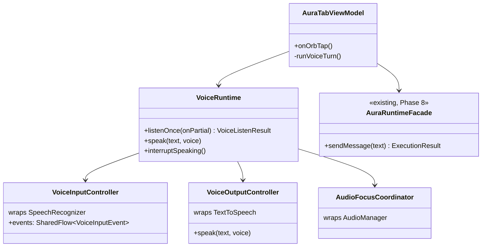
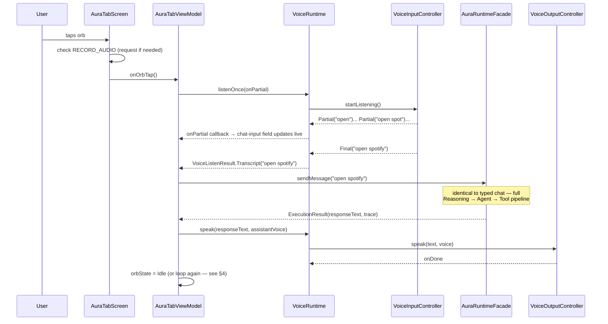

# AURA AI — Voice Runtime

Version 1.0 Critical item 2 ([TODO_V1.md §2.2](TODO_V1.md#22-voice-runtime)): the orb (`AuraSub.Orb`)
stops narrating a fake `delay()`-based conversation and becomes a real push-to-talk voice interface
over the exact same pipeline typed chat already uses. No new conversation path was built — a voice
turn and a typed turn both end at the identical `AuraRuntimeFacade.sendMessage(text: String)` call;
see [AURA_RUNTIME.md](AURA_RUNTIME.md) for what that does from there.

---

## 1. Where voice sits in the existing architecture

`VoiceRuntime` never touches `ConversationPipeline`, `ReasoningEngine`, `AgentOrchestrator`, or
`AIProviderManager` directly — it only produces a `String` (the transcript) and consumes a `String`
(`ExecutionResult.responseText`), the same two things the typed-chat path already produces and
consumes. This is deliberate: voice is an input/output modality, not a second conversation engine.
Nothing in `core-reasoning`, `core-agents`, `core-orchestrator`, or `core-providers` changed for this
milestone.

All four new classes live in `:app` (`com.aura.ai.ai.voice`), not a new `core-voice` module. Unlike
`core-reasoning`'s `PermissionChecker`/`NetworkStatusProvider`/`BatteryStatusProvider` — which are
abstracted into core modules because `ReasoningEngine`'s pure-Kotlin decision logic genuinely needs
to query them — nothing in core-* needs to know AURA has a voice interface at all. Introducing a
core module with no real consumer beyond `:app` would be the premature abstraction this codebase's
own conventions argue against elsewhere (see `docs/PLATFORM_REVIEW.md`).

---

## 2. One voice turn

`OrbState` (`Idle → Listening → Thinking → Speaking → Idle`) — already existed as a UI enum before
this milestone, previously driven by three hardcoded `delay()` calls with no real listening or
speaking behind them. It's now driven by real state: `Listening` for as long as
`VoiceInputController` has an active recognition session, `Thinking` for the `AuraRuntimeFacade`
call, `Speaking` for as long as `TextToSpeech` is actually producing audio.

---

## 3. Interruption (barge-in) — what's real and what's deliberately not

Tapping the orb while `OrbState.Speaking` calls `VoiceRuntime.interruptSpeaking()`, which stops
`TextToSpeech` immediately and starts a new voice turn — "stop talking, I want to say something
else," triggered by an explicit, unambiguous user action.

**Acoustic barge-in — interrupting just by starting to talk, with no tap — was evaluated and
deliberately not implemented.** It would mean running `SpeechRecognizer` and `TextToSpeech`
simultaneously on the same device: the microphone capturing while the speaker plays. Whether that
reliably avoids the recognizer picking up AURA's own voice and firing a false-positive interruption
depends on device-specific echo cancellation on the `VOICE_RECOGNITION` audio source — behavior this
environment has no physical hardware to verify. Shipping it unverified risked exactly the kind of
"looks complete, breaks in the field" outcome this codebase has consistently avoided (see every
`ScaffoldAIProvider`/`AuraError.ProviderNotConnected` honesty pattern in `docs/AI_PROVIDER_INTEGRATION.md`).
Tap-to-interrupt is the honest, verifiable version of the same requirement.

---

## 4. Conversation continuation

After AURA finishes speaking a response **that completed naturally** (not interrupted), and
`UserPreferences.voiceContinuousConversationEnabled` is on (default: on; toggle in Settings →
Personalization), `runVoiceTurn()` calls itself to start listening again for a follow-up — no tap
needed. This is bounded by `SpeechRecognizer`'s own silence timeout, not a separate hand-rolled
timer: if the user says nothing, the same `ERROR_SPEECH_TIMEOUT`/`ERROR_NO_MATCH` path that ends any
listening window ends this one too, and the orb returns to `Idle`.

---

## 5. Voice personas

`AssistantVoice` (`Jarvis`/`Friday`/`Neutral`) already existed as a persisted preference before this
milestone (Phase 1–2) — selectable in Settings, but nothing consumed it. There is no per-persona
synthesized voice model; the platform `TextToSpeech` engine only ever speaks in whatever system
voice is installed. Each persona instead maps to a distinguishable pitch/rate combination on that
one voice (`VoiceOutputController.pitch()`/`.rate()`) — "Jarvis" reads deeper and slightly slower,
"Friday" higher and slightly faster, "Neutral" unmodified. A genuinely distinct synthesized voice
per persona would mean bundling or downloading a model — the same category of work
`LocalModelProvider` was deferred for in `docs/AI_PROVIDER_INTEGRATION.md` §1, not something this
milestone's scope covers.

---

## 6. What's tested, and what isn't

`app/src/test/java/com/aura/ai/ai/voice/` (the `:app` module's first test source set) covers every
piece of **pure** logic: error-code-to-user-message mapping (`toReadableMessage`), the
silent-vs-surfaced error classification (`VoiceInputEvent.Error.toListenResult`), and the
persona-to-pitch/rate mapping — 10 tests, all passing, all plain JUnit with no Android runtime
needed (referencing `SpeechRecognizer.ERROR_*` constants is safe without Robolectric; they're
compile-time `int` fields, not a method call).

`VoiceInputController`, `VoiceOutputController`, and `AudioFocusCoordinator` themselves wrap real
Android framework classes (`SpeechRecognizer`, `TextToSpeech`, `AudioManager`) with no meaningful
behavior outside a real device or a Robolectric shadow — this project has neither yet. Deeper
testing of these three (and of `AuraTabViewModel`'s voice-turn orchestration) is deferred to
Milestone 6 (Testing), where Robolectric is added as part of the broader test-infrastructure
expansion rather than bolted on mid-feature.

---

## 7. Permissions

`RECORD_AUDIO` was already declared in the manifest (Phase 1) and already had an onboarding toggle
(`PermissionsScreen.kt`) — neither changed. What's new: `AuraTabRoute` checks the permission fresh
at the point of use (tapping the orb), exactly like `PermissionsScreen`'s own toggle does, rather
than trusting a possibly-stale grant from onboarding time (the user may have declined it then, or
revoked it since in system settings). Declined-again is a silent no-op today — the system permission
dialog itself is the only feedback — good enough for this milestone; a clearer in-app explanation is
tracked as a follow-up polish item, not a functional gap.

---

## 8. What's still honestly not done

- **Continuous/wake-word listening** (AURA listening without any tap at all) — out of scope by
  design. `docs/TODO_V1.md §2.2` flagged this as "a real battery/privacy tradeoff that should be a
  deliberate, user-facing setting, not a default" before this milestone started, and nothing here
  changes that judgment — push-to-talk (tap to start) is what shipped.
- **A foreground service** — not needed for push-to-talk; `SpeechRecognizer` runs fine bound to the
  app's own foreground lifetime. Would become necessary only for continuous/wake-word listening,
  which isn't in scope (above).
- **Acoustic barge-in** — see §3.
- **A distinct synthesized voice per persona** — see §5.
- **Deep unit coverage of the Android-framework-wrapping classes** — see §6.
