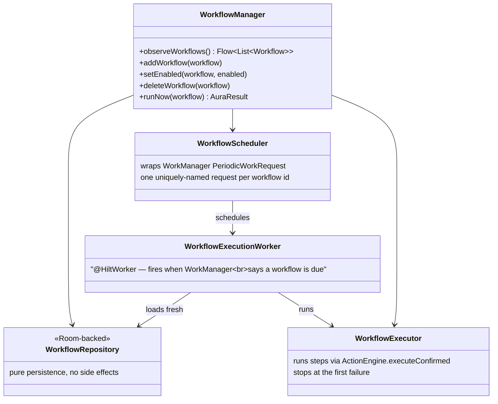

# AURA AI — Workflow Engine

Version 1.0 Critical item 5 ([TODO_V1.md §2.6](TODO_V1.md#26-workflow-engine)): persisted,
trigger-based, multi-step automations — the "run this later, unattended, on a schedule" capability
`docs/ANDROID_AUTOMATION.md` §3 deliberately left for this milestone rather than duplicating.

---

## 1. A `Workflow` is a list of the exact same tool calls everything else already makes

```kotlin
data class WorkflowStep(val toolName: String, val arguments: Map<String, String> = emptyMap())

data class Workflow(
    val id: String,
    val name: String,
    val description: String,
    val trigger: WorkflowTrigger,       // Manual, Daily, Weekly
    val triggerHour: Int = 8,
    val triggerMinute: Int = 0,
    val triggerDayOfWeek: Int = 1,      // DayOfWeek numbering, Weekly only
    val steps: List<WorkflowStep>,
    val enabled: Boolean = true,
)
```

`WorkflowStep` is deliberately the same `(toolName, arguments)` shape `ActionEngine`/`Tool` already
use everywhere — a workflow is not a second language for describing an action, it's a persisted,
ordered list of the same calls a Quick Action tap or a plan step already makes.

---

## 2. Persistence, execution, and scheduling are three separate, composed pieces



`WorkflowManager` is the one thing `AutomateViewModel` depends on — the same "one facade, several
composed collaborators" shape `AuraRuntimeFacade` and `VoiceRuntime` already established, kept
consistent rather than inventing a fourth shape for this milestone. `WorkflowRepository` stays
pure persistence (no scheduling side effects) on purpose, mirroring every other repository in this
codebase; `WorkflowManager` is where "keep the database and WorkManager in sync" actually lives, so
nothing else has to remember to call both.

---

## 3. Execution: `executeConfirmed`, stop-on-first-failure

`WorkflowExecutor` calls `ActionEngine.executeConfirmed` (not `execute`) for every step — creating
or enabling a workflow *is* the deliberate, explicit action that authorizes everything it will
later do unattended, the same reasoning `docs/ANDROID_AUTOMATION.md` §2 applies to a single Quick
Action tap, extended to "the user built and turned on this whole routine." A workflow containing
`schedule_action` (itself `requiresConfirmation = true`) runs it without a second gate — the
workflow's own creation was that gate.

Steps run in order and stop at the first failure — the exact same convention
`com.aura.ai.ai.PlanExecutor` already uses for `ExecutionPlan`, not a second policy
(partial-success, best-effort-continue) invented for a shape that's otherwise identical.

---

## 4. Scheduling: `WorkManager`, not `AlarmManager`

`WorkflowScheduler` uses a `PeriodicWorkRequest` per workflow (`Daily` → 1-day interval, `Weekly` →
7-day interval), with `setInitialDelay` computed to the next actual occurrence of the configured
time (`java.time`, native on `minSdk 26`, no desugaring needed). This means accepting
`PeriodicWorkRequest`'s own documented imprecision — `WorkManager` batches work to save battery, so
"daily at 7:30am" means "within some window around 7:30am," not to-the-minute. `ReminderTool`
(Phase 3) already established that this class of feature accepts inexactness as a fair trade;
reusing `WorkManager`/`HiltWorkerFactory` (already wired in `docs/ANDROID_AUTOMATION.md` §3) avoids
introducing a second scheduling mechanism (`AlarmManager` + a re-arming `BroadcastReceiver`) for
what is, at its core, the same "run something later" primitive `DeferredActionTool` already uses.

`WorkflowExecutionWorker` loads the workflow **fresh** from `WorkflowRepository` every time it
fires — an edit made between two scheduled runs takes effect on the very next one, not the one
after. A workflow deleted or disabled between scheduling and firing is a silent no-op
(`Result.success()`), not a crash — `WorkflowManager` is responsible for cancelling the
`WorkManager` request when that happens, but the worker doesn't trust that timing and checks for
itself regardless.

---

## 5. The five named presets — honestly built from tools that exist

Morning Brief, Study Routine, Shopping Routine, Daily Review, and Weekly Planning are real,
one-tap-to-add `Workflow`s (`WorkflowPresets.all()`), built strictly from tools this codebase
already has (`notify`, `media_control`, `shopping_search`) — not from capabilities invented for the
occasion. Today that means: Morning/Daily/Weekly are a scheduled notification with a fixed message;
Study Routine pauses whatever's playing and notifies; Shopping Routine opens a shopping search.

**What's honestly modest, not a bug:** none of these read a calendar, fetch weather, or generate an
AI summary — this codebase has no read-capable calendar tool and no dedicated "generate a briefing"
tool yet. A genuinely rich "Morning Brief" (weather + today's events + an AI-written summary) is a
natural extension once those exist, not something worth faking with static or misleading text now.
Presets can be added, enabled/disabled, deleted, and run on demand from the Automate tab's new
"Workflows" section — editing today means exactly that, not a custom step-by-step builder UI (out
of scope for this pass).

---

## 6. Database

`WorkflowEntity` is Room's fourth new entity added since Phase 1 — `AuraDatabase` bumped to
`version = 2`. Steps are stored as a single encoded `String` column
(`WorkflowStepEncoding.encode`/`.decode`, percent-encoding every component via plain
`java.net.URLEncoder`) rather than a `@TypeConverter` backed by kotlinx.serialization — deliberately,
given this project's own build history with that library inside a KSP processor classpath
(`docs/ANDROID_AUTOMATION.md` §5). `DatabaseModule` now calls `.fallbackToDestructiveMigration(true)` —
there are no real migrations yet and no install base to preserve pre-1.0, so destructively
recreating on a schema bump is the honest choice over crashing.

---

## 7. Testing

`app/src/test`: 5 tests for `WorkflowStepEncoding` (round-trips empty/no-argument/multi-argument
step lists, and specifically a value containing the encoding's own delimiter characters — the one
case that would silently corrupt data if percent-encoding weren't applied correctly), and 4 tests
for `WorkflowExecutor` (runs every step in order, stops at the first failure without running the
rest, an empty workflow succeeds trivially, and — the one that matters most — a fake `ActionEngine`
whose `execute()` unconditionally fails proves `WorkflowExecutor` genuinely calls
`executeConfirmed()`, not `execute()`). `WorkflowScheduler` and `WorkflowExecutionWorker` wrap
`WorkManager`/`java.time` with no meaningful behavior to verify without a real clock and a real
`WorkManager` test harness — deferred to Milestone 6 (Testing), the same reasoning as every prior
milestone's Android-framework-wrapping classes.
